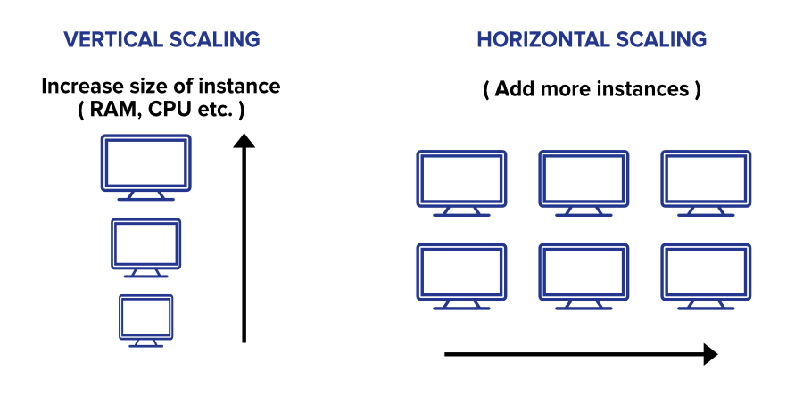

# Terminologies Fundamentals
We've attempted to explain some of the terms in plain English. For a more formal definition, go to wiki.

## Reliability
- The probability of a system failing in a given period is known as reliability.
- A distributed system is considered reliable if it continues to provide services despite the failure of one or more of its software or hardware components.

## Replication 
- Replication is the process of copying data across numerous devices on a regular basis. 
- Multiple copies of the data exist among devices after replication. This could be useful if one or more of the machines dies due to a malfunction.

## Consistency
- Assuming you have a storage system with multiple machines, consistency means the data is consistent throughout the cluster, so you can read or write to/from any node and get the same results.
- **Eventual consistency : Consistency in the long run**
Exactly as the name implies. If numerous machines in a cluster store the same data, an eventual consistent model implies that all machines will eventually have the same data.
- It's possible that those machines have various copies of the same data at any given time (temporarily inconsistent), but they'll eventually all have the same data.

## Availability
- It's a basic metric that shows how long a system, service, or machine has been operational under typical conditions.
- Availability in the context of a database cluster refers to the ability to always respond to queries (read or write) regardless of node failure.
- **The Difference Between Reliability and Availability**
A system is available if it is reliable. However, just because something is available does not mean it is trustworthy.

## Partition Tolerance
 In the context of a database cluster, Even if there is a "partition" (communications break) between two nodes in a database cluster, the cluster continues to function (both nodes are up, but can't communicate).

## Scaling 
Scalability refers to a system's, process's, or network's ability to grow and manage rising demand.
Horizontal and vertical scaling are the two types of scaling.
To put it another way, scaling horizontally means adding more servers. To scale vertically, the server's resources must be increased ( RAM, CPU, storage, etc. ).

 
  <kbd>
  
  </kbd>

## Sharding
Sharding is a data distribution strategy that uses many machines to distribute data.
Data does not fit on a single machine in most large systems. In these circumstances, sharding refers to the division of a huge database into smaller, quicker, and more manageable data shards.