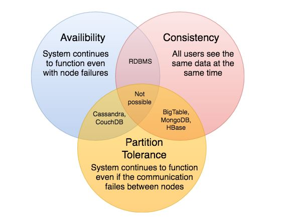

# CAP Theorem

According to the CAP theorem, a distributed software system cannot simultaneously provide more than two of the three guarantees (CAP): consistency, availability, and partition tolerance.

Trading off among CAP is almost the first thing we want to think about when designing a distributed system. According to the CAP theorem, we can only choose two of the following three possibilities when constructing a distributed system:

**Consistency:** At the same time, all nodes see the same data. Before enabling more reads, some nodes are updated to ensure consistency.

**Availability:** Every request receives a success/failure response. Data is replicated across multiple servers to ensure availability.

**Partition tolerance:** Despite communication loss or partial failure, the system continues to function. A partition-tolerant system may withstand any level of network failure without causing the entire network to fail. Data is appropriately replicated across a variety of nodes and networks to ensure that the system remains operational during outages.

 
  <kbd>
  
  </kbd>

- We won't be able to create a general data store that is always available, sequentially consistent, and resilient to partition faults. Only two of these three traits can be combined in a system. Because all nodes should see the same set of changes in the same order in order to remain consistent.
- If the network is partitioned, however, updates in one partition may not reach the other partitions before a client reads from the out-of-date partition after reading from the current one.
- The only way to deal with this issue is to stop servicing requests from the out-of-date partition, however this reduces the service's availability to zero.