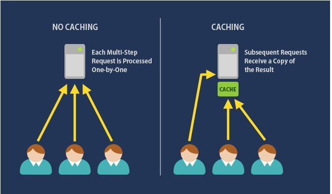
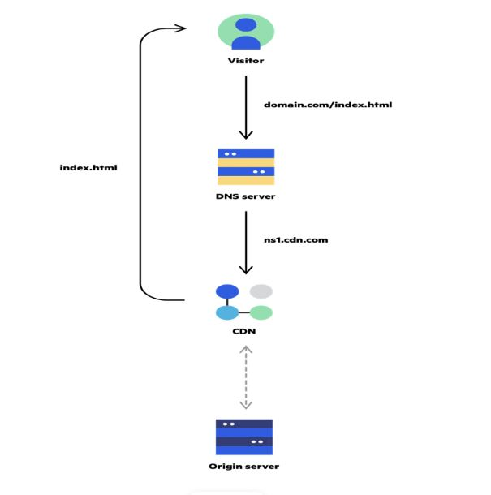

# Caching

 
  <kbd>
  
  </kbd>

## What is Cache and how does it work?
- A cache is a type of short-term memory with a finite quantity of storage space. It is often quicker than the original data source.
- Caching is made up of several steps.

       1. Perform a preliminary calculation (e.g. the number of visits from each referring domain for the previous day)
       2. Creating pricey indexes in advance (for example, suggested stories based on a user's click history)
       3. Using a quicker backend (e.g. Memcache instead of PostgreSQL) to store copies of frequently accessed data.

## Caches in several tiers

**1 Client-side**

- Use case: Improve the speed with which web content is retrieved from websites (browser or device)
- Tech: HTTP Cache Headers, Browsers
- Solutions: Browser Specific

**2 DNS**

- Use case: Domain to IP Resolution
- Tech: DNS Servers
- Solutions: Amazon Route 53

**3 Web Server**

- Use case: Improve the speed with which web material is retrieved from web/app servers. Web Session Management (server-side)
- Tech: HTTP Cache Headers, CDNs, Reverse Proxies, Web Accelerators, Key/Value Stores
- Solutions: Amazon CloudFront, ElastiCache for Redis, ElastiCache for Memcached, Partner Solutions

**4 Application**

- Use case: Improve the performance of your applications and data access.
- Tech: Key/Value data stores, Local caches
- Solutions: Redis, Memcached

Note: It essentially stores a cache on the Application server. If local, cached data exists, the node will promptly return it when a request is made to the service. If not, the data will be queried by the requesting node by accessing network storage, such as a database. When the application server is expanded to a large number of nodes, the following concerns may arise:

   1. The load balancer distributes requests across the nodes at random.
   2. The same request can be sent to many nodes, resulting in cache misses.
   3. Additional storage is required since the same data will be stored in two or more nodes.

Solutions for the issues:

  1. Global caches
  2. Distributed caches

**5 Database**

- Use case: Decrease the latency of database query requests
- Tech: Database buffers, Key/Value data stores
- Solutions: The database's default setup normally contains some level of caching, which is tuned for a generic use case. These variables can be tweaked for unique usage patterns, and Redis and Memcached can also be used to improve performance.

**6 Content Distribution Network (CDN)**

 
  <kbd>
  
  </kbd>

- Use case: Remove the burden of providing static media from your application servers by distributing it geographically.
- Solutions: Amazon CloudFront, Akamai

Note: If your system isn't big enough for CDN, you can build it this way:

  1. Use a lightweight HTTP server to serve static material from a separate subdomain (e.g. Nginx, Apache).
  2. Switch this subdomain's DNS to a CDN layer.

**7 Other Cache**

- *CPU Cache:* Small memories on or near the CPU can operate at a faster pace than the main memory, which is much larger.
- Since the 1980s, most CPUs have used one or more caches, sometimes in a cascaded configuration; modern high-end embedded, desktop, and server microprocessors may have as many as six cache types (between levels and functions)
- Cache for the GPU
- *Disk Cache:* While CPU caches are often maintained fully by hardware, other caches are managed by a variety of software. The operating system kernel manages the page cache in main memory, which is an example of disk cache.

## **Cache Invalidation**

If data is changed in the database, it should be invalidated in the cache; otherwise, the program may behave inconsistently. Write-through cache, Write-around cache, and Write-back cache are the three main types of caching systems.

Cache invalidation is a technique for resolving this issue; there are three main schemes:

**Write-through cache:**

- With this policy, data is simultaneously written to the cache and the appropriate database. Because the identical data is written in the permanent storage, we will have total data consistency between the cache and the store.
- This technique also assures that nothing is lost in the event of a breakdown, power outage, or other system failure.
- Although write through reduces the possibility of data loss, this technique has the disadvantage of increasing write latency because every write operation must be performed twice before providing success to the client.

**Write-around cache:**

- This technique is similar to write through cache, except that data is written directly to permanent storage rather than traveling through the cache. 
- This can help prevent the cache from being flooded with write operations that will not be re-read, but it also means that a read request for recently written data will result in a "cache miss," requiring the data to be read from slower back-end storage and resulting in increased latency.

**Write-back cache:**

- With this policy, data is written to the cache alone, and the client is notified as soon as it is complete. The persistent storage is written to at predetermined intervals or under specific conditions. 
- For write-intensive applications, this results in low latency and high throughput; but, because the sole copy of the written data is in the cache, this speed comes with the danger of data loss in the event of a crash or other adverse event.

## Cache eviction policies

Some of the most typical cache eviction policies are as follows:

1. **First In First Out (FIFO):** The cache evicts the first block accessed first, regardless of how often or how many times it was previously accessed.
2. **Last In First Out (LIFO):** The cache evicts the block that has been accessed the most recently first, regardless of how often or how many times it has been accessed previously.
3. **Least Recently Used (LRU):** Tosses out the items that haven't been utilized in a long time first.
4. **Most Recently Used (MRU):** Discards the most recently used objects first, as opposed to LRU.
5. **Least Frequently Used (LFU):** Determines how frequently an item is required. The ones that are utilized the least are the first to be discarded.
6. **Random Replacement (RR):** Selects a candidate item at random and discards it when space is needed.

The following links include useful information regarding caching:

1. **[Cache](https://en.wikipedia.org/wiki/Cache_(computing))**
2. **[Introduction to architecting systems](https://lethain.com/introduction-to-architecting-systems-for-scale/)**