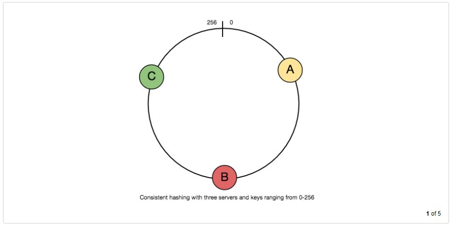

# Consistent Hashing

One of the most important components in distributed scalable systems is the Distributed Hash Table (DHT). Hash tables require a key, a value, and a hash function, which maps the key to a storage place for the value.

                                    index = hash_function(key)
                                    
Let's pretend we're working on a distributed caching system. An sensible hash function for 'n' cache servers would be 'key percent n'. It's straightforward and widely utilized. However, it has two fundamental flaws:

1. It is not scalable horizontally. All current mappings are broken whenever a new cache host is introduced to the system. If the caching system has a lot of data, it will be difficult to maintain. In practice, scheduling a downtime to update all caching mappings becomes problematic.
2. It may not be load balanced, especially if the data is not spread consistently. In practice, it is reasonable to expect that the data will not be dispersed evenly. For the caching system, this means that some caches will become hot and saturated while others will remain inactive and nearly empty.

Consistent hashing is an excellent method to improve the caching system in these scenarios.

## What is Consistent Hashing, and how does it work?

For distributed caching systems and DHTs, consistent hashing is a particularly beneficial method. It allows us to distribute data across a cluster in such a way that nodes are added or withdrawn with minimal rearrangement. As a result, scaling up or down the caching system will be much easier.

Only 'k/n' keys need to be remapped in Consistent Hashing when the hash table is resized (e.g. a new cache host is added to the system), where 'k' is the total number of keys and 'n' is the total number of servers. Remember that in a caching system that uses the hash function'mod,' all keys must be remapped.

If possible, items in Consistent Hashing are mapped to the same host. When a host is removed from the system, its objects are shared by other hosts; when a new host is introduced, it takes its share from a few hosts without affecting the shares of others.

## How does it function?

Consistent hashing is a hash function that maps a key to an integer. Assume the hash function's output is in the range [0, 256]. Consider placing the integers in the range on a ring and wrapping the values around it.

The following is an example of how consistent hashing works:

1. Hash a list of cache servers into integers in the range given.
2. To associate a key with a server,

    a. Convert it to a single integer hash.

    b. Work your way around the ring clockwise until you reach the first cache.
    
    c. That cache is the one that contains the key. 
    
As an example, consider the following: Key1 corresponds to cache A, while key2 corresponds to cache C.

 
  <kbd>
  
  </kbd>

When a new server, say D, is added, keys that were previously stored on C will be divided. Some will be transferred to D, while others will remain unchanged.

To remove a cache or if a cache fails, say A, all keys mapped to A will fall into B, and only those keys will need to be relocated to B; other keys will not be affected.

As we noted in the outset, real data for load balancing is fundamentally randomly distributed and hence may not be uniform. It's possible that the keys on caches will become imbalanced as a result.

We add "virtual replicas" for caches to address this issue. We map each cache to many points on the ring, i.e. replicas, rather than a single point on the ring. As a result, each cache is linked to numerous ring segments.

If the hash function "mixes well," the keys will become more balanced as the number of replicates grows.