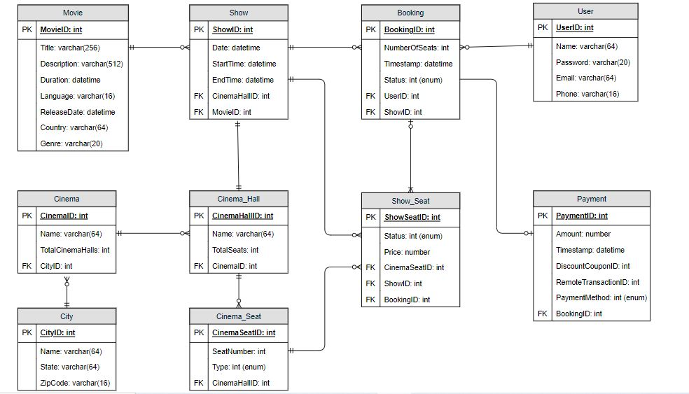
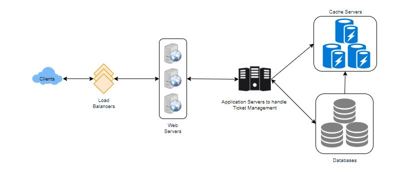
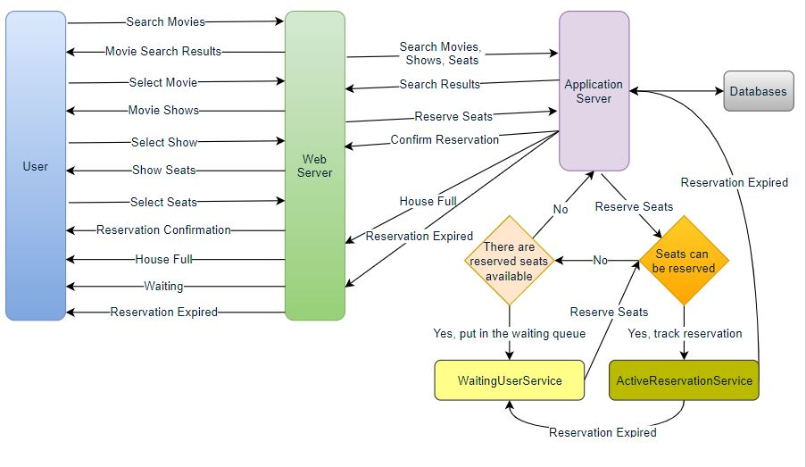
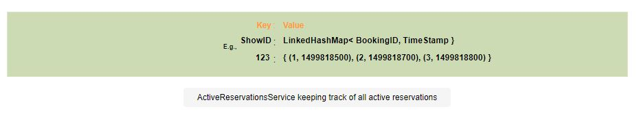

# Design Ticketmaster
## Problem Statement
Let's design an online ticketing system that sells movie tickets like Ticketmaster or BookMyShow.

Similar Services: bookmyshow.com, ticketmaster.com

Difficulty Level: Hard

### What is an online movie ticket booking system?
Customers can acquire theater seats online through a movie ticket reservation system. Customers can browse and book seats for presently playing movies using e-ticketing systems from anywhere at any time.

## Pratice Problem

***Let's get started on the system design solution.***

**If you run into any problems, please see the solution below.**

<!DOCTYPE html>
<html>
<head>
	<meta charset="UTF-8">
	<meta name="viewport" content="width=device-width, initial-scale=1.0">
	<meta name="description" content="X-Frame-Bypass: Web Component extending IFrame to bypass X-Frame-Options: deny/sameorigin">
</head>
<body>
    <a href="https://jayaemekar.github.io/praticedesign/" target="_blank">Pratice on full Screen</a>
      
	<iframe is="x-frame-bypass" src="https://ej2.syncfusion.com/showcase/angular/diagrambuilder/" width="725" height="500"></iframe>

      
    <h2>Hints to solve the problem</h2>

    <a href="https://jayaemekar.github.io/systemdesign/DesignTicketmaster/#requirements-and-goals-of-the-system" target="_blank">1. Consider functional and non-functional requirements. </a>
      
    <a href="https://jayaemekar.github.io/systemdesign/DesignTicketmaster/#some-design-considerations" target="_blank">2. Estimation of capacity and constraints, such as traffic, bandwidth, and storage. </a>
      
    <a href="https://jayaemekar.github.io/systemdesign/DesignTicketmaster/#system-apis" target="_blank">3. Consider System APIs. </a>
      
    <a href="https://jayaemekar.github.io/systemdesign/DesignTicketmaster/#database-design" target="_blank">4. How do you create a database system? </a>
      
    <a href="https://jayaemekar.github.io/systemdesign/DesignTicketmaster/#high-level-design" target="_blank">5. What about high level and component level design?</a>
     
     
    <a href="https://jayaemekar.github.io/systemdesign/DesignTicketmaster/#fault-tolerance" target="_blank">6.  Consider Fault Tolerance and Data Partitioning </a>
     
  
</body>
</html>

## <h1>Solution<h1>
### Requirements and Goals of the System
Our ticket booking service should meet the following requirements:

**Functional Requirements:**

1. Our ticketing service should be able to provide a list of cities in which its affiliated cinemas are located.
2. After the user selects a city, the service should show all movies that have been released in that city.
3. After the user selects a film, the service should list the theaters showing that film as well as show times.
4. The user should be able to select a show and purchase tickets at a certain theatre.
5. The service should be able to show the user the cinema's seating configuration. The user should have the option of selecting multiple seats based on their preferences.
6. The user should be able to tell the difference between available and booked seats.
7. Users should be allowed to place a five-minute hold on seats before making a payment to complete the booking.
8. If there is a potential chance that the seats will become available, such as when other users' holds expire, the user should be permitted to wait.
9. Customers who are in line shall be served in a fair, first-come, first-served manner.

**Non-Functional Requirements:**

1. The system must be extremely concurrent. At any given time, there will be many booking requests for the same seat. This should be handled gracefully and fairly by the service.
2. The service's main feature is ticketing, which entails financial transactions. This means the system must be secure and the database must be ACID-compliant.

### Some Design Considerations
1. Assume that our service does not require any user authentication for the sake of simplicity.
2. Partial ticket orders will not be accepted by the system. Either the user receives all of the tickets they desire, or they do not.
3. The system is required to be fair.
4. To prevent exploitation of the system, we can limit users to booking no more than ten seats at a time.
5. We should expect crowds to surge for popular/anticipated film releases, with tickets filling up quickly. To keep up with the increased traffic, the system should be scalable and highly available.

### Capacity Estimation
**Traffic estimates:** Assume that our service receives 3 billion monthly page views and sells 10 million tickets.

**Storage estimates:** Assume there are 500 cities and each city has ten cinemas on average. If each cinema has 2000 seats and there are two shows every day on average.

Assume that each seat booking requires 50 bytes in the database (IDs, NumberOfSeats, ShowID, MovieID, SeatNumbers, SeatStatus, Timestamp, and so on). We'd also need to save information on movies and theaters, which we'll suppose will take up 50 bytes. To store all data for a day about all shows in all cinemas in all cities:

                500 cities * 10 cinemas * 2000 seats * 2 shows * (50+50) bytes = 2GB / day
To store five years of this data, we would need storage of around 3.6TB.

### System APIs
To expose the functionality of our service, we can use SOAP or REST APIs. The APIs to search movie shows and reserve seats may be defined as follows.

    SearchMovies(api_dev_key, keyword, city, lat_long, radius, start_datetime, end_datetime, postal_code, 
        includeSpellcheck, results_per_page, sorting_order)
**Parameters:**

- **api_dev_key (string):** A registered account's API developer key. This will be used to throttle users based on their quota allocation, among other things.
- **keyword (string):** Keyword to search with.
- **city (string):** City filter to search movies.
- **lat_long (string):** Latitude and longitude to filter by. radius (number): Radius of the area in which we want to search for events.
- **start_datetime (string):** Filter movies with a starting date and time.
- **end_datetime (string):** Filter movies with an ending date and time.
- **postal_code (string):** Filter movies by postal code / zipcode.
- **includeSpellcheck (Enum: “yes” or “no”):** Yes, to include spell check suggestions in the response.
- **results_per_page (number):** Number of results to return per page. Maximum is 30.
- **sorting_order (string):** Sorting order of the search result. Some allowable values : ‘name,asc’, ‘name,desc’, ‘date,asc’, ‘date,desc’, ‘distance,asc’, ‘name,date,asc’, ‘name,date,desc’, ‘date,name,asc’, ‘date,name,desc’.

**Returns: (JSON)**
Here is a sample list of movies and their shows:

        [
        {
            "MovieID": 1,
            "ShowID": 1,
            "Title": "Cars 2",
            "Description": "About cars",
            "Duration": 120,
            "Genre": "Animation",
            "Language": "English",
            "ReleaseDate": "8th Oct. 2014",
            "Country": USA,
            "StartTime": "14:00",
            "EndTime": "16:00",
            "Seats": 
            [
            {  
                "Type": "Regular"
                "Price": 14.99
                "Status: "Almost Full"
            },
            {  
                "Type": "Premium"
                "Price": 24.99
                "Status: "Available"
            }
            ]
        },
        {
            "MovieID": 1,
            "ShowID": 2,
            "Title": "Cars 2",
            "Description": "About cars",
            "Duration": 120,
            "Genre": "Animation",
            "Language": "English",
            "ReleaseDate": "8th Oct. 2014",
            "Country": USA,
            "StartTime": "16:30",
            "EndTime": "18:30",
            "Seats": 
            [
                {  
                "Type": "Regular"
                "Price": 14.99
                "Status: "Full"
            },
                {  
                "Type": "Premium"
                "Price": 24.99
                "Status: "Almost Full"
            }
            ]
        },
        ]

        ReserveSeats(api_dev_key, session_id, movie_id, show_id, seats_to_reserve[])
**Parameters:**
- api_dev_key (string): same as above
- session_id (string): This reservation will be tracked using the user's session ID. When the reservation time expires, this ID will be used to delete the user's reservation from the server.
- movie_id (string): Movie to reserve.
- show_id (string): Show to reserve.
- seats_to_reserve (number): An array containing seat IDs to reserve.

**Returns: (JSON)**
Returns the reservation's status, which can be one of the following: 1) "Successful Reservation" 2) "Show Full - Reservation Failed," 3) "Reservation Failed - Please try again as other users have reserved seats."

### Database Design
Here are a few key observations about the data we are going to store:

1. There are several cinemas in each city.
2. There will be many halls in each cinema.
3. Each film will have numerous screenings, and each screening will have multiple bookings.
4. A user may make several reservations.

 
  <kbd>
  
  </kbd>

### High Level Design
At a high level, our web servers will manage user sessions, while application servers will handle all ticket administration, data storage in databases, and reservation processing in collaboration with cache servers.

 
  <kbd>
  
  </kbd>

### Detailed Component Design
First, let’s try to build our service assuming it is being served from a single server.

Ticket Booking Workflow: The following would be a typical ticket booking workflow:

1. The user looks for a film to watch.
2. The user chooses a film.
3. The user is shown the movie's available shows.
4. The user chooses a show to watch.
5. The quantity of seats to be reserved is chosen by the user.
6. If the appropriate number of seats are available, the user is presented with a theater map from which to choose seats. Otherwise, the user is directed to'step 8' below.
7. Once the user has chosen a seat, the system will attempt to reserve that seat.
8. If seats cannot be reserved, the following options are available:
- The show is full, and the user receives an error notice.
- The user's desired seats are no longer available, but there are alternative seats available, thus the user is returned to the theater map to select different seats.
- There are no seats available for reservation, but all seats are not yet booked since other users are holding seats in the reservation pool that they have not yet booked. The user will be directed to a website where they can wait for the appropriate seats to become available in the reservation pool. Waiting could lead to the following options:
        - If enough seats become available, the user is directed to the theater map page, where they can select seats.
        - While waiting, the user is shown an error message if all seats are booked or there are fewer seats in the reservation pool than the user intended to book.
        - When the user quits the waiting, they are returned to the movie search page.
        - A user can wait a maximum of one hour before their session expires and they are returned to the movie search page.
9. If tickets are successfully reserved, the user has five minutes to complete the payment process. The booking is marked finalized after payment is received. If a user does not pay within five minutes, all of their reserved seats become available to other users.

 
  <kbd>
  
  </kbd>

**How would the server keep track of all the active reservation that haven’t been booked yet? And how would the server keep track of all the waiting customers?**
Let's call one of the daemon services ActiveReservationService to maintain track of all active bookings and remove any expired reservations from the system. The other service, which we'll call WaitingUserService, will keep track of all the waiting user requests and, as soon as the required number of seats become available, it will tell the (longest waiting) user to choose the seats.

**a. ActiveReservationsService**

- In addition to keeping all the data in the database, we can keep all the reservations for a'show' in memory in a data structure similar to Linked HashMap or TreeMap. 
- We'll need a linked HashMap-style data structure that allows us to jump to any reservation and remove it after it's finished. 
- Also, because each reservation will have an expiry time, the HashMap's head will always point to the oldest reservation record, allowing the reservation to expire when the timeout is reached.
- To keep each reservation for each show, we may use a HashTable with the 'ShowID' as the key and the Linked HashMap containing 'BookingID' and the creation 'Timestamp' as the value.

- The reservation will be stored in the database's 'Booking' table, with the expiration time in the Timestamp field. 
- The 'Status' field will be set to 'Reserved (1),' and if a booking is completed, the system will change the 'Status' to 'Booked (2),' and remove the reservation record from the relevant show's Linked HashMap. 
- We can either erase the reservation from the Booking table or mark it as 'Expired (3)' in addition to removing it from memory when it has expired.

In order to process user payments, ActiveReservationsService will collaborate with an external financial service. WaitingUsersService will get a signal if a booking is completed or a reservation expires, allowing any waiting customers to be served.

 
  <kbd>
  
  </kbd>

**b. WaitingUsersService**

- We can retain all the waiting users of a show in memory in a Linked HashMap or a TreeMap, just like ActiveReservationsService. 
- When a user cancels their request, we require a data structure similar to Linked HashMap so that we can jump to any user and remove them from the HashMap. 
- Also, because we are serving on a first-come, first-serve basis, the Linked HashMap's head would always point to the longest-waiting user, allowing us to serve users fairly whenever seats become available.

- A HashTable will be used to keep all of the waiting users for each Show. 
- 'ShowID' would be the 'key,' and a Linked HashMap containing 'UserIDs' and their wait-start-time would be the 'value.'
- Long Polling allows customers to stay informed about the status of their reservations. The server can utilize this request to notify the user when seats become available.

**Reservation Expiration**

- ActiveReservationsService on the server maintains track of when active reservations expire (based on reservation time). 
- Because the client will see a timer (for the expiration time), which may be out of sync with the server, we may put a five-second buffer on the server to protect against a broken experience, ensuring that the client never times out before the server, preventing a successful transaction.

### Concurrency
How to deal with concurrency so that no two people may book the same seat. To avoid conflicts in SQL databases, we can utilize transactions. If we're using a SQL server, for example, we can use Transaction Isolation Levels to lock records before updating them. Here's an example of code:

        SET TRANSACTION ISOLATION LEVEL SERIALIZABLE;
        
        BEGIN TRANSACTION;
        
            -- Suppose we intend to reserve three seats (IDs: 54, 55, 56) for ShowID=99 
            Select * From Show_Seat where ShowID=99 && ShowSeatID in (54, 55, 56) && Status=0 -- free 
        
            -- if the number of rows returned by the above statement is three, we can update to 
            -- return success otherwise return failure to the user.
            update Show_Seat ...
            update Booking ...
        
        COMMIT TRANSACTION;
The greatest isolation level is 'Serializable,' which ensures protection from Dirty, Nonrepeatable, and Phantoms readings. One thing to keep in mind here: when we read rows within a transaction, we obtain a write lock on them, which means no one else can update them.

We may start tracking the reservation in ActiveReservationService after the above database transaction is complete.

### Fault Tolerance
**What happens when ActiveReservationsService or WaitingUsersService crashes?**

- We can read all active reservations from the 'Booking' database whenever ActiveReservationsService dies. Remember that until a reservation is booked, the 'Status' column will remain 'Reserved (1).' 
- Another alternative is to set up a master-slave arrangement so that the slave can take over if the master fails. 
- We don't store the waiting users in the database, therefore unless we have a master-slave configuration, we won't be able to retrieve that data if WaitingUsersService crashes.

To make databases fault resilient, we'll use a master-slave configuration.

### Data Partitioning
**Database partitioning:** 

- If we partition by 'MovieID,' all of a movie's Shows will be on the same server. This could put a lot of strain on the server if the movie is really popular. 
- A better technique would be to divide depending on ShowID, which would distribute the load across multiple servers.

**ActiveReservationService and WaitingUserService partitioning:** 
- Our web servers will keep track of all active users' sessions and handle all user contact. Based on the 'ShowID,' we may utilize Consistent Hashing to allocate application servers for both ActiveReservationService and WaitingUserService. 
- This way, a specific set of servers will manage all bookings and waiting users for a specific show. Assume that our Consistent Hashing allocates three servers for each Show for load balancing purposes, therefore when a reservation expires, the server holding that reservation will do the following:

1. Update the 'Show Seats' table in the database to remove the Booking (or mark it as expired) and update the seats' Status.
2. Get rid of the reservation in the Linked HashMap.
3. Inform the user that their reservation has run out of time.
4. To determine the longest waiting user, send a message to all WaitingUserService servers that are holding waiting users for that Show. A reliable hashing algorithm will reveal which servers are hosting these users.
5. If required seats become available, send a message to the WaitingUserService server holding the longest waiting user to execute their request.

When a reservation is confirmed, the following events occur:

1. The server holding that reservation sends a message to all servers holding the Show's waiting users, instructing them to expire all waiting users who require more seats than are available.
2. When all servers holding waiting users receive the aforementioned message, they will query the database to see how many open seats are currently available. To run this query only once, a database cache would be really useful.
3. All waiting users who try to reserve more seats than are available will be removed from the system. WaitingUserService must cycle through the Linked HashMap of all the waiting users to do this.