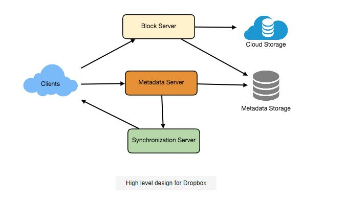
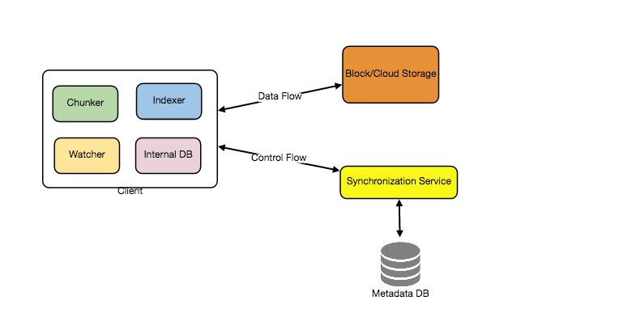
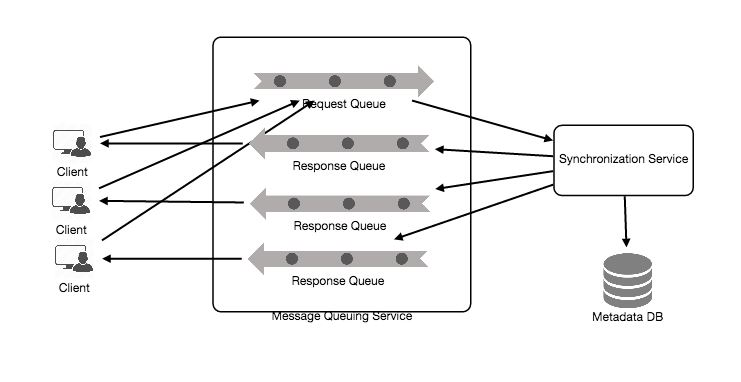
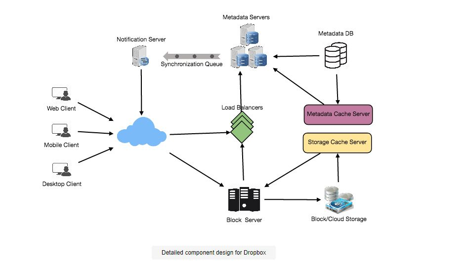

# Designing Dropbox

## Problem Statement

Create a file hosting service similar to Dropbox or Google Drive. 
Users can save their data on faraway servers using cloud file storage. Typically, cloud storage providers manage these servers and make them available to consumers over a network (typically through the Internet). 
Users pay a monthly fee for their cloud data storage.

- Similar Services: OneDrive, Google Drive
- Difficulty Level: Medium

### Why Use Cloud Storage?
Cloud file storage services have recently grown in popularity as they make it easier to store and share digital files across various devices. The massive popularity of cloud storage services is thought to be due to the change from single personal computers to multiple devices with diverse platforms and operating systems, such as smartphones and tablets, each with portable access from various geographical places at any time. The following are some of the most significant advantages of such services:

**Availability:** Cloud storage services promote data accessibility from anywhere, at any time. Users can access their files/photos from any device, at any time and from any location.

**Reliability and Durability:** Another advantage of cloud storage is that it guarantees data security and longevity. Cloud storage ensures that users' data is never lost by storing several copies of the data on many servers across the globe.

**Scalability:** There will never be a shortage of storage capacity for users. You have infinite storage with cloud storage if you are willing to pay for it.

If you haven't used dropbox.com before, we highly recommend opening an account and uploading/editing a file, as well as exploring the various options available.

## Pratice Problem

***Let's get started on the system design solution.***

**If you run into any problems, please see the solution below.**

<!DOCTYPE html>
<html>
<head>
	<meta charset="UTF-8">
	<meta name="viewport" content="width=device-width, initial-scale=1.0">
	<meta name="description" content="X-Frame-Bypass: Web Component extending IFrame to bypass X-Frame-Options: deny/sameorigin">
</head>
<body>
    <a href="https://ej2.syncfusion.com/showcase/angular/diagrambuilder/" target="_blank">Pratice on full Screen</a>
      
	<iframe is="x-frame-bypass" src="https://ej2.syncfusion.com/showcase/angular/diagrambuilder/" width="725" height="500"></iframe>

      
    <h2>Hints to solve the problem</h2>

    <a href="https://jayaemekar.github.io/systemdesign/DesigningURLShorteningService/#requirements-and-goals-of-the-system" target="_blank">1. Consider functional and non-functional requirements. </a>
      
    <a href="https://jayaemekar.github.io/systemdesign/DesigningURLShorteningService/#capacity-estimation-and-constraints" target="_blank">2. Estimation of capacity and constraints, such as traffic, bandwidth, and storage. </a>
      
    <a href="https://jayaemekar.github.io/systemdesign/DesigningURLShorteningService/#system-apis" target="_blank">3. Consider System APIs. </a>
      
    <a href="https://jayaemekar.github.io/systemdesign/DesigningURLShorteningService/#database-design" target="_blank">4. How do you create a database system? </a>
      
    <a href="https://jayaemekar.github.io/systemdesign/DesigningURLShorteningService/#data-partitioning-and-replication" target="_blank">5. What about data replication and partitioning?</a>
     
     
    <a href="https://jayaemekar.github.io/systemdesign/DesigningURLShorteningService/#cache" target="_blank">6.  Consider Cache and Load Balancing </a>
     
  
</body>
</html>

## <h1>Solution<h1>

### Requirements and Goals of the System
At the start of the interview, you should always outline criteria. Ask questions to determine the extent of the system that the interviewer is considering.

1. Users should have the ability to upload and download files/photos from any device.
2. Users should have the ability to share files and folders with other users.
3. Our service should allow automated device synchronization, which means that when a file is updated on one device, it should be updated on all devices.
4. The system should be able to store huge files of up to a GB in size.
5. Acidity is necessary. All file operations should be assured to be atomic, consistent, isolated, and durable.
6. Offline editing should be possible in our system. Users should be able to add, delete, and alter files when offline, and their modifications should be synced to remote servers and other online devices as soon as they reconnect.

**Extended Requirements**
The system should support snapshotting of the data, so that users can go back to any version of the files.

### Some Design Considerations

1. Huge read and write volumes are to be expected.
2. The read-to-write ratio should be about equal.
3. Internally, files can be saved in small chunks (for example, 4MB); this has a number of advantages, such as the fact that all failed operations will only be retried for smaller portions of a file. Only the failing chunk will be retried if a user fails to upload a file.
4. By simply sharing updated chunks, we may limit the quantity of data transmission.
5. We can save storage space and bandwidth by deleting duplicate pieces.
6. Keeping a local copy of the metadata (file name, size, etc.) on the client can save us a lot of server trips.
7. Clients can intelligently upload the diffs instead of the entire chunk for minor changes.

### Capacity Estimation and Constraints

1. Assume we have 500 million total users and 100 million daily active users (DAU).
2. Assume that each user connects from three distinct devices on average.
3. If each user has 200 files/photos, we will have a total of 100 billion files.
4. Assuming that the average file size is 100KB, total storage would be ten petabytes.

                        10PB = 100B * 100KB
5. Assume that there will be one million active connections per minute.

 
  <kbd>
  
  </kbd>

### High Level Design

- On their device, the user will designate a folder as their workspace. Any file/photo/folder saved in this folder will be uploaded to the cloud, and any changes or deletions to the file will be reflected in the cloud storage as well. 
- The user can create similar workspaces on all of their devices, and any changes made on one device will be replicated on all other devices, ensuring that everyone sees the same workplace.

- We need to store files and metadata information such as File Name, File Size, Directory, and who this file is shared with at a high level. 
- As a result, we'll need some servers to assist clients in uploading and downloading files to Cloud Storage, as well as servers to update information about files and users. 
- We also require a technique to alert all clients when an update occurs, allowing them to synchronize their data.

- Block servers will interact with clients to upload/download files from cloud storage, and Metadata servers will maintain file metadata updated in a SQL or NoSQL database, as depicted in the figure below. 
- Synchronization servers will handle the process of notifying all clients about synchronization updates.

 
  <kbd>
  
  </kbd>

### Component Design

Let’s go through the major components of our system one by one:

**a. Client**

- The Client Application keeps track of the user's workspace folder and syncs all files and folders in it with the remote Cloud Storage. 
- The client application will communicate with the storage servers to upload, download, and edit files in the backend Cloud Storage. 
- The client also communicates with the distant Synchronization Service to handle any changes in file metadata, such as file name, size, or modification date.

Here are some of the client's critical operations:

1. Download and upload files.
2. Monitor changes to files in the workspace folder.
3. Deal with conflicts caused by offline or simultaneous updates.

**How do we efficiently transfer files?**

- As previously stated, we can partition each file into smaller chunks so that only the updated chunks are transferred rather than the entire file. 
- Let's imagine each file is divided into four 4MB parts. Based on 1) Storage devices we utilize in the cloud to optimize space utilization and input/output operations per second, we can statically determine what might be an appropriate chunk size (IOPS) 2) Internet bandwidth 3) Average file size in storage, and so forth. 
- We should additionally keep a record of each file and the portions that make it up in our metadata.

**Do we need to keep a copy of the metadata with the client?**

Keeping a local copy of metadata allows us to make offline updates while also reducing the number of round trips required to update remote metadata.

**How can clients effectively listen to developments among their peers?**

- One approach could be for the clients to check with the server on a regular basis to see if anything has changed. 
- The downside with this technique is that changes will take longer to reflect locally because clients would check for updates on a regular basis rather than a server reporting anytime something changes. 
- If the client checks the server frequently for changes, it will not only waste bandwidth by returning an empty response the majority of the time, but it will also keep the server busy. 
- This method of gathering data is not scalable.

- The above problem could be solved by using HTTP long polling. Long polling is when a client requests information from a server knowing that the server may not respond right away. 
- Instead of returning an empty response if the server has no fresh data for the client when the poll is received, the server keeps the request open and waits for response information to become available. 
- The server provides an HTTP/S response to the client as soon as it receives fresh information, completing the open HTTP/S Request. 
- The client can instantly send another server request for future updates after receiving the server answer.

Based on the above considerations, we can divide our client into following four parts:

**I. Internal Metadata Database** will keep track of all files, chunks, versions, and file system locations.

**II. Chunker** will split the files down into smaller bits. It will also be in charge of reassembling a file from its fragments. Our chunking algorithm will detect portions of files that have been updated by the user and only send those portions to Cloud Storage, saving bandwidth and synchronization time.

**III. Watcher** will keep an eye on the local workspace folders and alert the Indexer (described below) of any user actions, such as creating, deleting, or updating files or folders. Watcher also listens for any updates on other clients that the Synchronization service broadcasts.

**IV. Indexer** The Watcher's events will be processed by the Indexer, who will update the internal metadata database with information about the chunks of updated files. The Indexer will communicate with the remote Synchronization Service to advertise changes to other clients and update the remote metadata database after the chunks have been successfully submitted/downloaded to Cloud Storage.

 
  <kbd>
  
  </kbd>

**How should customers deal with slow servers?** If the server is busy or not responding, clients should back off significantly. Clients should delay their retries if a server is too sluggish to respond, and this delay should grow exponentially.

**Should mobile clients automatically sync remote changes?** Mobile clients, unlike desktop or web clients, sync on demand to conserve bandwidth and storage space.

**b. Metadata Database**

- Versioning and metadata information on files/chunks, users, and workspaces are maintained by the Metadata Database. 
- A relational database, such as MySQL, or a NoSQL database service, such as DynamoDB, can be used as the Metadata Database. 
- Regardless of the database type, the Synchronization Service should be able to give a consistent view of the files stored in the database, particularly if multiple users are working on the same file at the same time. 
- Because NoSQL data stores prioritize scalability and performance over ACID properties, we'll need to programmatically include support for ACID properties in the logic of our Synchronization Service if we choose this type of database.
- However, using a relational database can simplify the implementation of the Synchronization Service as they natively support ACID properties.

The metadata Database should be storing information about following objects:

- Chunks
- Files
- User
- Devices
- Workspace (sync folders)

**c. Synchronization Service**

- The Synchronization Service is the component that processes a client's file updates and distributes them to other subscribers. 
- It also synchronizes the information held in the distant Metadata DB with the local databases of clients. Because of its crucial function in managing metadata and synchronizing users' files, the Synchronization Service is the most important aspect of the system design. 
- Desktop clients use the Synchronization Service to get updates from Cloud Storage or transfer files and updates to Cloud Storage and, perhaps, other users. 
- If a client has been offline for an extended period of time, it will poll the system for new updates as soon as they are available. 
- When the Synchronization Service receives an update request, it checks with the Metadata Database for consistency and then proceeds with the update. 
- Subsequently, a notification is sent to all subscribed users or devices to report the file update.

- To achieve a faster response time, the Synchronization Service should be built to transport less data between clients and the Cloud Storage. 
- The Synchronization Service can use a differencing method to reduce the quantity of data that needs to be synced to satisfy this design goal. 
- We can send the difference between two versions of a file instead of sending whole files from clients to the server or vice versa. 
- As a result, just the altered portion of the file is transferred. For the end user, this reduces bandwidth consumption and cloud data storage. 
- As previously said, we will divide our files into 4MB chunks and only transfer the updated parts.
- To determine whether or not to update the local copy of a chunk, the server and clients can compute a hash (e.g., SHA-256). 
- We don't need to build a new chunk on the server if we already have one with a comparable hash (even from another user). This is covered in further depth under Data Deduplication.

- We can use a communication middleware between clients and the Synchronization Service to create an efficient and scalable synchronization mechanism. 
- To support a large number of clients utilizing pull or push techniques, the messaging middleware should provide scalable message queuing and change notifications. 
- Multiple Synchronization Service instances can accept requests from a global request Queue in this manner, allowing the communication middleware to balance its load.

**d. Message Queuing Service**

- A messaging middleware, which should be able to manage a large number of requests, is an important aspect of our system. 
- Our application requires a scalable Message Queuing Service that provides asynchronous message-based communication between clients and the Synchronization Service. 
- Asynchronous and loosely coupled message-based communication between dispersed system components is supported by the Message Queuing Service. 
- The Message Queuing Service should be able to hold any number of messages in a highly available, scalable queue.

- In our system, the Message Queuing Service will implement two types of queues. The Request Queue is a global queue that is shared by all clients. 
- Client requests to update the Metadata Database will first be sent to the Request Queue, where they will be processed by the Synchronization Service. 
- The update messages are delivered to each client by the Response Queues that correspond to individual subscribed clients. 
- We need to construct distinct Response Queues for each subscribed client to exchange update messages because a message will be erased from the queue after it is received by a client.

 
  <kbd>
  
  </kbd>

**e. Cloud/Block Storage**

Cloud/Block Storage saves portions of files that users upload. To send and receive things from the storage, clients interact directly with it. We may use any storage, whether in the cloud or on-premises, because the metadata is separated from the storage.

 
  <kbd>
  
  </kbd>

### File Processing Workflow

The following sequence depicts the interaction of the application's components in a case where Client A modifies a file that is shared with Clients B and C, and they should also receive the update. If the other clients aren't online at the time of the update, the Message Queuing Service retains their update alerts in separate response queues until they do.

1. Client A saves chunks to the cloud.
2. Client A commits modifications and updates metadata.
3. Client A receives confirmation, and Clients B and C are notified of the modifications.
4. Clients B and C are notified of metadata changes and are prompted to download updated chunks.

### Data Deduplication

Data deduplication is a storage optimization technique that eliminates redundant copies of data. It can also be used to minimize the number of bytes that must be delivered over a network. We can create a hash for each new arriving chunk and compare it to all the hashes of previous chunks to check if we already have the same chunk in our storage.

In our system, we have two options for deduplication:

**a. Post-process deduplication**

- New chunks are initially put on the storage device with post-process deduplication, and then a mechanism checks the data for duplication. 
- The advantage is that clients will not have to wait for the hash computation or lookup to finish before storing the data, guaranteeing that storage performance is not harmed. 
- The disadvantages of this technique are that 

1) duplicate data will be stored unnecessarily, although for a short period, and 
2) duplicate data will be transported, using bandwidth.

**b. In-line deduplication**

Deduplication hash calculations can also be performed in real time when customers submit data on their devices. If our system recognizes a chunk that it already possesses, the metadata will just provide a reference to the existing chunk rather than a full duplicate of the chunk. This strategy will allow us to make the most of our network and storage resources.

### Metadata Partitioning

To scale the metadata database, we must split it so that it can contain data for millions of users and billions of files/chunks. We need to devise a partitioning strategy that will divide and store our data across multiple database servers.

**1. Vertical Partitioning:** 

- We can divide our database so that tables pertaining to a single feature are stored on a single server. For example, all user-related tables can be stored in one database, while all files/chunks-related tables can be stored in another. 
- Although this method is simple to apply, it has certain drawbacks:
   - Will there be scaling issues? 
   - What if we need to store trillions of chunks and our database isn't designed to handle such a large amount of records? 
   - How would we segment such tables further?
   - When two tables from two different databases are joined, performance and consistency difficulties can arise. How often must we link the user and file tables?

**2. Range Based Partitioning:** 

- What if we partition files and chunks according to the first letter of the File Path? 
- In that situation, we save all files beginning with the letter 'A' in one partition, files beginning with the letter 'B' in another, and so on. Range-based partitioning is the name for this method. 
- Even less commonly occurring letters can be combined into a single database split. 
- This partitioning scheme should be created statically so that we can always store/find a file in a predictable manner.
- The biggest disadvantage of this method is that it can result in unbalanced servers. 
- For example, suppose we decide to place all files beginning with the letter 'E' into a DB partition, only to discover later that we have far too many files beginning with the letter 'E' to fit into one DB partition.

**3. Hash-Based Partitioning:** 

- In this scheme, we create a hash of the item we're storing and use that hash to determine which DB partition this object belongs in. 
- In our example, we can use the hash of the File object's 'FileID' to figure out which partition the file would be placed on. Our hashing function will distribute objects into different partitions at random, for example, any ID can be mapped to a number between [1...256], and this number will be the division in which we will put our object.

This approach can still result in overcrowded partitions, which can be avoided by employing Consistent Hashing.

### Caching

- In our system, we can have two types of caches. We can use a cache for Block storage to deal with hot files/chunks. 
- We can use an off-the-shelf solution like Memcached to store complete chunks with their corresponding IDs/Hashes, and Block servers can rapidly verify if the cache has the necessary chunk before contacting Block storage. 
- We can figure out how many cache servers we need based on client usage patterns. A high-end commercial server can have up to 144GB of memory, with 36K chunks cached.

**Which cache replacement policy would be most appropriate for our requirements?** 

- What would we do if the cache was full and we needed to replace a chunk with a newer/hotter chunk? 
- For our system, LRU (Least Recently Used) can be a suitable policy. 
- We discard the chunk that has been used the least recently first. 
- Load We can also have a cache for Metadata DB.

### Load Balancer (LB)

The load balancing layer can be added to our system in two places: 

- 1) Between Clients and Block servers and 
- 2) Between Clients and Metadata servers. 

- At first, a basic Round Robin technique that evenly distributes incoming requests among backend servers can be used. 
- This LB is simple to set up and has no additional overhead. Another advantage of this method is that if a server goes down, LB will remove it from the rotation and stop transmitting traffic to it. 
- Round Robin LB has the drawback of not taking server load into account. 
- The LB will not cease delivering new requests to a server that is overloaded or slow. 
- To address this, a more intelligent LB solution can be implemented, which queries the backend server about their load on a regular basis and adjusts traffic accordingly.

### Security, Permissions and File Sharing

- One of the main worries customers would have when saving their files in the cloud is data privacy and security, especially since our system allows users to share their files with other users or even make them public for everyone to see. 
- To deal with this, we'll store each file's rights in our metadata database to indicate which files are visible or changeable by any user.