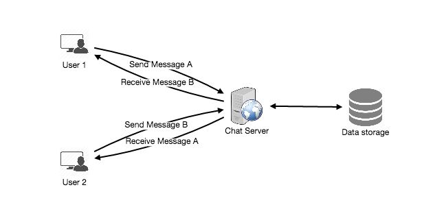
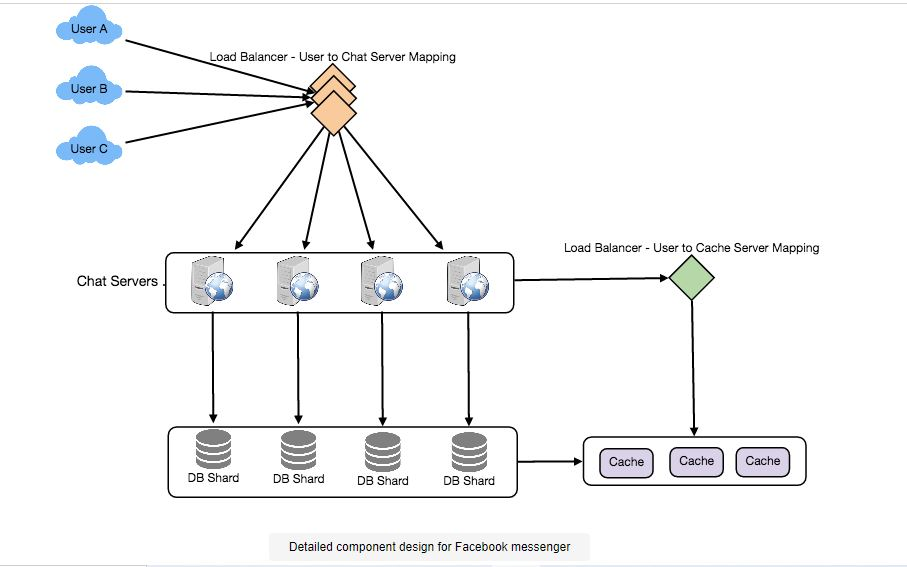

# Designing Facebook Messenger

## Problem Statement
Let's create a service similar to Facebook Messenger that allows users to send text messages to one another via online and mobile interfaces.

- Difficulty Level: Medium

### What is Facebook Messenger, exactly?
Facebook Messenger is a software application that allows users to send text-based instant messages. Messenger allows users to communicate with their Facebook friends from both their phones and the Facebook 

## Pratice Problem

***Let's get started on the system design solution.***

**If you run into any problems, please see the solution below.**

<!DOCTYPE html>
<html>
<head>
	<meta charset="UTF-8">
	<meta name="viewport" content="width=device-width, initial-scale=1.0">
	<meta name="description" content="X-Frame-Bypass: Web Component extending IFrame to bypass X-Frame-Options: deny/sameorigin">
</head>
<body>
    <a href="https://ej2.syncfusion.com/showcase/angular/diagrambuilder/" target="_blank">Pratice on full Screen</a>
      
	<iframe is="x-frame-bypass" src="https://ej2.syncfusion.com/showcase/angular/diagrambuilder/" width="725" height="500"></iframe>

      
    <h2>Hints to solve the problem</h2>

    <a href="https://jayaemekar.github.io/systemdesign/DesigningFacebookMessenger/#requirements-and-goals-of-the-system" target="_blank">1. Consider functional and non-functional requirements. </a>
      
    <a href="https://jayaemekar.github.io/systemdesign/DesigningFacebookMessenger/#capacity-estimation-and-constraints" target="_blank">2. Estimation of capacity and constraints, such as traffic, bandwidth, and storage. </a>
      
    <a href="https://jayaemekar.github.io/systemdesign/DesigningFacebookMessenger/#high-level-design" target="_blank">3. Consider High Level Design. </a>
      
    <a href="https://jayaemekar.github.io/systemdesign/DesigningFacebookMessenger/#detailed-component-design" target="_blank">4. How do you create a detailed component design? </a>
      
    <a href="https://jayaemekar.github.io/systemdesign/DesigningFacebookMessenger/#data-partitioning" target="_blank">5. What about data replication and partitioning?</a>
     
     
    <a href="https://jayaemekar.github.io/systemdesign/DesigningFacebookMessenger/#cache" target="_blank">6.  Consider Cache and Load Balancing </a>
     
  
</body>
</html>

## <h1>Solution<h1>

### Requirements and Goals of the System
Our Messenger should meet the following requirements:

**Functional Requirements:**

1. Messenger should allow users to have one-on-one talks.
2. Messenger should maintain track of its users' online and offline statuses.
3. Messenger should be able to save chat history indefinitely.

**Non-functional Requirements:**

1. Users should be able to chat in real time with minimal latency.
2. Our system should be extremely consistent, with consumers seeing the same conversation history across all of their devices.
3. We prefer Messenger's high availability, but we can live with reduced availability for the sake of consistency.

**Extended Requirements:**

1. Group Chats: Messenger should allow several users to converse in a group setting.
2. Push notifications: When users are offline, Messenger should be able to alert them of new messages.

### Capacity Estimation and Constraints
Assume we have 500 million daily active users, each of whom sends 40 messages each day, for a total of 20 billion messages every day.

**Storage Estimation:**  Assuming that a message is 100 bytes on average, we'd need 2TB of storage to store all of the communications for a single day.

                            20 billion messages * 100 bytes => 2 TB/day
To store five years of chat history, we would need 3.6 petabytes of storage.

                            2 TB * 365 days * 5 years ~= 3.6 PB
We would also need to keep user information and message metadata in addition to the chat messages (ID, Timestamp, etc.). Not to mention the fact that the above computation ignores data compression and replication.

**Bandwidth Estimation:** If our service is getting 2TB of data every day, this will give us 25MB of incoming data for each second.

                            2 TB / 86400 sec ~= 25 MB/s
Since each incoming message needs to go out to another user, we will need the same amount of bandwidth 25MB/s for both upload and download.

**High level estimates:**

                            Total messages	        20 billion per day
                            Storage for each day	2TB
                            Storage for 5 years	    3.6PB
                            Incomming data	        25MB/s
                            Outgoing data	        25MB/s

### High Level Design

On a high level, we'll require a chat server to function as the central hub, orchestrating all user communications. When a user wants to send a message to another user, they connect to the chat server and transmit the message to the server, which then sends it to the other user and stores it in the database.

 
  <kbd>
  
  </kbd>

The detailed workflow would be as follows:

1. User-A uses the chat server to send a message to User-B.
2. The server receives the message and responds to User-A with an acknowledgement.
3. The message is stored in the server's database and sent to User-B.
4. User-B receives the message and sends the server an acknowledgment.
5. The server informs User-A that the message was successfully sent to User-B.

### Detailed Component Design
Let's start with a simple approach that runs everything on a single server. Our system must be able to handle the following use scenarios at a high level:

- Receive and deliver incoming and outgoing messages.
- Messages are stored and retrieved from a database.
- Keep track of which users are online and which have gone offline, and inform all relevant users of these changes.

Let's go over each scenario one by one:

**a. Messages Handling**

**How would we efficiently send/receive messages?** 

A user must connect to the server and post messages for other users in order to send messages. The user has two options for receiving a message from the server:

- **Pull model:** Users can periodically query the server to see whether they have any new messages.

- **Push model:** Users can keep their connection to the server open and rely on the server to notify them when new messages arrive.

If we apply the first strategy, the server will need to keep track of messages that have yet to be delivered, and when the receiving user connects to the server to request a new message, the server will be able to return all of the pending messages. To reduce latency for the user, they must check the server frequently, and if there are no outstanding messages, they will most likely receive an empty response. This is a waste of resources and does not appear to be an effective solution.

If we apply our second strategy, in which all active users maintain a connection with the server, the server can transmit messages to the intended user as soon as they are received. Because the messages are delivered promptly on the opened connection, the server does not need to maintain track of the outstanding messages, and we have minimal latency.

**How will clients keep their connection to the server open?** 

- HTTP Long Polling or WebSockets are two options. 
- Clients can request information from the server using extended polling with the understanding that the server may not respond immediately. 
- Instead of returning an empty response if the server has no fresh data for the client when the poll is received, the server keeps the request open and waits for response information to become available. 
- The server provides the response to the client as soon as it receives fresh information, completing the open request. 
- The client can instantly send another server request for future updates after receiving the server answer.
- This results in significant gains in latency, throughput, and overall performance. 
- The long polling request may time out or be disconnected from the server, in which case the client must start over.

**How can the server keep track of all open connections in order to efficiently relay messages to users?** 

- The server can keep a hash table with the UserID as the key and the connection object as the value. 
- As a result, if the server receives a message for a user, it searches the hash table for that user's connection object and transmits the message on the open request.

**What happens if a message for a user who has gone offline is received by the server?** 

- The server can notify the sender of a delivery failure if the recipient has disconnected. 
- If the connection is temporary, such as when the receiver's long-poll request timed out, we should expect the user to reconnect. 
- In that instance, we can request that the sender transmit the message again. 
- This retry might be built into the client's logic, eliminating the need for users to retype their messages. 
- The server can also save the message and transmit it again whenever the receiver reconnects.

**How many chat servers are we going to need?** 

Let's assume there are 500 million connections at any given time. We'd need 10K such servers if a modern server can handle 50K concurrent connections at any given moment.

**How do we know which server is responsible for which user's connection?** 

In front of our chat servers, we can put a software load balancer in place that can map each UserID to a server and redirect the request..

**How should a 'deliver message' request be handled by the server?** 

When the server receives a new message, it must do the following:

- 1) Save the message in the database 
- 2) Send the message to the recipient 
- 3) Send the sender an acknowledgment

The chat server will first locate the server that holds the recipient's connection and transmit the message to that server, which will then send the message to the receiver. We don't have to wait for the message to be stored in the database before the chat server sends the acknowledgement to the sender (this can happen in the background). The next section discusses storing the message.

**How does the messenger keep track of the messages' sequence?** 

With each message, we can save a timestamp, which is the moment the message was received by the server. This will still not assure that clients receive messages in the correct order. The following is a scenario in which the server timestamp cannot establish the exact order of messages:

1. User-1 sends the server the message M1 for User-2.
2. At T1, the server gets M1.
3. In the meantime, User-2 sends User-1 a message M2 to the server.
4. At T2, the server gets the message M2, and T2 > T1.
5. The server sends messages M1 and M2 to User-2 and User-1, respectively.

As a result, User-1 will view M1 first, followed by M2, whereas User-2 will see M2 first, followed by M1.

To fix this, we need to assign a sequence number to each message sent to each client. This number will define the exact order in which messages are delivered to each user. Both clients will see a different perspective of the message sequence using this solution, but it will be consistent across all devices.

**b. Message storage and retrieval from the database**

When a new message is received, the chat server must save it in the database. We have two alternatives for doing so:

1. Create a new thread that will interact with the database to save the message.
2. Make an asynchronous database request to save the message.
While designing our database, we must keep the following in mind:

1. How to work with the database connection pool effectively.
2. How to retry requests that have failed.
3. Where should requests that failed after several retries be logged?
4. After all the issues have been rectified, how can I retry these logged requests (that failed after the retry)?

**How should we organize our storage?** 

- We need a database that can handle a high rate of tiny updates while also retrieving a large number of records rapidly. 
- This is necessary because we have a large number of small messages to insert into the database, and users are more interested in sequentially accessing the messages when querying.
- Because we can't afford to read/write a row from the database every time a user receives/sends a message, we can't utilize RDBMS like MySQL or NoSQL like MongoDB. 
- This will cause not just excessive latency in our service's core functions, but also a massive pressure on databases.

- A wide-column database solution like HBase can easily meet both of our requirements. 
- HBase is a column-oriented key-value NoSQL database that may store numerous values in different columns for a single key. 
- HBase is based on the Google BigTable database and runs on top of the Hadoop Distributed File System (HDFS). HBase groups data together to store new data in a memory buffer, which it then dumps to disk once the buffer is full. 
- This kind of storing not only allows you to store a large amount of little data fast, but it also allows you to retrieve rows by key or scan ranges of rows. 
- HBase is an efficient database for storing variable-sized data, which our business also requires.

**How should clients get data from the server quickly?** 

When retrieving data from the server, clients should use pagination. The size of the page may vary depending on the client; for example, cell phones have smaller screens, therefore we need fewer messages/conversations in the viewport.

**c. Managing user’s status**

We need to maintain track of each user's online/offline state and notify all affected users when that status changes. We can easily determine the user's current status because we keep a connection object on the server for all active users. With 500 million active users at any given time, broadcasting each status change to all relevant active users would use a significant amount of resources. Around this, we can apply the following optimization:

1. When a user first opens the app, it can see the current state of all of their pals.
2. We can send a failure to the sender and change the status on the client whenever a user sends a message to another user who has gone offline.
3. When a user logs in, the server can broadcast that information with a delay of a few seconds to determine if the person logs out immediately.
4. Clients can get the status of those users who are visible in the user's viewport from the server. This shouldn't be done frequently because the server broadcasts users' online status, and we can live with the stale offline status of users for a time.
5. We can pull the status whenever the client starts a new chat with another user.

 
  <kbd>
  
  </kbd>

**Design Summary:** 

- Clients will establish a connection with the chat server in order to deliver a message, which the server will then forward to the appropriate user. 
- To receive messages, all active users will maintain a connection with the server. On the lengthy poll request, the chat server will push new messages to the receiving user whenever a new message arrives. 
- HBase, which offers speedy tiny updates and range-based searches, can be used to store messages. The servers can advertise a user's online status to other users who are interested. 
- Clients can get fewer frequent status updates for people who are visible in the client's viewport.

### Data partitioning
We'll need to divide the data over numerous database servers because we'll be storing a lot of it (3.6PB for five years). What is our plan for partitioning?

**Partitioning based on UserID:**  

- Let's pretend we split based on the UserID hash so we can keep all of a user's messages in the same database. We'll have "3.6PB/4TB = 900" shards for five years if each DB shard is 4TB. 
- Let's assume we maintain 1K shards for the sake of simplicity. 
- So we'll use "hash(UserID) percent 1000" to obtain the shard number, and then store/retrieve the data from there. This segmentation approach will also make retrieving conversation history for any user very quick.
- We can start with fewer database servers and several shards on a single physical server in the beginning. 
- We can simply store several partitions on a single server because we may have multiple database instances on it. 
- To map many logical partitions on one physical server, our hash function must grasp this logical partitioning scheme.
- We can start with a large number of logical partitions that are mapped to fewer physical servers because we will keep an indefinite history of messages, and as our storage requirement grows, we can add more physical servers to disperse our logical partitions.

**Partitioning based on MessageID:** 

We should not utilize this technique since getting a range of messages from a chat would be exceedingly sluggish if we store different messages of a user on various database shards.

### Cache
We can cache a subset of recent messages (say, the last 15) in a subset of recent conversations displayed in a user's viewport (say last 5). Because we choose to store all of a user's communications on a single shard, the user's cache should also be on a single machine.

### Load balancing
In front of our chat servers, we'll need a load balancer that can map each UserID to a server that has the user's connection and then divert requests to that server. A load balancer would also be required for our caching servers.

### Fault tolerance and Replication
- What happens if a chat server goes down? Our chat servers are maintaining user connections. Should we create a system to transfer connections to another server if one goes down? 
- It's difficult to failover TCP connections to different servers; a simpler solution is to have clients reconnect automatically if the connection is lost.
- Should several copies of user messages be kept? 
- We can't have only one copy of a user's data since we won't be able to restore it if the server that has it crashes or goes down permanently. 
- We can either store several copies of the data on various servers or distribute and replicate it using techniques like Reed-Solomon encoding.

### Extended Requirements
**a. Group chat**

- Separate group-chat objects can be created in our system and saved on the chat servers. 
- GroupChatID is used to identify a group-chat object, which also keeps track of who is in the conversation. Our load balancer can send each group chat message to the server that handles that group chat based on GroupChatID, and the server that handles that group chat can iterate over all of the users in the chat to determine the server that handles each user's connection to deliver the message.

All group conversations can be stored in a distinct table partitioned by GroupChatID in databases.

**b. Push notifications**

- Users can only send messages to active users in our present architecture, and if the receiving user is offline, we transmit a failure to the sending user. 
- Our system will be able to send messages to people who are not online thanks to push notifications.
- Each user can opt-in to receive push notifications from their device (or a web browser) whenever a new message or event is received. 
- Each manufacturer has its own set of servers that handle the distribution of these notifications to users.
- To implement push notifications, we'll need to build up a Notification server that will collect messages for offline users and transmit them to the manufacturer's push notification server, which will then send them to the user's device.
