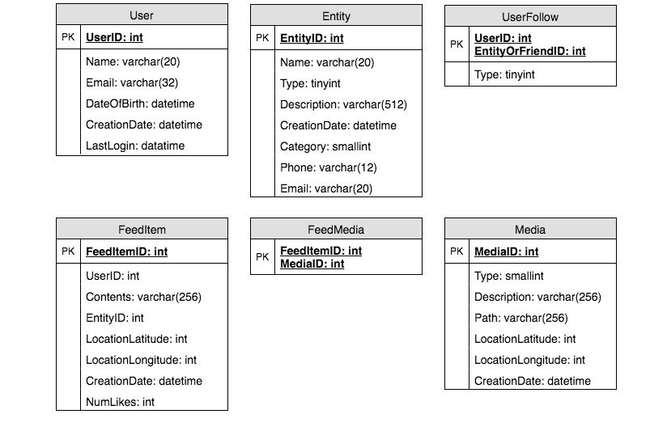
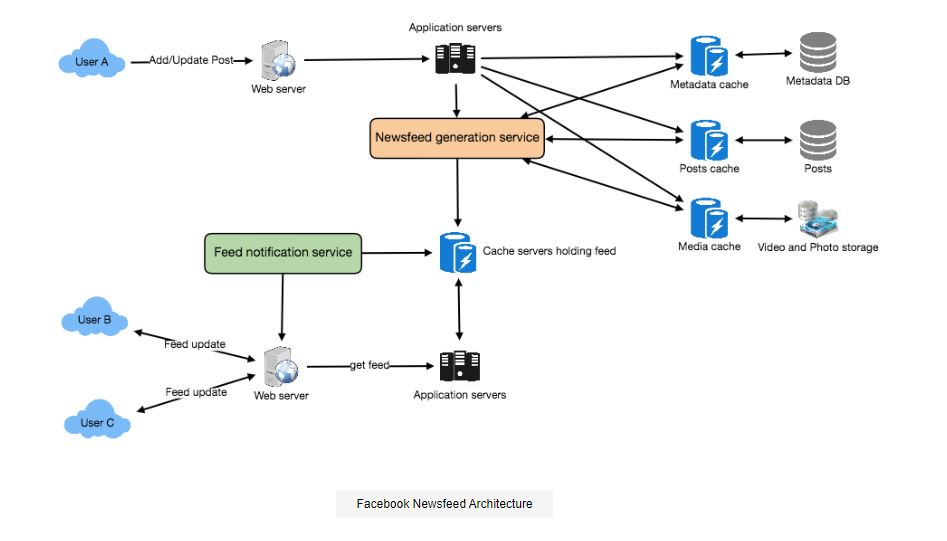

# Designing Facebook’s Newsfeed

## Problem Statement
Let's design Facebook's Newsfeed, which would contain posts, photos, videos, and status updates from all the people and pages a user follows.

- Similar Services: Twitter Newsfeed, Instagram Newsfeed, Quora Newsfeed
- Difficulty Level: Hard

### What is Facebook’s newsfeed?
The constantly updated list of stories in the centre of Facebook's site is known as a Newsfeed. It contains status updates, photographs, videos, links, app activity, and 'likes' from Facebook friends, pages, and groups. In other words, it's a collection of images, videos, locations, status updates, and other activities that form a comprehensive scrollable version of your friends' and your life story.

You'll need a newsfeed system to display updates from friends and followers on any social media site you create, whether it's Twitter, Instagram, or Facebook.

## Pratice Problem

***Let's get started on the system design solution.***

**If you run into any problems, please see the solution below.**

<!DOCTYPE html>
<html>
<head>
	<meta charset="UTF-8">
	<meta name="viewport" content="width=device-width, initial-scale=1.0">
	<meta name="description" content="X-Frame-Bypass: Web Component extending IFrame to bypass X-Frame-Options: deny/sameorigin">
</head>
<body>
    <a href="https://ej2.syncfusion.com/showcase/angular/diagrambuilder/" target="_blank">Pratice on full Screen</a>
      
	<iframe is="x-frame-bypass" src="https://ej2.syncfusion.com/showcase/angular/diagrambuilder/" width="725" height="500"></iframe>

      
    <h2>Hints to solve the problem</h2>

    <a href="https://jayaemekar.github.io/systemdesign/DesigningFacebookNewsfeed/#requirements-and-goals-of-the-system" target="_blank">1. Consider functional and non-functional requirements. </a>
      
    <a href="https://jayaemekar.github.io/systemdesign/DesigningFacebookNewsfeed/#capacity-estimation-and-constraints" target="_blank">2. Estimation of capacity and constraints, such as traffic, bandwidth, and storage. </a>
      
    <a href="https://jayaemekar.github.io/systemdesign/DesigningFacebookNewsfeed/#system-apis" target="_blank">3. Consider System APIs. </a>
      
    <a href="https://jayaemekar.github.io/systemdesign/DesigningFacebookNewsfeed/#database-design" target="_blank">4. How do you create a database system? </a>
      
    <a href="https://jayaemekar.github.io/systemdesign/DesigningFacebookNewsfeed/#high-level-system-designn" target="_blank">5. What about high level and component level design?</a>
     
     
    <a href="https://jayaemekar.github.io/systemdesign/DesigningFacebookNewsfeed/#data-partitioning" target="_blank">6.  Consider data partitioning</a>
     
  
</body>
</html>

## <h1>Solution<h1>

### Requirements and Goals of the System
Let’s design a newsfeed for Facebook with the following requirements:

**Functional requirements:**

1. A user's newsfeed will be based on posts from the individuals, pages, and groups that he or she follows.
2. A user may have a huge number of friends and follow numerous pages/groups.
3. Images, videos, and text can all be found in feeds.
4. For all active users, our service should allow adding new posts to the newsfeed as they arrive.

**Non-functional requirements:**

1. Our system should be capable of generating any user's newsfeed in real-time, with a maximum latency of 2 seconds visible to the end user.
2. If a new newsfeed request comes in, a post should appear in a user's feed in less than 5 seconds.

### Capacity Estimation and Constraints
Let’s assume on average a user has approximately 290-300 friends and follows 190-200 pages.

**Traffic estimates:** Assume 300 million daily active users, with each user fetching their timeline five times each day on average. This will result in 1.5 billion daily newsfeed requests, or about 17,500 requests every second.

**Storage estimates:** Let's imagine that each user's feed has roughly 500 posts that we wish to save in memory for a quick fetch request. Let's also assume that each post is 1KB in size on average. This means that each user will require approximately 500KB of data storage. We'd need 150TB of memory to store all of this info for all of the active users. We'd need roughly 1500 machines to retain the top 500 posts in memory for all active users if a server can hold 100GB.

### System APIs

To expose the functionality of our service, we can use SOAP or REST APIs. The API for retrieving the newsfeed could be defined as follows:

        getUserFeed(api_dev_key, user_id, since_id, count, max_id, exclude_replies)
**Parameters:**

- **api_dev_key (string):** The API developer key of a registered user can be used to throttle users based on their quota allocation, among other things.
- **user_id (number):** The ID of the user for whom the system will generate the newsfeed.
- **since_id (number):** Optional; returns results with an ID higher than (that is, more recent than) the specified ID.
- **count (number):** Optional; specifies the number of feed items to try and retrieve up to a maximum of 200 per distinct request.
- **max_id (number):** Optional; returns results with an ID less than (that is, older than) or equal to the specified ID.
- **exclude_replies(boolean):** Optional; this parameter will prevent replies from appearing in the returned timeline.

**Returns: (JSON)** Returns a JSON object containing a list of feed items.

### Database Design
User, Entity (e.g. page, group, etc.) and FeedItem are the three main objects (or Post). Here are some observations about these entities' relationships:

1. A user can follow and become friends with other entities.
2. FeedItems, which can comprise text, images, or videos, can be posted by both users and entities.
3. Each FeedItem will be assigned a UserID that will refer to the person who generated it. Let's pretend that just users can produce feed items for the sake of simplicity, while Facebook Pages can also post feed items.
4. Each FeedItem can have an EntityID that points to the page or group where the post was created as an option.

If we're working with a relational database, we'll need to model two relationships: User-Entity and FeedItem-Media. We can keep this relationship in a separate table because each user can be friends with a lot of individuals and follow a lot of things. In "UserFollow," the "Type" column indicates whether the entity being followed is a User or an Entity. Similarly, a table for FeedMedia relations can be created.

 
  <kbd>
  
  </kbd>

### High Level System Design
At a high level this problem can be divided into two parts:

**Feed generation:** 

The posts (or feed items) of persons and entities (pages and groups) that a user follows are used to create the newsfeed. So, whenever our system receives a request to build a feed for a certain user (let's say Jane), we'll do the following:

1. Get the IDs of all the users and entities Jane is following.
2. For those IDs, get the most recent, popular, and relevant posts. These are the possible posts to display on Jane's newsfeed.
3. Determine the importance of these jobs to Jane. This is Jane's most recent feed.
4. Save this feed in the cache and present the top posts (say 20) on Jane's feed.
5. When Jane reaches the end of her current feed, she can use the front-end to fetch the following 20 posts from the server, and so on.

It's worth noting that we just generated the feed once and saved it in the cache. What about fresh posts from Jane's friends and followers? We should be able to rate and add those new posts to Jane's feed if she is online. We can repeat the above processes every five minutes or so to rate and add the latest posts to her feed. Jane can then be notified when newer items in her feed become available for her to fetch.

**Feed publishing:** 

Jane must request and pull feed articles from the server every time she loads her newsfeed page. She can pull new data from the server when she reaches the end of her current stream. For newer things, the server can either notify Jane, who can then pull or push these new posts, or the server can notify Jane, who can then pull or push these new posts. We'll go through these alternatives in further detail later.

Our Newsfeed service will require the following components at a high level:

- **1. Web servers:** Maintaining the user's connection. Data will be transferred between the user and the server over this connection.
- **2. Application server:** To carry out workflows for saving new postings in database servers. To retrieve and push the newsfeed to the end user, we'll also need some application servers.
- **3. Metadata database and cache:** To store the metadata about Users, Pages, and Groups.
- **4. Posts database and cache:** To store metadata about posts and their contents.
- **5. Video and photo storage, and cache:** Blob storage, to store all the media included in the posts.
- **6. Newsfeed generation service:** To gather and rank all relevant posts for a user's newsfeed generation and cache storage. This service will also receive real-time updates, and these updated feed items will be added to any user's timeline.
- **7. Feed notification service:** To alert the user that newer items have been added to their newsfeed.
Our system's high-level architecture diagram is shown below. User A is being followed by User B and C.

 
  <kbd>
  
  </kbd>

### Detailed Component Design
Let’s discuss different components of our system in detail.

**a. Feed generation**

Take, for example, the newsfeed creation service retrieving the most recent postings from all the persons and entities Jane follows; the query would be:

        (SELECT FeedItemID FROM FeedItem WHERE UserID in (
            SELECT EntityOrFriendID FROM UserFollow WHERE UserID = <current_user_id> and type = 0(user))
        )
        UNION
        (SELECT FeedItemID FROM FeedItem WHERE EntityID in (
            SELECT EntityOrFriendID FROM UserFollow WHERE UserID = <current_user_id> and type = 1(entity))
        )
        ORDER BY CreationDate DESC 
        LIMIT 100
This concept for the feed generating service has the following flaws:

Users with a large number of friends/followers will notice a significant slowdown because we must sift, merge, and rank a large number of postings.
When a user loads their page, we construct the timeline. This would be extremely slow and have a significant amount of delay.
Each status update will result in feed updates for all followers for live updates. This may cause significant delays in our Newsfeed Generation Service.
For live updates, the server pushing (or notifying users about) newer postings could result in extremely high loads, particularly for people or sites with a large following. We can pre-generate the timeline and save it in memory to increase efficiency.

**Offline generation for newsfeed:** We can have dedicated servers that are constantly creating and storing users' newsfeeds in memory. As a result, anytime a user requests new entries for their feed, we may simply provide them from the previously generated, cached location. Users' newsfeeds are not compiled on demand with this scheme, but rather on a regular basis and returned to them whenever they request it.

When these servers need to build a feed for a user, they'll first check to see when the feed was last generated for that user. From that point on, new feed data would be generated. We may store this information in a hash table with UserID as the "key" and STRUCT as the "value" as seen below:

            Struct {
                LinkedHashMap<FeedItemID, FeedItem> feedItems;
                DateTime lastGenerated;
            }
FeedItemIDs can be stored in a data structure similar to Linked HashMap or TreeMap, allowing us to simply jump to any feed item as well as loop across the map. Users can send the last FeedItemID they see in their newsfeed whenever they want more feed items, and we can jump to that FeedItemID in our hash-map and retrieve the next batch/page of feed items from there.

**How many feed items should we store in memory for a user’s feed?** 

- We can choose to save 500 feed items per user at first, but this quantity can be changed later based on usage patterns. 
- For example, if one page of a user's feed has 20 items and most users never visit more than ten pages of their feed, we can keep just 200 posts per user. 
- We can always query backend servers for every user who wishes to see more posts (than what is stored in memory).

**Should we generate (and keep in memory) newsfeeds for all users?** 

- There will be many users who do not log in on a regular basis. 
- Here are several options for dealing with this: 
   1) A simpler solution could be to employ an LRU-based cache to remove users from memory who haven't seen their newsfeed in a long time. 
   2) A smarter system can figure out a user's login pattern to pre-generate their newsfeed, such as when a user is active and on which days of the week they read their newsfeed. etc.

In the next section, we'll look at various solutions to our "live updates" issues.

**b. Feed publishing**

A fanout is the process of sending a post to all of your followers. The push strategy is known as fanout-on-write, whereas the pull approach is known as fanout-on-load. Let's look at the many possibilities for distributing feed data to users.

**“Pull” model or Fan-out-on-load:** 

- This strategy involves storing all recent feed data in memory so that users can retrieve it whenever they need it from the server. 
- Clients can pull data from the stream on a regular basis or whenever they require it manually. This strategy has the following drawbacks: 
  a) Users may not see fresh data until they send a pull request; 
  b) It's difficult to determine the correct pull cadence, as most pull requests would return an empty response if there is no new data, wasting resources.

**“Push” model or Fan-out-on-write:** 

- With a push system, if a user publishes a post, it can be instantaneously pushed to all followers. 
- The benefit is that you don't have to go through your buddy list and get feeds for each of them when fetching feeds. 
- It decreases read operations greatly. 
- Users must keep a Long Poll request with the server to receive updates in an effective manner. 
- A potential flaw in this strategy is that when a user (a superstar) has millions of followers, the server must push changes to a large number of individuals.

**Hybrid:** 

- A hybrid strategy to handling feed data, combining fan-out-on-write and fan-out-on-load, could be used as an alternative. We can, for example, stop pushing posts from users with a large number of followers (celebrities) and only send data to people with a few hundred (or thousand) followers. 
- We can allow the followers of celebrities pull the updates. 
- We can save a lot of resources by blocking fanout for users who have a lot of friends or follows because the push operation can be very expensive for them. 
- Another option is to limit the fanout to only her online friends after a user writes a post. 
- A mix of 'push to notify' and 'pull for serving' end users is also a wonderful method to get the most out of both approaches. 
- A model that is solely push or pull is less versatile.

**How many feed items can we return to the client in each request?** 

- We should set a limit on how many items a user can retrieve in a single request (say 20). 
- However, we should allow the client to define the amount of feed items they want with each request because the user may wish to fetch a varied number of posts depending on the device (mobile vs. desktop).

**Should we always notify users if there are new posts available for their newsfeed?** 

- Users may find it beneficial to be notified when new data becomes available. 
- On mobile devices, however, when data usage is relatively expensive, it can waste bandwidth. 
- As a result, we can opt not to push data to mobile devices and instead allow users to "Pull to Refresh" for new postings.

### Feed Ranking
- The simplest straightforward approach to rank items in a newsfeed is by their creation time, but today's ranking algorithms go far further to ensure that "important" messages are prioritized. 
- The high-level goal behind ranking is to find out how to integrate crucial "signals" that make a post relevant before calculating a final ranking score.
- More specifically, we can choose features that are related to the importance of any feed item, such as the number of likes, comments, shares, time of the update, whether the article contains images/videos, and so on, and then use these features to create a score. This is usually sufficient for a basic ranking system. 
- By regularly monitoring if we are making progress in terms of user stickiness, retention, ad income, and so on, a better ranking system may greatly enhance itself.

### Data Partitioning

**a. Sharding posts and metadata**

- We need to divide our data across numerous machines so that we can read and write it quickly because we have a large number of new postings every day and our read load is also incredibly high. 
- We can use a scheme similar to the one described in Designing Twitter for sharding our databases that store posts and their metadata.

**b. Sharding feed data**

- We can partition feed data that is being kept in memory based on UserID. 
- We can try storing all of a user's data on a single server. We can supply the UserID to our hash function when storing, and it will map the user to a cache server where the user's feed objects will be stored. 
- Also, because we don't anticipate to keep more than 500 FeedItmeIDs per user, we won't come into a situation where a person's feed data won't fit on a single server. 
- We would always have to contact only one server to retrieve a user's feed. 
- Consistent Hashing is required for future development and replication.