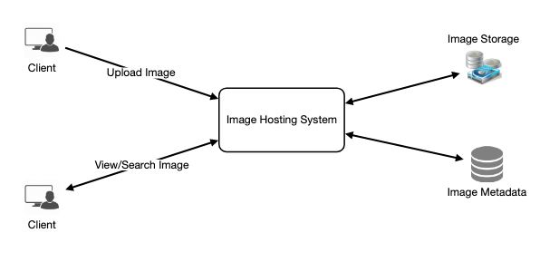

## Designing Instagram

Let's design a photo-sharing service like Instagram, where users can upload photos to share them with other users.

Similar Services: Flickr, Picasa
Difficulty Level: Medium

## 1. What is Instagram?
Instagram is a social networking service which enables its users to upload and share their photos and videos with other users. Instagram users can choose to share information either publicly or privately. Anything shared publicly can be seen by any other user, whereas privately shared content can only be accessed by a specified set of people. Instagram also enables its users to share through many other social networking platforms, such as Facebook, Twitter, Flickr, and Tumblr.

For the sake of this exercise, we plan to design a simpler version of Instagram, where a user can share photos and can also follow other users. The ‘News Feed’ for each user will consist of top photos of all the people the user follows.

## 2. Requirements and Goals of the System

We’ll focus on the following set of requirements while designing the Instagram:

### Functional Requirements

1. Users should be able to upload/download/view photos.
2. Users can perform searches based on photo/video titles.
3. Users can follow other users.
4. The system should be able to generate and display a user’s News Feed consisting of top photos from all the people the user follows.

### Non-functional Requirements

1. Our service needs to be highly available.
2. The acceptable latency of the system is 200ms for News Feed generation.
3. Consistency can take a hit (in the interest of availability), if a user doesn’t see a photo for a while; it should be fine.
4. The system should be highly reliable; any uploaded photo or video should never be lost.

Not in scope: Adding tags to photos, searching photos on tags, commenting on photos, tagging users to photos, who to follow, etc.

## 3. Some Design Considerations
The system would be read-heavy, so we will focus on building a system that can retrieve photos quickly.

1. Practically, users can upload as many photos as they like. Efficient management of storage should be a crucial factor while designing this system.
2. Low latency is expected while viewing photos.
3. Data should be 100% reliable. If a user uploads a photo, the system will guarantee that it will never be lost.

## 4. Capacity Estimation and Constraints
Let’s assume we have 500M total users, with 1M daily active users.
2M new photos every day, 23 new photos every second.
Average photo file size => 200KB
Total space required for 1 day of photos

                    2M * 200KB => 400 GB
Total space required for 10 years:

                    400GB * 365 (days a year) * 10 (years) ~= 1425TB

## 5. High Level System Design
At a high-level, we need to support two scenarios, one to upload photos and the other to view/search photos. Our service would need some object storage servers to store photos and also some database servers to store metadata information about the photos.

 
  <kbd>
  
  </kbd>

