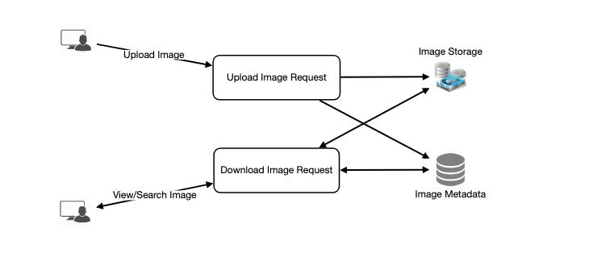

# Designing Instagram

## Problem Statement
Let's create a photo-sharing site similar to Instagram, where users can post photographs to share with others.

- Similar Services: Flickr, Picasa
- Difficulty Level: Medium

### What exactly is Instagram?
- Instagram is a social media platform that allows users to upload and share photographs and videos with other people. Users can opt to publish information publicly or privately on Instagram. 
- Any user can see anything published publicly, whereas privately shared items can only be accessed by a limited number of people. 
- Instagram also allows users to share via a variety of other social media platforms, including Facebook, Twitter, Flickr, and Tumblr.

We want to create a simplified version of Instagram for this experiment, where users can share photographs and follow other users. Each user's 'News Feed' will comprise of the top photos of everyone they follow.

## Pratice Problem

***Let's get started on the system design solution.***

**If you run into any problems, please see the solution below.**

<!DOCTYPE html>
<html>
<head>
	<meta charset="UTF-8">
	<meta name="viewport" content="width=device-width, initial-scale=1.0">
	<meta name="description" content="X-Frame-Bypass: Web Component extending IFrame to bypass X-Frame-Options: deny/sameorigin">
</head>
<body>
    <a href="https://jayaemekar.github.io/praticedesign/" target="_blank">Pratice on full Screen</a>
      
	<iframe is="x-frame-bypass" src="https://ej2.syncfusion.com/showcase/angular/diagrambuilder/" width="725" height="500"></iframe>

      
    <h2>Hints to solve the problem</h2>

    <a href="https://jayaemekar.github.io/systemdesign/DesigningInstagram/#requirements-and-goals-of-the-system" target="_blank">1. Consider functional and non-functional requirements. </a>
      
    <a href="https://jayaemekar.github.io/systemdesign/DesigningInstagram/#capacity-estimation-and-constraints" target="_blank">2. Estimation of capacity and constraints, such as traffic, bandwidth, and storage. </a>
      
    <a href="https://jayaemekar.github.io/systemdesign/DesigningInstagram/#high-level-system-design" target="_blank">3. Discuss about High level design. </a>
      
    <a href="https://jayaemekar.github.io/systemdesign/DesigningInstagram/#database-schema" target="_blank">4. How do you create a database system? </a>
      
    <a href="https://jayaemekar.github.io/systemdesign/DesigningInstagram/#ranking-and-news-feed-generation" target="_blank">5. What about ranking news feed generation ?</a>
     
     
    <a href="https://jayaemekar.github.io/systemdesign/DesigningInstagram/#cache-and-load-balancing" target="_blank">6.  Consider Cache and Load Balancing </a>
     
  
</body>
</html>

## <h1>Solution<h1>

### Requirements and Goals of the System

While designing the Instagram, we'll concentrate on the following set of requirements:

**Functional Requirements**

1. Photos should be able to be uploaded, downloaded, and viewed.
2. Users can do searches based on the titles of photos and videos.
Users can follow each other.
4. The system should be able to create and show a user's News Feed, which includes the best photos from everyone the user follows.

**Non-functional Requirements**

1. Our service must be really accessible.
2. For News Feed creation, the system's allowable latency is 200ms.
3. If a user doesn't see a photo for a time, consistency may suffer (in the interest of availability); it should be acceptable.
4. The system should be extremely dependable; no photo or video uploaded should ever be deleted.

**Not in scope:** Adding tags to photos, searching photos on tags, commenting on photos, tagging users to photos, who to follow, etc.

### Some Design Considerations
We'll focus on designing a system that can fetch photographs quickly because the system will be read-heavy.

1. Users can practically upload as many photographs as they like. Storage management should be a key consideration when constructing this system.
2. When viewing photos, expect low latency.
3. Data should be completely trustworthy. When a user submits a photograph, the system ensures that it is never lost.

### Capacity Estimation and Constraints
Let’s assume we have 500M total users, with 1M daily active users.
2M new photos every day, 23 new photos every second.
Average photo file size => 200KB
Total space required for 1 day of photos

                    2M * 200KB => 400 GB
Total space required for 10 years:

                    400GB * 365 (days a year) * 10 (years) ~= 1425TB

### High Level System Design
We need to enable two situations at a high level: one for uploading images and another for viewing/searching photos. Our service would require some object storage servers for photographs and database servers for metadata information.

 
  <kbd>
  
  </kbd>

### Database Schema
**💡 Defining the database schema early in the interview will aid in understanding the data flow between various components and will eventually lead to data segmentation.**

We need to keep track of users' uploaded photos and the people they follow. The Photo table will record all information about a photo; we'll need an index on (PhotoID, CreationDate) because we'll want to get the most recent photos first.

 
  <kbd>
  
  </kbd>

Because we need joins, a straight simple approach for storing the above schema would be to utilize an RDBMS like MYSQL, however relational databases have their own set of problems. especially when they need to be scaled

Photos can be stored in a distributed file system like HDFS or S3.

To take use of NoSQL's features, we can store the above schema in a distributed key-value store. All photo metadata can be stored in a table with the 'PhotoID' as the key and an object including PhotoLocation, UserLocation, CreationTimestamp, and so on as the value.

To know who owns which photo, we need to store relationships between users and photos. We also need to keep track of who a user follows. We can use a wide-column datastore like Cassandra for both of these tables. The 'key' for the 'UserPhoto' table would be 'UserID,' and the 'value' would be the user's list of 'PhotoIDs,' kept in distinct columns. The 'UserFollow' table will follow a similar pattern.

Cassandra, like all key-value stores, keeps a set number of replicas to ensure reliability. Furthermore, in such data storage, deletes are not applied immediately; data is held for a specified number of days (to allow for undeleting) before being completely erased from the system.

### Data Size Estimation

Let’s estimate how much data will be going into each table and how much total storage we will need for 10 years.

**User:** Assuming each “int” and “dateTime” is four bytes, each row in the User’s table will be of 68 bytes:

        UserID (4 bytes) + Name (20 bytes) + Email (32 bytes) + DateOfBirth (4 bytes) + CreationDate (4 bytes) + LastLogin (4 bytes) = 68 bytes
If we have 500 million users, we will need 32GB of total storage.

        500 million * 68 ~= 32GB

**Photo:** Each row in Photo’s table will be of 284 bytes:

        PhotoID (4 bytes) + UserID (4 bytes) + PhotoPath (256 bytes) + PhotoLatitude (4 bytes) + PhotLongitude(4 bytes) + UserLatitude (4 bytes) + UserLongitude (4 bytes) + CreationDate (4 bytes) = 284 bytes
If 2M new photos get uploaded every day, we will need 0.5GB of storage for one day:

        2M * 284 bytes ~= 0.5GB per day
For 10 years we will need 1.88TB of storage.

**UserFollow:** Each row in the UserFollow table will consist of 8 bytes. If we have 500 million users and on average each user follows 500 users. We would need 1.82TB of storage for the UserFollow table:

        500 million users * 500 followers * 8 bytes ~= 1.82TB
Total space required for all tables for 10 years will be 3.7TB:

        32GB + 1.88TB + 1.82TB ~= 3.7TB

### Component Design

- Photo uploads (or writes) are slow because they must write to the disk, while reads are faster, especially if they are served from cache.
- Because uploading is a slow procedure, uploading users can absorb all available connections. 
- This means that if the system becomes overburdened with write requests,'reads' will not be served. Before developing our system, we should keep in mind that web servers have a connection restriction. 
- We can't have more than 500 concurrent uploads or reads if we think a web server can only handle 500 connections at any given moment. 
- We can split reading and writes into distinct services to alleviate this bottleneck. To guarantee that uploads do not clog the system, we will have dedicated servers for readers and separate servers for writes.
- Separating read and write requests for photos will allow us to scale and optimize each of these activities separately.

 
  <kbd>
  
  </kbd>

### Reliability and Redundancy
- Our service does not allow you to lose files. As a result, we'll keep numerous copies of each picture so that if one storage server fails, we can still access the photo from another storage server.
- The same idea applies to the system's other components. 
- If we want the system to be highly available, we must have several clones of services running in the system, so that even if a few services fail, the system remains operational. Redundancy eliminates the system's single point of failure.
- If only one instance of a service is required to run at any one time, we can deploy a redundant secondary copy that is not providing any traffic but can assume control after the original fails.
- Adding redundancy to a system can eliminate single points of failure and provide backup or emergency functionality. If two instances of the same service are running in production and one of them fails or degrades, the system can failover to the healthy copy. 
- Failover can occur automatically or with the need for user intervention.

 
  <kbd>
  
  </kbd>

### Data Sharding
Let's look at several possible metadata sharding schemes:

**a. Partitioning based on UserID**  

- Assume we shard based on the 'UserID' in order to maintain all of a user's images on the same shard. 
- We'll need four DB shards to store 3.7TB of data if each DB shard is 1TB. 
- Assume we keep 10 shards for improved performance and scalability.
- So we'll use UserID percent 10 to discover the shard number and then save the data there. 
- We can attach a shard number to each PhotoID to uniquely identify any photo in our system.

**How can we generate PhotoIDs?** 

Each DB shard can have its own auto-increment sequence for PhotoIDs and since we will append ShardID with each PhotoID, it will make it unique throughout our system.

**What are the different issues with this partitioning scheme?**

  1. How would we deal with unhappy users? Many people follow such popular users, and many more people see whatever photo they post.
  2. Some users will have more photos than others, resulting in a non-uniform storage distribution.
  3. What if we can't fit all of a user's photos onto one shard? Will distributing a user's photographs across several shards result in longer latencies?
  4. Storing all of a user's images on a single shard might lead to concerns such as the loss of all of the user's data if that shard goes down, or increased latency if it is serving a large load, among other things.

**b. Partitioning based on PhotoID** 

- If we can generate unique PhotoIDs first and then find a shard number through “PhotoID % 10”, the above problems will have been solved. 
- We would not need to append ShardID with PhotoID in this case as PhotoID will itself be unique throughout the system.

**How can we generate PhotoIDs?** 

- Here we cannot have an auto-incrementing sequence in each shard to define PhotoID because we need to know PhotoID first to find the shard where it will be stored. 
- One solution could be that we dedicate a separate database instance to generate auto-incrementing IDs. 
- If our PhotoID can fit into 64 bits, we can define a table containing only a 64 bit ID field. 
- So whenever we would like to add a photo in our system, we can insert a new row in this table and take that ID to be our PhotoID of the new photo.

**Wouldn’t this key generating DB be a single point of failure?** 

- Yes, it would be. A workaround for that could be defining two such databases with one generating even numbered IDs and the other odd numbered. 
- For the MySQL, the following script can define such sequences:

        KeyGeneratingServer1:
        auto-increment-increment = 2
        auto-increment-offset = 1
        
        KeyGeneratingServer2:
        auto-increment-increment = 2
        auto-increment-offset = 2

- We can place a load balancer in front of each of these databases to ensure round robin and minimize downtime. Both servers may be out of sync, with one producing more keys than the other, but this will not affect our system. 
- This architecture can be extended by creating distinct ID tables for Users, Photo-Comments, and other items in our system.
- Alternatively, we can use a 'key' creation technique like the one described in Designing a URL Shortening Service Like TinyURL.

**How can we prepare for our system's future expansion?** 

- To support future data growth, we can have a high number of logical partitions, so that several logical partitions can live on a single physical database server at first. 
- We can have distinct databases for each logical partition on any server since each database server can have numerous database instances. 
- So, whenever we suspect a database server is overburdened with data, we can move some logical partitions to another server. We can keep a configuration file (or a separate database) that maps our logical partitions to database servers, allowing us to quickly move partitions around. 
- We only have to shift a partition when we need to.

### Ranking and News Feed Generation

To make a user's News Feed, we need to get the most recent, popular, and relevant photographs from the people they follow.

- Let's pretend we need to get the top 100 photographs for a user's News Feed for the sake of simplicity. 
- Our application server will first obtain a list of persons the user follows, and then retrieve metadata information for the user's most recent 100 images. 
- The server will then submit all of these photographs to our ranking system, which will select the top 100 photos (based on recency, likeness, and other factors) and return them to the user. 
- Because we must query many tables and conduct sorting, merging, and ranking on the results, this strategy may have increased latency. 
- We can pre-generate the News Feed and store it in a separate table to increase efficiency.

**Generating the News Feed in Advance:** 

- We can have dedicated servers that generate users' News Feeds on a regular basis and store them in a 'UserNewsFeed' database. 
- So, whenever a user wants the most recent photos for their News Feed, we'll just query this table and provide them the results.
- When these servers need to generate a user's News Feed, they first look in the UserNewsFeed database to see when the user's News Feed was last generated. 
- From that point forward, new News Feed data will be generated (following the steps mentioned above).

***What are the different approaches for sending News Feed contents to the users?***

**1. Pull:** 

  - Clients can get the contents of the News Feed from the server on a regular basis or whenever they require it manually. 
  - This strategy has the following drawbacks: 

     - a) New data may not be visible to users until clients initiate a pull request; 
     - b) Most pull requests will return an empty response if there is no new data.

**2. Push:** 

- As soon as fresh data becomes available, servers can push it to users. 
- Users must keep a Long Poll request with the server to receive updates in an effective manner. 
- A person with a large number of followers or a superstar with millions of followers could be a problem with this strategy because the server would have to push changes often.

**3. Hybrid:** 

- A hybrid approach is possible. We can switch all users with a lot of followers to a pull-based paradigm and just push data to those with a few hundred (or thousands) followers. 
- Another option is for the server to transmit changes to all users at a set frequency, allowing those with a lot of follows/updates to pull data on a regular basis.

Designing Facebook's Newsfeed contains a detailed description of News Feed production.

### News Feed Creation with Sharded Data

- One of the most significant requirements for creating a user's News Feed is to get the most recent photos from everyone the user follows. 
- We'll need a way to sort images according to when they were taken. 
- We can do this more efficiently by including photo production time in the PhotoID. 
- We will be able to find the most recent PhotoIDs quickly since we will have a primary index on PhotoID.

- For this, we can utilize epoch time. 
- Let's pretend our PhotoID has two parts: the first represents the epoch time, and the second is an auto-incrementing sequence. 
- To create a new PhotoID, we can use the current epoch time and an auto-incrementing ID from our key-generating database. From this PhotoID (PhotoID percent 10) we can calculate the shard number and place the photo there.

**What is the maximum size of our PhotoID?** If our epoch begins today, how many bits would be required to store the number of seconds over the following 50 years?

        86400 sec/day * 365 (days a year) * 50 (years) => 1.6 billion seconds
This number would require 31 bits to store. We can devote 9 bits to store the auto incremented sequence because we predict 23 new images each second on average. So we can store (29 => 512) fresh photographs every second. Every second, we can reset our auto incrementing sequence.

In Designing Twitter, we'll go over this concept in further depth under the heading 'Data Sharding.'

### Cache and Load balancing

- To serve the worldwide spread consumers, our service would require a large-scale photo delivery infrastructure. 
- Our service should leverage a large number of geographically distributed photo cache servers and CDNs to bring its material closer to the user (for details see Caching).

- To cache hot database rows, we can add a cache to metadata servers. We can use Memcache to cache the data, and application servers can quickly check if the cache contains the needed rows before reaching the database.
- For our system, the Least Recently Used (LRU) policy may be an appropriate cache eviction policy. The least recently viewed row is discarded first under this policy.

**How can we build more intelligent cache?** If we go with 80-20 rule, i.e., 20% of daily read volume for photos is generating 80% of traffic which means that certain photos are so popular that the majority of people read them. This dictates that we can try caching 20% of daily read volume of photos and metadata.