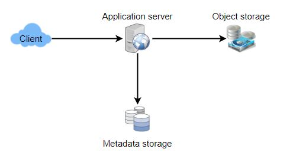

# Designing Pastebin

## Problem Statement

Let's create a web service that works like Pastebin and allows users to save plain text. Users will submit a text fragment and receive a randomly generated URL to access it.

- Similar Services: pastebin.com, pasted.co, chopapp.com
- Difficulty Level: Easy

### What is Pastebin, exactly?

Pastebin-style services allow users to upload plain text or images to a network (usually the Internet) and generate unique URLs to retrieve the data. Users can also utilize such services to swiftly distribute data over the network by just passing the URL to other users.

If you haven't used pastebin.com before, you should try making a new 'Paste' there and spending some time exploring the various choices available.

## Pratice Problem

***Let's get started on the system design solution.***

**If you run into any problems, please see the solution below.**

<!DOCTYPE html>
<html>
<head>
	<meta charset="UTF-8">
	<meta name="viewport" content="width=device-width, initial-scale=1.0">
	<meta name="description" content="X-Frame-Bypass: Web Component extending IFrame to bypass X-Frame-Options: deny/sameorigin">
</head>
<body>
    <a href="https://jayaemekar.github.io/praticedesign/" target="_blank">Pratice on full Screen</a>
      
	<iframe is="x-frame-bypass" src="https://ej2.syncfusion.com/showcase/angular/diagrambuilder/" width="725" height="500"></iframe>

      
    <h2>Hints to solve the problem</h2>

    <a href="https://jayaemekar.github.io/systemdesign/DesigningPastebin/#requirements-and-goals-of-the-system" target="_blank">1. Consider functional and non-functional requirements. </a>
      
    <a href="https://jayaemekar.github.io/systemdesign/DesigningPastebin/#some-design-considerations" target="_blank">2. Estimation of capacity and constraints, such as traffic, bandwidth, and storage. </a>
      
    <a href="https://jayaemekar.github.io/systemdesign/DesigningPastebin/#system-apis" target="_blank">3. Consider System APIs. </a>
      
    <a href="https://jayaemekar.github.io/systemdesign/DesigningPastebin/#component-design" target="_blank">4. How do you create a database system? </a>
      
    <a href="https://jayaemekar.github.io/systemdesign/DesigningPastebin/#data-partitioning-and-replication" target="_blank">5. What about data replication and partitioning?</a>
     
     
    <a href="https://jayaemekar.github.io/systemdesign/DesigningPastebin/#cache" target="_blank">6.  Consider Cache and Load Balancing </a>
       

</body>
</html>

## <h1>Solution<h1>

### Requirements and Goals of the System

The following requirements should be met by our Pastebin service:

**Functional Requirements:**

1. Users should be able to upload or "paste" their data and receive a unique URL with which to view it.
2. Users will be limited to text uploads.
3. Data and links will automatically expire after a set period of time; users should also be allowed to set the 4. expiration time.
4. Users should be allowed to choose a custom alias for their paste as an option.

**Non-Functional Requirements:**

1. The system must be extremely dependable, and any data uploaded must not be lost.
2. The system should have a high level of availability. This is necessary because users will be unable to access their Pastes if our service is unavailable.
3. Users should have real-time access to their Pastes with minimal delay.
4. Paste links should be impossible to guess (not predictable).

**Extended Requirements:**

1. Analytics, such as the number of times a paste was accessed.
2. Other services should be able to access our service via REST APIs.

### Some Design Considerations
Although Pastebin and URL Shortening share similar criteria, there are also extra design considerations to keep in mind.

What should the maximum quantity of text a user can paste at one time be? To prevent misuse of the service, we can limit users' Paste sizes to no more than 10MB.

Should we limit the size of custom URLs? Users can use whatever URL they want because our service supports custom URLs, however giving a custom URL is not required. However, imposing a size limit on custom URLs is reasonable (and frequently desirable) in order to maintain a consistent URL database.

Our services will be heavily read-heavy, with more read requests than new Pastes production. We can assume a read-to-write ratio of 5:1.

**Traffic estimates**

Pastebin services are not expected to have the same level of traffic as Twitter or Facebook, so let's pretend we get one million new pastes every day. This gives us a total of five million daily reads.

New Pastes per second:

                    1M / (24 hours * 3600 seconds) ~= 12 pastes/sec
Paste reads per second:

                    5M / (24 hours * 3600 seconds) ~= 58 reads/sec

**Storage estimates:** 
Users can upload up to 10MB of data; Pastebin-like services are frequently used to share source code, configurations, and logs. Because such texts aren't particularly large, let's say that each paste is 10KB on average.

We'll be storing 10GB of data per day at this rate.

                    1M * 10KB => 10 GB/day
We would require a total storage capacity of 36TB to store this data for ten years.

In ten years, we will have 3.6 billion pastes if 1 million pastes are produced every day. To uniquely identify these pastes, we need to generate and store keys. We'd need six letters strings if we used base64 encoding ([A-Z, a-z, 0-9,., -]):

                    64^6 ~= 68.7 billion unique strings
If it takes one byte to store one character, total size required to store 3.6B keys would be:

                    3.6B * 6 => 22 GB
22GB is negligible compared to 36TB. To keep some margin, we will assume a 70% capacity model (meaning we don’t want to use more than 70% of our total storage capacity at any point), which raises our storage needs to 51.4TB.

**Bandwidth estimates:** 
For write requests, we expect 12 new pastes per second, resulting in 120KB of ingress per second.

                    12 * 10KB => 120 KB/s
As for the read request, we expect 58 requests per second. Therefore, total data egress (sent to users) will be 0.6 MB/s.

                    58 * 10KB => 0.6 MB/s
Although total ingress and egress are not big, we should keep these numbers in mind while designing our service.

**Memory estimates:** 
Some of the most frequently accessed hot pastes can be cached. We'd like to cache these 20% pastes based on the 80-20 rule, which states that 20% of hot pastes produce 80% of traffic.

With 5 million read requests per day, caching 20% of these queries would require:

                    0.2 * 5M * 10KB ~= 10 GB

### System APIs

To expose the functionality of our service, we can use SOAP or REST APIs. The APIs to create/retrieve/delete Pastes could be defined as follows:

- addPaste(api_dev_key, paste_data, custom_url=None user_name=None, paste_name=None, expire_date=None)

**Parameters:**

1. **api_dev_key (string):** The API developer key of a registered account. This will be used to, among other things, throttle users based on their allocated quota.
2. **paste_data (string):** Textual data of the paste.
3. **custom_url (string):** Optional custom URL.
4. **user_name (string):** Optional user name to be used to generate URL.
5. **paste_name (string):** Optional name of the paste
6. **expire_date (string):** Optional expiration date for the paste.

**Returns: (string)**
A successful insertion will return the URL to which the paste can be accessible; otherwise, an error code will be returned.

We can also have Paste APIs that retrieve and remove data:

                getPaste(api_dev_key, api_paste_key)
Where “api_paste_key” is a string representing the Paste Key of the paste to be retrieved. This API will return the textual data of the paste.

                deletePaste(api_dev_key, api_paste_key)
A successful deletion returns ‘true’, otherwise returns ‘false’.

### Database Design

A couple more observations on the data we're storing:

1. We require billions of documents to be stored.
2. Each metadata object that we store will be small (less than 1KB).
3. Each paste object we store can be of average size (it can be a few MB).
4. Except for storing which user generated which Paste, there are no linkages between entries.
5. Our service requires extensive reading.

**Database Schema:**
We would need two tables, one for storing information about the Pastes and the other for users’ data.

 
  <kbd>
  
  </kbd>

'URlHash' is the URL counterpart of the TinyURL, and 'ContentKey' is a reference to an external object that stores the paste contents; we'll go over external paste storage later in the chapter.

### High Level Design

- A high-level application layer is required to handle all read and write requests. 
- To store and retrieve data, the application layer will communicate with the storage layer. 
- Our storage layer can be divided into two databases, one keeping metadata about each paste, users, and so on, and the other storing the paste contents in some object storage (like Amazon S3). 
- This data split will also allow us to grow them separately.

 
  <kbd>
  
  </kbd>

### Component Design

**Application layer**
All incoming and outgoing requests will be processed by our application layer. To serve the requests, the application servers will communicate with the backend data storage components.

**How should a write request be handled?** 

- When our application server receives a write request, it generates a six-letter random string that will be used as the paste key (if the user has not provided a custom key). 
- The contents of the paste, as well as the created key, will be saved in the database by the application server. The server can return the key to the user after successful insertion. 
- One potential issue here is that the insertion fails due to a duplicate key. 
- Because we're producing a random key, it's possible that the freshly produced key will match an existing one. In that scenario, we should try again after generating a new key. 
- We should keep retrying until the duplicate key does not cause failure. If the user's custom key already exists in our database, we should provide them an error message.

- A standalone Key Generation Service (KGS) that creates random six-letter strings and saves them in a database (let's name it key-DB) could be used to solve the aforementioned problem.
- We'll just use one of the previously produced keys whenever we want to save a new paste. Because we won't have to worry about duplications or collisions, this strategy will make things very simple and quick.
- KGS will ensure that all of the keys in key-DB are unique. KGS can keep keys in two tables: one for keys that haven't been used yet, and another for all keys that have been used.
- KGS can move keys to the used keys table as soon as they are sent to an application server. KGS can maintain some keys in memory at all times so that it can rapidly provide them to a server when it needs them.
- As soon as KGS loads certain keys into memory, it can move them to the utilized keys table, ensuring that each server has its own set of keys.
- We will be squandering those keys if KGS dies before using all of the keys loaded in memory. We can disregard these keys because there are so many of them.

**Doesn't KGS represent a single point of failure?**

 It certainly is. To overcome this, we may create a standby replica of KGS that will take over key generation and distribution when the original server fails.

**Are some keys from key-DB cacheable on each app server?** 

Yes, this will undoubtedly expedite things. However, if the application server dies before all the keys have been consumed, we will lose those keys. This may be acceptable because we have 68B unique six-letter keys, which is far more than we need.

**How does a paste read request get handled?** 

The application service layer contacts the datastore when it receives a read paste request. The datastore looks for the key and returns the paste's contents if it is found. An error code is returned otherwise.

**Datastore layer**

We can divide our datastore layer into two:

1. **Metadata database:** A relational database, such as MySQL, or a Distributed Key-Value Store, such as Dynamo or Cassandra, can be used.
2. **Object storage:** We can save our files in Object Storage, such as Amazon's S3. We can easily enhance our content storage capacity whenever we feel like it by adding more servers.

 
  <kbd>
  
  </kbd>

### Purging or DB Cleanup
Please see Designing a URL Shortening service.

### Data Partitioning and Replication
Please see Designing a URL Shortening service.

### Cache and Load Balancer
Please see Designing a URL Shortening service.

### Security and Permissions
Please see Designing a URL Shortening service.