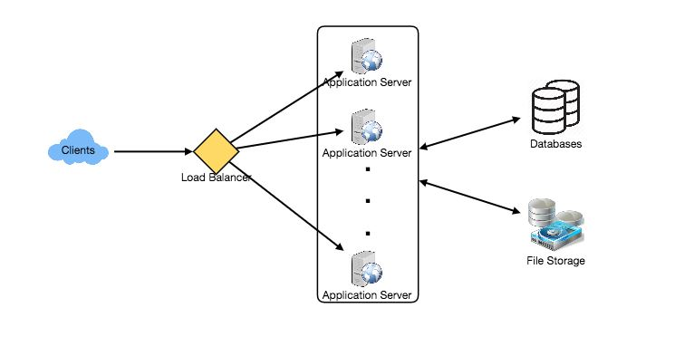
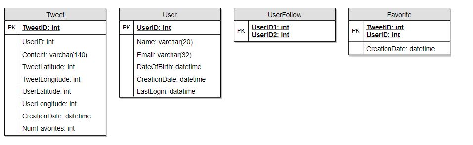
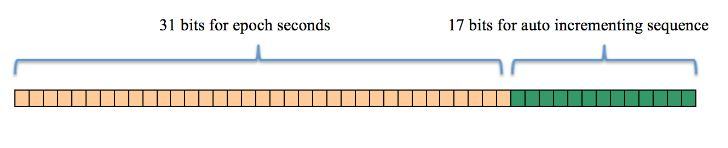
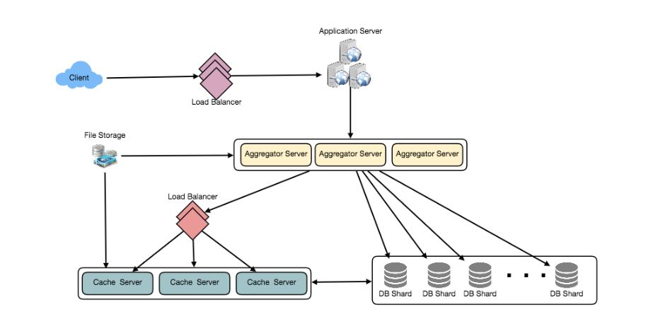

# Designing Twitter

## Problem Statement
Let's create a social networking service similar to Twitter. Users will be able to submit tweets, follow other users, and favorite tweets on the service.

- Difficulty Level: Medium

### What is Twitter?

Twitter is a social media platform that allows users to send and receive 140-character messages known as "tweets." Only registered users can post and read tweets; non-registered users can only read them. Twitter can be accessed by the internet, SMS, or mobile app.

## Pratice Problem

***Let's get started on the system design solution.***

**If you run into any problems, please see the solution below.**

<!DOCTYPE html>
<html>
<head>
	<meta charset="UTF-8">
	<meta name="viewport" content="width=device-width, initial-scale=1.0">
	<meta name="description" content="X-Frame-Bypass: Web Component extending IFrame to bypass X-Frame-Options: deny/sameorigin">
</head>
<body>
    <a href="https://jayaemekar.github.io/praticedesign/" target="_blank">Pratice on full Screen</a>
      
	<iframe is="x-frame-bypass" src="https://ej2.syncfusion.com/showcase/angular/diagrambuilder/" width="725" height="500"></iframe>

      
    <h2>Hints to solve the problem</h2>

    <a href="https://jayaemekar.github.io/systemdesign/DesigningTwitter/#requirements-and-goals-of-the-system" target="_blank">1. Consider functional and non-functional requirements. </a>
      
    <a href="https://jayaemekar.github.io/systemdesign/DesigningTwitter/#capacity-estimation-and-constraints" target="_blank">2. Estimation of capacity and constraints, such as traffic, bandwidth, and storage. </a>
      
    <a href="https://jayaemekar.github.io/systemdesign/DesigningTwitter/#system-apis" target="_blank">3. Consider System APIs. </a>
      
    <a href="https://jayaemekar.github.io/systemdesign/DesigningTwitter/#database-schema" target="_blank">4. How do you create a database system? </a>
      
    <a href="https://jayaemekar.github.io/systemdesign/DesigningTwitter/#replication-and-fault-tolerance" target="_blank">5. What about data replication and partitioning?</a>
     
     
    <a href="https://jayaemekar.github.io/systemdesign/DesigningTwitter/#cache" target="_blank">6.  Consider Cache and Load Balancing </a>
     
  
</body>
</html>

## <h1>Solution<h1>
### Requirements and Goals of the System
We'll make a simpler version of Twitter that meets the following criteria:

**Functional Requirements**

1. New tweets should be able to be posted by users.
2. Other users should be able to follow them.
3. Tweets should be able to be marked as favorites by users.
4. The service should be able to construct and show a user's timeline, which includes the most recent tweets from everyone the user follows.
5. Photos and movies can be included in tweets.

**Non-functional Requirements**

1. Our service must be really accessible.
2. For timeline creation, the system's acceptable latency is 200ms.
3. Consistency may suffer (in the interest of availability); it's fine if a person doesn't see a tweet for a time.

**Extended Requirements**

1. Searching for tweets.
2. Replying to a tweet.
3. Trending topics – current hot topics/searches.
4. Tagging other users.
5. Tweet Notification.
6. Who to follow? Suggestions?
7. Moments.

### Capacity Estimation and Constraints
Assume we have a total of one billion members, with 200 million daily active users (DAU). Assume there are 100 million new tweets every day, and each user follows 200 people on average.

How many favorites are there each day? If each user favorites five tweets every day on average, we will have:

                        200M users * 5 favorites => 1B favorites
How many total tweet-views will our system generate? Assume a user sees their timeline two times each day on average and five other people's pages. If a user sees 20 tweets on each page, our method will create 28 billion tweet views each day:

                        200M DAU * ((2 + 5) * 20 tweets) => 28B/day
Estimates of Storage Let's imagine each tweet is 140 characters long and each character requires two bytes to store without compression. Assume that each tweet requires 30 bytes to store metadata (like ID, timestamp, user ID, etc.). Total storage space required:

                        100M * (280 + 30) bytes => 30GB/day
What kind of storage would we require in five years? How much storage would we require for user data, preferences, and follows? This will be left for the exercise.

Not all tweets will contain media; assume that every fifth tweet contains a photo and every tenth contains a video. Assume that a photo is 200KB and a video is 2MB on average. This will result in 24TB of fresh media being created every day.

                        (100M/5 photos * 200KB) + (100M/10 videos * 2MB) ~= 24TB/day
Estimates of Bandwidth This translates to 290MB/sec based on total ingress of 24TB per day.

Keep in mind that we get 28 billion tweet views per day. We must display every tweet's photo (if it has one), but let's assume that consumers view every third video in their timeline. Total egress will thus be:

                        (28B * 280 bytes) / 86400s of text => 93MB/s
                        + (28B/5 * 200KB ) / 86400s of photos => 13GB/S
                        + (28B/10/3 * 2MB ) / 86400s of Videos => 22GB/s
                        Total ~= 35GB/s

### System APIs
💡 **It's always a good idea to establish the system APIs after we've finalized the requirements. This should express clearly what the system is intended to do.**

To expose the functionality of our service, we can use SOAP or REST APIs. The API for posting a new tweet may be defined as follows:

                    tweet(api_dev_key, tweet_data, tweet_location, user_location, media_ids)
**Parameters:**

- **api_dev_key (string):** The API developer key of a registered account. This will be used to, among other things, throttle users based on their allocated quota.
- **tweet_data (string):** The text of the tweet, typically up to 140 characters.
- **tweet_location (string):** Optional location (longitude, latitude) this Tweet refers to.
- **user_location (string):** Optional location (longitude, latitude) of the user adding the tweet.
- **media_ids (number[]):** Optional list of media_ids to be associated with the Tweet. (all the media photo, video, etc. need to be uploaded separately).

**Returns: (string)**
A successful post will return the URL to access that tweet. Otherwise, an appropriate HTTP error is returned.

### High Level System Design
We need a system that can store all new tweets efficiently (100M/86400s => 1150 tweets per second) and read them quickly (28B/86400s => 325K tweets per second). The specifications indicate that this will be a read-intensive system.

To service all of these requests, we'll need many application servers with load balancers in front of them for traffic distribution. On the backend, we'll need a database that can handle a large number of reads while storing all of the new tweets. We'll also require some file storage for photographs and movies.

 
  <kbd>
  
  </kbd>

Although we anticipate a daily writing load of 100 million tweets and a daily read load of 28 billion. This means our system will receive approximately 1160 new tweets and 325K read requests every second on average. This traffic will be distributed unevenly throughout the day, but we may expect at least a few thousand write requests and roughly 1 million read requests per second during peak hours. This is something we should bear in mind when creating our system's architecture.

### Database Schema
We'll need to keep track of users' tweets, favorite tweets, and people they follow.

 
  <kbd>
  
  </kbd>

See 'Database schema' under Designing Instagram for information on choosing between SQL and NoSQL databases to store the above schema.

### Data Sharding
We need to divide our data across numerous machines so that we can read and write it quickly because we receive a large number of new tweets every day and our read load is also incredibly high. Let's go over the various choices for sharding our data one by one:

**Sharding based on UserID:** 

We can try storing all of a user's data on a single server. We can provide the UserID to our hash function to map the user to a database server where all of the user's tweets, favorites, and followers will be stored. While searching for a user's tweets, follows, or favorites, we may ask our hash function where we can find the user's data and then read it from there. This strategy has several flaws:

  **What happens if a user becomes too hot?** 

 - On the server where the user is stored, there could be a lot of inquiries. This heavy load will have an impact on our service's performance.
 - In comparison to others, certain users may accumulate a large number of tweets or followers over time. -
 - It's challenging to keep a consistent distribution of rising user data.
 - We must either repartition/redistribute our data or utilize consistent hashing to recover from these instances.

**Sharding based on TweetID:** 

Each TweetID will be mapped to a random server where it will be stored by our hash algorithm. We must query all servers to find tweets, and each server will return a set of tweets. These results will be compiled and returned to the user by a centralized server. Consider the following example of timeline generation: To build a user's timeline, our system must complete the following steps:

- All of the persons the user follows will be found by our application (app) server.
- To find tweets from these users, the app server will issue a query to all database servers.
- Each database server will locate each user's tweets, organize them by recency, and return the most recent tweets.
- The app server will combine all of the results and sort them again to present the user with the best options.
- This solution overcomes the problem of hot users, however unlike sharding by UserID, we must query all database partitions to find a user's tweets, which can lead to longer latency.

We can increase our performance even further by putting a cache in front of the database servers to store hot tweets.

**Sharding based on Tweet creation time:** 

- Storing tweets according to when they were created will allow us to swiftly retrieve all of the top tweets while just querying a limited number of servers. 
- The issue here is that the traffic burden will not be spread; for example, while writing, all new tweets will travel to one server, leaving the other servers inactive. 
- Similarly, when reading, the server with the most recent data will have a much higher burden than those with older data.
- What if we could combine TweetID sharding with Tweet creation time sharding? We can get the benefits of both techniques if we don't store tweet creation time separately and instead use TweetID to reflect it. 
- It will be much easier to locate the most recent Tweets this way. 
- To do this, we must make each TweetID in our system universally unique, and each TweetID should also have a timestamp.
- For this, we can utilize epoch time. Let's pretend our TweetID is made up of two parts: the first represents epoch seconds, and the second is an auto-incrementing sequence. 
- To create a new TweetID, we simply append an auto-incrementing integer to the current epoch time. From this TweetID, we can calculate the shard number and save it.

What is the maximum size of our TweetID? How many bits would it take to hold the number of seconds for the next 50 years if our epoch time began today?

                        86400 sec/day * 365 (days a year) * 50 (years) => 1.6B

 
  <kbd>
  
  </kbd>

This number would require 31 bits to store. We can devote 17 bits to keep auto incremented sequence because we predict 1150 new tweets every second on average; this will make our TweetID 48 bits long. So we can store (217 => 130K) fresh tweets every second. Every second, we can reset our auto incrementing sequence.

We can have two database servers generate auto-incrementing keys for us, one generating even numbered keys and the other generating odd numbered keys, for fault tolerance and improved performance.
Our TweetID will look like this if we assume our current epoch seconds are "1483228800."

- 1483228800 000001
- 1483228800 000002
- 1483228800 000003
- 1483228800 000004
…

We can easily store tweets for the next 100 years and for mili-second granularity if we make our TweetID 64bits (8 bytes) long.

We still have to query all of the servers for timeline generation in the aforementioned technique, but our reads (and writes) will be much faster.

Because there is no secondary index (at the time of creation), our write latency will be reduced.
We don't need to filter on creation-time when reading because our primary key includes the epoch time.

### Cache
We can utilize a database server cache to cache popular tweets and users. We can use a commercially available solution like Memcache to store the entire tweet object. Before reaching the database, application servers can rapidly check if the cache has the requested tweets. We can figure out how many cache servers we need based on client usage patterns.

**Which cache replacement policy would be most appropriate for our requirements?** 

How would we chose a newer/hotter tweet to replace an old one when the cache is full? For our system, LRU (Least Recently Used) can be a suitable policy. The most recently viewed tweet gets discarded first under this strategy.

**How can we make a cache that is more intelligent?** 

According to the 80-20 rule, 20% of tweets generate 80% of read traffic, implying that some tweets are so popular that the majority of people read them. This means that each shard should be able to cache 20% of the daily read volume.

**How about caching the most recent data?** 

- This method could be beneficial to our service. 
- If 80% of our users only view tweets from the previous three days, we can try to cache all of the tweets from the previous three days.
- Assume we have dedicated cache servers that store all tweets from all users for the previous three days. Every day, we receive 100 million new tweets or 30GB of new data, as estimated above (without photos and videos).
- We'll need less than 100GB of memory to keep all of the tweets from the last three days. Although this data can readily fit on a single server, we should replicate it across numerous servers to spread out the read traffic and lessen the stress on cache servers. 
- So, whenever we're creating a user's timeline, we can check to see if the cache servers have all of that user's recent tweets.
- If so, we may just return the entire cached data. If there aren't enough tweets in the cache, we'll have to query the backend server for more. 
- We can try caching photographs and videos from the previous three days using a similar strategy.
- Our cache would be similar to a hash table, with 'OwnerID' as the key and a doubly linked list holding all of that user's tweets from the previous three days as the value. 
- We may always enter new tweets at the head of the linked list, which means all previous tweets will be near the tail of the linked list, since we want to retrieve the most current data first. 
- As a result, tweets in the tail can be removed to make room for fresh tweets.

 
  <kbd>
  
  </kbd>

### Timeline Generation
For a detailed discussion about timeline generation, take a look at Designing Facebook’s Newsfeed.

### Replication and Fault Tolerance
- We can have numerous secondary database servers for each DB partition because our system is read-heavy. Only read traffic will be sent to secondary servers. 
- All writes will go to the primary server first, and then to the subsidiary servers. 
- This system also provides fault tolerance, as we may failover to a secondary server if the original server fails.

### Load Balancing
We may add a load balancing layer to our system in three places: 

 - 1) between clients and application servers, 
 - 2) between clients and application servers, and 
 - 3) between clients and application servers. 
 - 4) Between Aggregation servers and Cache servers.

A simple Round Robin technique can be used at first, which evenly distributes incoming requests among servers. This Load Balancer is simple to set up and has no additional overhead. Another advantage of this method is that if a server goes down, Load Balancer removes it from the rotation and stops transmitting traffic to it. Round Robin LB has the disadvantage of not taking server load into account. 

The Load Balancer will not cease delivering new requests to a server that is overloaded or slow. To address this, a more intelligent Load Balancer solution can be implemented, which queries the backend server about their load on a regular basis and adjusts traffic accordingly.

### Monitoring
It is critical to be able to monitor our systems. We should collect data on a regular basis to get a quick picture of how our system is performing. To acquire a better knowledge of our service's performance, we can collect the following metrics/counters:

1. What is the daily high of new tweets per day/second?
2. Stats on timeline delivery, such as how many tweets are delivered each day/second by our service.
3. The user's average latency when refreshing the timeline.
4. We can determine whether we need more replication, load balancing, or caching by monitoring these counters.

### Extended Requirements

**How do we serve feeds?** 

- Get all of the most recent tweets from the people you follow and arrange them by time. To fetch/show tweets, use pagination. 
- Only get the top N tweets from everyone you're following. This N will be determined by the client's Viewport, as we show fewer tweets on mobile than on a Web client. 
- To save time, we can also cache the following top tweets.
- Alternatively, we can pre-generate the feed to save time; see 'Ranking and timeline production' under Designing Instagram for more information.

**Retweet:** 

We can store the ID of the original Tweet on each Tweet object in the database, but no content on this retweet object.

**Trending Topics:** 

In the last N seconds, we can store the most frequently occurring hashtags or search queries and update them every M seconds. The frequency of tweets, search searches, retweets, and likes can be used to rank hot topics. We can attach more weight to things that are seen by a larger number of individuals.

**Who to follow? How to give suggestions?** 

This feature will increase user interaction. Friends of persons someone follows can be suggested. To locate prominent persons for the suggestions, we can go two or three tiers down. People with more followers can be given priority.

Because only a few ideas may be made at a time, shuffle and re-prioritize using Machine Learning (ML). People with recently increased follow-ship, common followers if the other person is following this user, common location or interests, and so on are examples of ML signals.

**Moments:** 

Using ML – supervised learning or Clustering, obtain top news for various websites over the last 1 or 2 hours, identify related tweets, prioritize them, and categorize them (news, support, financial, entertainment, etc.). These articles can then be displayed as trending topics in Moments.

**Search:** 

Search involves Indexing, Ranking, and Retrieval of tweets. A similar solution is discussed in our next problem Design Twitter Search.
