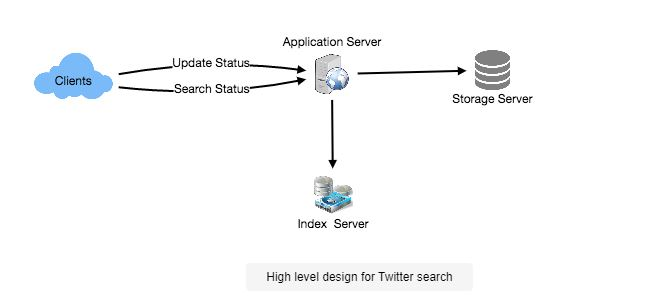
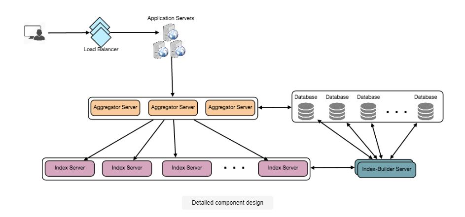

# Designing Twitter Search
## Problem Statement

Twitter is a popular social media platform that allows users to exchange photographs, news, and text-based communications. We'll create a service that can store and search user tweets in this chapter.

- Similar Problems: Tweet search.
- Difficulty Level: Medium

### What is Twitter Search?

Twitter users can change their status at any time. Each status (also known as a tweet) is made up of plain text, and our goal is to create a system that allows users to search through all of their tweets.

## Pratice Problem

***Let's get started on the system design solution.***

**If you run into any problems, please see the solution below.**

<!DOCTYPE html>
<html>
<head>
	<meta charset="UTF-8">
	<meta name="viewport" content="width=device-width, initial-scale=1.0">
	<meta name="description" content="X-Frame-Bypass: Web Component extending IFrame to bypass X-Frame-Options: deny/sameorigin">
</head>
<body>
    <a href="https://ej2.syncfusion.com/showcase/angular/diagrambuilder/" target="_blank">Pratice on full Screen</a>
      
	<iframe is="x-frame-bypass" src="https://ej2.syncfusion.com/showcase/angular/diagrambuilder/" width="725" height="500"></iframe>

      
    <h2>Hints to solve the problem</h2>

    <a href="https://jayaemekar.github.io/systemdesign/DesigningURLShorteningService/#requirements-and-goals-of-the-system" target="_blank">1. Consider functional and non-functional requirements. </a>
      
    <a href="https://jayaemekar.github.io/systemdesign/DesigningURLShorteningService/#capacity-estimation-and-constraints" target="_blank">2. Estimation of capacity and constraints, such as traffic, bandwidth, and storage. </a>
      
    <a href="https://jayaemekar.github.io/systemdesign/DesigningURLShorteningService/#system-apis" target="_blank">3. Consider System APIs. </a>
      
    <a href="https://jayaemekar.github.io/systemdesign/DesigningURLShorteningService/#database-design" target="_blank">4. How do you create a database system? </a>
      
    <a href="https://jayaemekar.github.io/systemdesign/DesigningURLShorteningService/#data-partitioning-and-replication" target="_blank">5. What about data replication and partitioning?</a>
     
     
    <a href="https://jayaemekar.github.io/systemdesign/DesigningURLShorteningService/#cache" target="_blank">6.  Consider Cache and Load Balancing </a>
     
  
</body>
</html>

## <h1>Solution<h1>
### Requirements and Goals of the System

- Assume Twitter has 1.5 billion overall users, with 800 million of them engaged on a daily basis.
- Every day, Twitter receives 400 million tweets on average.
- A tweet's average size is 300 bytes.
- Let's say there are 500 million queries every day.
- Multiple terms will be concatenated with AND/OR in the search query.
- We need to create a system that can store and query tweets quickly.

### Capacity Estimation and Constraints

**Storage Capacity:** With 400 million new tweets each day and an average of 300 bytes per tweet, the total storage we'll require is:

                        400M * 300 => 120GB/day
Total storage per second:

                        120GB / 24hours / 3600sec ~= 1.38MB/second
### System APIs

To expose the functionality of our service, we can use SOAP or REST APIs; for example, the search API could be defined as follows:

        search(api_dev_key, search_terms, maximum_results_to_return, sort, page_token)
**Parameters:**

- **api_dev_key (string):** The API developer key of a registered account. This will be used to, among other things, throttle users based on their allocated quota.
- **search_terms (string):** A string containing the search terms.
- **maximum_results_to_return (number):** Number of tweets to return.
- **sort (number): Optional sort mode:** Latest first (0 - default), Best matched (1), Most liked (2).
- **page_token (string):** This token will specify a page in the result set that should be returned.

**Returns: (JSON)**
A JSON containing information about a list of tweets matching the search query. Each result entry can have the user ID & name, tweet text, tweet ID, creation time, number of likes, etc.

### High Level Design

Which tweet contains which word? This index will aid us in rapidly locating tweets that users are looking for.

 
  <kbd>
  
  </kbd>

### Detailed Component Design

**1. Storage:**

Every day, we must store 120GB of new data. We need to devise a data partitioning technique that will efficiently distribute the data across numerous servers, given the massive amount of data. We will require the following storage in the next five years if we plan ahead:

                            120GB * 365days * 5years ~= 200TB
We'll need about 250TB of total storage if we never wish to be more than 80% full at any given time. Assume we wish to preserve a backup copy of all tweets for disaster recovery; our total storage need will be 500TB. If we assume that a current server can store up to 4TB of data, we'll need 125 of them to store all of the data needed during the next five years.

Let's begin with a simple design that stores tweets in a MySQL database. We'll suppose that the tweets are stored in a table with two columns: TweetID and TweetText. Assume we want to organize our data by TweetID. If our TweetIDs are system-wide unique, we can build a hash function to map a TweetID to a storage server where that tweet object can be stored.

**How can we create unique TweetIDs for the entire system?**

How many tweet objects can we expect in five years if we get 400 million new tweets every day?

                            400M * 365 days * 5 years => 730 billion
This means we'd need a five-byte integer to uniquely identify TweetIDs. Assume we have a service that can produce a unique TweetID anytime an object needs to be stored (The TweetID discussed here will be similar to TweetID discussed in Designing Twitter). We can use the TweetID to discover the storage server and put our tweet object there using our hash function.

**2. Index:**

How should we design our index? Because our tweet queries will be made up of words, we'll need an index to tell us which word appears in which tweet object. Let's start by estimating the size of our index. If we wish to create an index for all English words as well as certain well-known nouns such as people's names, city names, and so on, and we suppose that we have roughly 300K English words and 200K nouns, we will end up with 500K total words in our index. Let's say a word has an average length of five characters. We'll need 2.5MB of RAM to hold all the words if we maintain our index in memory:

                            500K * 5 => 2.5 MB
Let's pretend we just want to maintain the index in memory for the last two years of tweets. Since there will be 730 billion tweets in five years, we will have 292 billion tweets in two years. How much RAM will we need to store all the TweetIDs if each one is 5 bytes long?

                            292B * 5 => 1460 GB
As a result, our index will be similar to a large distributed hash table, with the 'key' being the term and the 'value' being a list of TweetIDs for all tweets that contain that phrase. Let's assume each tweet has 40 words on average, and since we won't be indexing prepositions and other tiny words like 'the,' 'an,' and 'and,' we'll have roughly 15 words in each tweet that need to be indexed. This means that each TweetID will be saved in our index 15 times. As a result, the total memory required to store our index is:

                            (1460 * 15) + 2.5MB ~= 21 TB
We'd need 152 high-end servers to house our index, assuming each has 144GB of memory.

We can divide our data into two groups based on two criteria:

**Word-based sharding:**

We will iterate through all of the terms in a tweet and calculate the hash of each word to locate the server where it will be indexed while constructing our index. To find all tweets that contain a given word, we must only query the server that has that word.

We have a few difficulties with this strategy:

**What if a word gets popular?**

The server will then get a flood of queries containing that word. This heavy load will have an impact on our service's performance.

Maintaining a uniform distribution of terms while tweets expand is fairly difficult because some words can end up holding a lot more TweetIDs relative to others.
We can either repartition our data or utilize Consistent Hashing to recover from these circumstances.

**Sharding based on the tweet object:**

While storing, we'll give the TweetID to our hash function, which will locate the server and index all of the tweet's words. When searching for a specific term, we must query all servers, with each server returning a collection of TweetIDs. These results will be compiled and returned to the user by a centralized server.

 
  <kbd>
  
  </kbd>

### Fault Tolerance

**What happens if an index server goes down?**

We can have a secondary replica of each server that can assume control after the parent server fails. The index will be duplicated on both primary and backup servers.

**What if both the primary and secondary servers fail simultaneously?**

- We'll need to set up a new server and rebuild the index there. What are our options? We have no idea what words or tweets were saved on this server. 
- If we used 'Sharding based on the tweet object,' the brute-force method would be to iterate through the entire database, filtering TweetIDs with our hash function to find all of the required tweets that would be kept on this server. 
- This would be inefficient, and we wouldn't be able to service any queries from the server while it was being rebuilt, resulting in the user missing some tweets that should have been seen.

**How can we efficiently retrieve a mapping between tweets and the index server?**

- We need to create a reverse index that maps all TweetIDs to their respective index servers. This information can be stored on our Index-Builder server. 
- We'll need to create a Hashtable with the index server number as the key and a HashSet containing all of the TweetIDs stored at that index server as the value. 
- Notice how we've stored all of the TweetIDs in a HashSet; this allows us to rapidly add and remove tweets from our index. So, whenever an index server has to rebuild itself, it can simply ask the Index-Builder server for all of the tweets it requires, and then fetch those tweets to create the index.
- This approach will surely be fast. We should also have a replica of the Index-Builder server for fault tolerance.

### Cache

- We can put a cache in front of our database to deal with hot tweets. Memcached can be used to store all of these hot tweets in memory. 
- Before contacting the backend database, application servers can rapidly check if the tweet is in the cache. We can modify the number of cache servers required based on client usage trends. 
- Least Recently Used (LRU) appears to be a good cache eviction policy for our system.

### Load Balancing

- Load balancing can be added to our system in two places: 1) between clients and application servers, and 2) between application servers and backend servers. 
- A simple Round Robin technique can be used at first, which evenly distributes incoming requests among backend servers. 
- This Load balancer is simple to set up and has no additional overhead. Another advantage of this strategy is that Load balancer will remove dead servers from the rotation and stop transmitting traffic to them. 
- Round Robin Load balancer has the drawback of not taking server load into account. 
- The Load balancer will not cease delivering new requests to a server that is overloaded or slow.
- To deal with this, a more intelligent load balancer system can be implemented, which will periodically query the backend server about their load and modify traffic accordingly.

### Ranking

How about ranking the search results based on social graph distance, popularity, relevance, and so on?

Assume we want to rank tweets based on their popularity, such as how many likes or comments they receive, and so on. Our ranking algorithm can calculate a 'popularity number' (depending on the amount of likes, etc.) and store it with the index in this scenario. 

Before submitting results to the aggregator server, each partition might sort the results based on this popularity value. The aggregator server compiles all of these results, arranges them by popularity, and provides the user the top results.