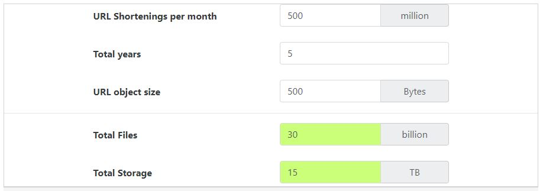
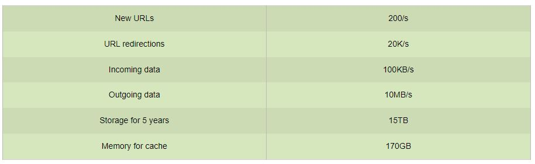
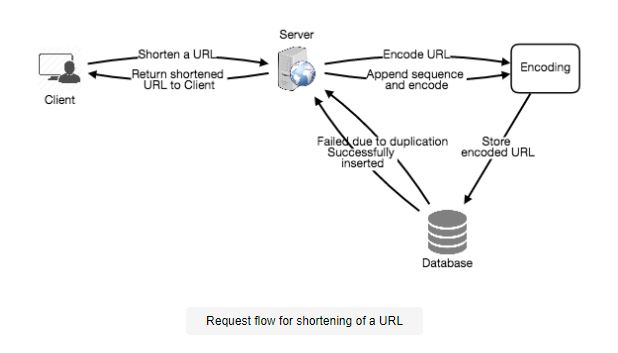
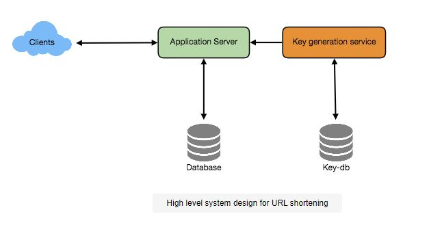
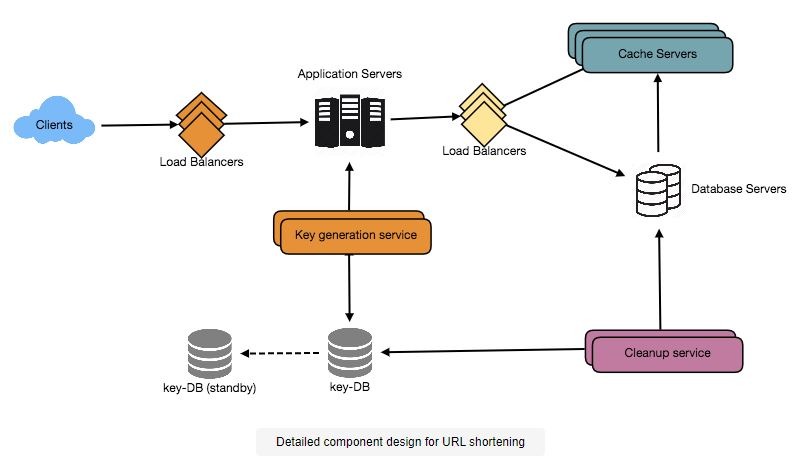

# Creating a TinyURL-style URL shortening service

Let's make a TinyURL-style URL shortening service. Short aliases for long URLs will be provided by this service.

- Bit.ly, goo.gl, qlink.me, and other similar services
- Level of Difficulty: Easy

***What is the purpose of URL shortening?***

For long URLs, URL shortening is utilized to create shorter aliases. These shortened aliases are referred to as "short links." When users click on these short links, they are forwarded to the original URL. When displayed, printed, messaged, or tweeted, short links save a lot of space. Shorter URLs are also less likely to be mistyped by users.

For example, if we use TinyURL to shorten this page:

        https://www.jayaaemekar.io/collection/page/5668639101419520/

We would get:

        http://tinyurl.com/jlg8zpc

The abbreviated URL is almost one-third the length of the original.

The abbreviated URL is almost one-third the length of the original.

URL shortening is used for a variety of purposes, including optimizing links across devices, tracking individual links to gauge audience and campaign performance, and concealing connected original URLs.

## Pratice Problem

***Let's get started on the system design solution.***

**If you run into any problems, please see the solution below.**

<!DOCTYPE html>
<html>
<head>
	<meta charset="UTF-8">
	<meta name="viewport" content="width=device-width, initial-scale=1.0">
	<meta name="description" content="X-Frame-Bypass: Web Component extending IFrame to bypass X-Frame-Options: deny/sameorigin">
</head>
<body>
    <a href="https://ej2.syncfusion.com/showcase/angular/diagrambuilder/" target="_blank">Pratice on full Screen</a>
      
	<iframe is="x-frame-bypass" src="https://ej2.syncfusion.com/showcase/angular/diagrambuilder/" width="725" height="500"></iframe>
</body>
</html>

## Solution
### Requirements and Goals of the System

💡 **At the start of the interview, you should always outline criteria. Ask questions to figure out the exact extent of the system that the interviewer is thinking of.**

The following requirements should be met by our URL shortening system:

**Functional Requirements:**

1. Given a URL, our service should create a unique and shorter alias for it. This is referred to as a short link. This URL should be short enough to be copied and pasted into programs without difficulty.
2. Our service should redirect visitors to the original site when they click on a short link.
3. Users should be allowed to choose a custom short link for their URL as an option.
4. Links will expire after a set amount of time. The expiration time should be configurable by the user.

**Non-Functional Requirements:**

1. The system should have a high level of availability. This is necessary because if our service is unavailable, all URL redirections would fail.
2. URL redirection should take place in real time with the least amount of latency possible.
3. It should not be possible to guess the length of shortened connections (not predictable).

**Extended Requirements:**

1. Analytical data; for example, how many times has a redirection occurred?
2. Our service should also be accessible through REST APIs by other services.

### Capacity Estimation and Constraints
Our system will rely heavily on reading. In comparison to new URL shortenings, there will be a lot of redirection requests. Assume that read and write have a 100:1 ratio.

**Traffic estimates:**  If we assume 500 million new URL shortenings every month and a 100:1 read/write ratio, we can expect 50 billion redirections in the same time period:

        100 * 500M => 50B
What would our system's Queries Per Second (QPS) be? Per second, new URL shortenings:

        500 million / (30 days * 24 hours * 3600 seconds) = ~200 URLs/s
Considering 100:1 read/write ratio, URLs redirections per second will be:

        100 * 200 URLs/s = 20K/

**Storage estimates:** Let's say we keep track of every URL shortening request (and the abbreviated link that goes with it) for five years. With 500 million new URLs expected per month, the total number of objects we expect to store is 30 billion:

        500 million * 5 years * 12 months = 30 billion
Let's assume that each stored object is 500 bytes in size (this is just a guess–we'll look at it later). We'll need a total of 15TB of storage:

        30 billion * 500 bytes = 15 TB

 
  <kbd>
  
  </kbd>

**Bandwidth estimates:** For write requests, since we expect 200 new URLs every second, total incoming data for our service will be 100KB per second:

        200 * 500 bytes = 100 KB/s
For read requests, since every second we expect ~20K URLs redirections, total outgoing data for our service would be 10MB per second:

        20K * 500 bytes = ~10 MB/s
**Memory estimates:** How much RAM will we need to keep some of the most often visited URLs if we wish to cache them? We'd like to cache this 20% of hot URLs if we follow the 80-20 rule, which states that 20% of URLs produce 80% of traffic.

We'll get 1.7 billion requests each day if we have 20K requests per second:

        20K * 3600 seconds * 24 hours = ~1.7 billion
To cache 20% of these requests, we will need 170GB of memory.

        0.2 * 1.7 billion * 500 bytes = ~170GB

One thing to keep in mind is that because there will be a lot of duplicate requests (for the same URL), our actual memory consumption will be less than 170GB.

**Estimates at a high level:** The following is a summary of our high-level estimations for our service, assuming 500 million new URLs each month and a 100:1 read:write ratio:

 
  <kbd>
  
  </kbd>

### System APIs

💡 **It's always a good idea to establish the system APIs after we've finalized the requirements. This should express clearly what the system is intended to do.**
To expose the functionality of our service, we can use SOAP or REST APIs. The following are possible API specifications for creating and removing URLs:

- createURL(api_dev_key, original_url, custom_alias=None, user_name=None, expire_date=None)

**Parameters:**

- **api_dev_key (string):** The API developer key of a registered account. This will be used to, among other things, throttle users based on their allocated quota.
- **original_url (string):** Original URL to be shortened.
- **custom_alias (string):** Optional custom key for the URL.
- **user_name (string):** Optional user name to be used in the encoding.
- **expire_date (string):** Optional expiration date for the shortened URL.

**Returns:** (string)
A successful insertion returns the shortened URL; otherwise, it returns an error code.

- **deleteURL(api_dev_key, url_key)** Where “url_key” is a string representing the shortened URL to be retrieved. A successful deletion returns ‘URL Removed’.

**How do we detect and prevent abuse?**

- By consuming all URL keys in the existing design, a hostile person can put us out of business. We can restrict users based on their api_dev_key to prevent abuse. 
- A specific amount of URL creations and redirections each time period can be configured for each api_dev_key (which may be set to a different duration per developer key). 

### Database Design

💡 **Defining the database schema early in the interview will aid in understanding the data flow between various components and will eventually lead to data segmentation.**

A few points to consider regarding the data we'll be storing:

1. We'll need billions of records to store.
2. Each item we keep is little (less than 1K).
3. Except for storing which user created a URL, there are no linkages between records.
4. Our service requires a lot of reading.

**Database Schema:**
We'd need two tables: one to store information about URL mappings, and another to store data about the user who created the short link.

 
  <kbd>
  
  </kbd>

**What kind of database should we use?**
A NoSQL store like DynamoDB, Cassandra, or Riak is a preferable choice because we expect to store billions of rows and don't need to employ associations between items. It would also be easy to scale a NoSQL database. 

### Algorithms and Basic System Design

We're trying to figure out how to make a short and unique key for a given URL.

The abbreviated URL in the TinyURL example in Section 1 is "http://tinyurl.com/jlg8zpc." The short key we want to produce is the final seven characters of this URL. Here, we'll look at two options:

### Encoding actual URL 
- We can generate a unique hash of the supplied URL (e.g., MD5 or SHA256, etc.). 
- After that, the hash can be decoded for display. This encoding might be base36 ([a-z,0-9]) or base62 ([A-Z, a-z, 0-9]), and we can use Base64 encoding by adding '+' and '/'. 
- What should the length of the short key be, is a legitimate question. Is it better to have six, eight, or ten characters?

        Using base64 encoding, a 6 letters long key would result in 64^6 = ~68.7 billion possible strings
        Using base64 encoding, an 8 letters long key would result in 64^8 = ~281 trillion possible strings

With 68.7B unique strings, let’s assume six letter keys would suffice for our system.

- The MD5 algorithm produces a 128-bit hash value when used as a hash function. 
- We'll get a string with more than 21 characters after base64 encoding (since each base64 character encodes 6 bits of the hash value). How will we choose our key now that we only have space for 8 characters per short key? For the key, we can use the first six (or eight) letters. 
- This could lead to key duplication; to avoid this, we can exchange certain characters or choose other characters from the encoding string.

**What are the different issues with our solution?**

The following are a couple of issues with our encoding scheme:

1. If numerous users enter the same URL, the abbreviated URL will be the same, which is unacceptable.
2. What if parts of the URL are URL-encoded? e.g., http://www.jayaaemekar.io/distributed.php?id=design, and http://www.jayaaemekar.io/distributed.php%3Fid%3Ddesign are identical except for the URL encoding.

**Alternative to the problems:**

- To make each input URL unique, we can append an ascending sequence number to it and then construct a hash of it. However, we do not need to save this sequence number in the databases. 
- An ever-increasing sequence number could be a concern with this method. 
- Is it possible for it to overflow? Increasing the sequence number will have an effect on the service's performance.
- Another option is to include a user id to the input URL (which should be unique). If the user hasn't signed in yet, we'll have to prompt them to select a uniqueness key. If there is still a disagreement, we must keep creating keys until we find one that is unique.

 
  <kbd>
  
  </kbd>

### Generating keys offline

- We could create a separate **Key Generation Service (KGS)** that produces random six-letter strings and saves them in a database (let's call it key-DB). 
- We'll just utilize one of the already-generated keys to abbreviate a URL whenever we need to. This method simplifies and expedites the process. 
- We won't have to worry about duplications or collisions because the URL won't be encoded. KGS will ensure that all keys placed into key-DB are one-of-a-kind.

**Can concurrency lead to issues?**

- Once a key has been used, it should be marked in the database to prevent it from being reused. 
- If many servers are reading keys at the same time, we may see a situation where two or more servers attempt to read the same key from the database. 
- What are our options for dealing with this concurrent issue?
- KGS allows servers to read and mark database keys. To store keys, KGS can employ two tables: one for keys that haven't been used yet, and another for all keys that have been used. 
- KGS can move keys into the used keys table as soon as they are given to one of the servers. 
- KGS can maintain some keys in memory at all times so that they can be rapidly provided to a server when it is needed.
- For simplicity, KGS can move keys to the used keys table as soon as they are loaded into memory. This guarantees that each server has its own set of keys. 
- We will be squandering those keys if KGS dies before allocating all of the loaded keys to some server–which may be acceptable given the large amount of keys we have.
- KGS must also ensure that the same key is not used by several servers. 
- Before removing keys from the data structure and delivering them to a server, it must synchronize (or gain a lock on) the data structure holding the keys.

**How big should the key-DB be?**
We can construct 68.7 billion unique six-letter keys using base64 encoding. If each alpha-numeric character requires one byte, we can store all of these keys in:

        6 (characters per key) * 68.7B (unique keys) = 412 GB.

**Doesn't KGS represent a single point of failure?**

Yes, it is correct. We can solve this by having a backup copy of KGS. When the primary server fails, the standby server can generate and distribute keys in its place.

**Is it possible for each app server to cache some keys from the key-DB?**

Yes, this will undoubtedly expedite things. However, if the application server dies before all of the keys have been consumed, we will lose those keys. Because we have 68B distinct six-letter keys, this may be okay.

**How would we go about doing a key lookup?**

To acquire the whole URL, we may look up the key in our database. If it's in the database, send a "HTTP 302 Redirect" status to the browser, including the stored URL in the "Location" field. If the key isn't in our system, return the user to the homepage or deliver a "HTTP 404 Not Found" status.

**Should custom aliases be limited in size?**

Custom aliases are supported by our service. Users can choose any 'key' they like, but a custom alias is not required. However, imposing a size restriction on a custom alias is understandable (and frequently desirable) in order to maintain a consistent URL database. Assume that each customer key can have a maximum of 16 characters (as reflected in the above database schema).

 
  <kbd>
  
  </kbd>

### Data Partitioning and Replication

We need to split our database such that it can hold information about billions of URLs in order to scale it out. We need to devise a partitioning strategy that will divide and store our data across multiple DB servers.

**Range Based Partitioning:**

- Based on the initial letter of the hash key, we can store URLs in different partitions. As a result, we save all URLs that begin with the letter 'A' (and 'a') in one partition, those that begin with the letter 'B' in another, and so on. 
- Range-based partitioning is the name for this method. 
- We can even merge a few characters that aren't used very often into a single database segment. 
- We should devise a static partitioning scheme to ensure that we can always store and retrieve URLs in a consistent manner.
- The biggest issue with this method is that it can result in unbalanced database servers. For example, suppose we decide to put all URLs beginning with the letter 'E' into a database partition, only to discover later that we have far too many URLs beginning with the letter 'E.'

**Partitioning based on hashes:**

- We take a hash of the object we're storing in this scheme. The hash is then used to determine which partition to use. 
- In our situation, the hash of the 'key' or the short link can be used to determine the partition in which the data object is stored.
- Our hashing function will distribute URLs into different divisions at random (e.g., any 'key' can be mapped to a number between [1...256]), and this number will represent the partition in which we will put our object.

This method can still result in overloaded partitions, which can be remedied by employing Consistent Hashing.

### Cache

URLs that are often visited can be cached. We can utilize a commercially available solution like Memcached, which can store complete URLs along with their hashes. Before contacting backend storage, application servers can rapidly check if the needed URL is in the cache.

**Should we have a lot of cache memory?**

- We can start with 20% of daily traffic and change the number of cache servers needed based on client usage patterns. To cache 20% of daily traffic, we'll require 170GB of memory, as previously calculated. 
- We can easily fit all of the cache into one machine because a modern-day server can have 256GB of memory. Alternatively, we can store all of these popular URLs on a couple of smaller servers.

**Which cache eviction policy would be most appropriate for our requirements?**

- What would we do if the cache was full and we needed to change a link with a newer/hotter URL? For our system, LRU (Least Recently Used) can be a suitable policy. 
- We start with the URL that has been used the least lately. To store our URLs and Hashes, we can use a Linked Hash Map or a similar data structure, which will also keep track of the URLs that have been accessed recently.

We may replicate our cache servers to divide the load between them to boost efficiency even more.

**How do I refresh each cache replica?**

- Our servers would hit a backend database whenever a cache miss occurred. We may update the cache and pass the new entry to all cache replicas once this happens. 
- By adding the new entry, each copy can update its cache. If the entry already exists in a replica, it can be ignored.

 
  <kbd>
  
  </kbd>

### Load Balancer (LB)
We may add a load balancing layer to our system in three places:

1. Between the application servers and the clients
2. The Relationship Between Application and Database Servers
3. The Relationship Between Application and Cache Servers

We might start with a simple Round Robin strategy, which evenly distributes incoming requests among backend servers. This LB is easy to set up and doesn't add any more overhead. Another advantage of this method is that if a server goes down, LB removes it from the rotation and stops transmitting traffic to it.

We don't take the server load into account with Round Robin LB, which is a concern. The LB will not cease delivering new requests to a server that is overloaded or slow. To deal with this, a more intelligent LB solution can be implemented, which queries the backend server about its load on a regular basis and adjusts traffic accordingly.

### Database cleansing or purging
Should entries be saved indefinitely or should they be deleted? What should happen to the link if it reaches the user-specified expiration time?

It would put a lot of strain on our database if we decided to actively look for outdated links and remove them. Instead, we can execute a lazy cleanup and gently remove expired links. Only expired links will be erased by our service, while some expired links may exist longer but will never be returned to users.

1. If a user attempts to access an expired link, we can erase the link and provide the user an error message.
2. A separate Cleanup service can run on a regular basis to clear out expired links from our cache and storage. This service should be extremely light, and it should only be used when user traffic is predicted to be low.
3. Each link can have a default expiration time (e.g.,two years).
4. After removing an expired link, we may re-use the key by putting it back in the key-DB.
5. Should links that haven't been seen in a certain amount of time, say six months, be removed? This could be challenging. Because storage is becoming more affordable, we can chose to store links indefinitely.

 
  <kbd>
  
  </kbd>

### Telemetry

- What were the user locations, how many times a short URL was used, etc.? 
- How would we keep track of these figures? What happens when a popular URL is bombarded with a huge number of concurrent requests if it's part of a DB row that gets updated on each view?
- The visitor's nation, date and time of access, web page that relates to the click, browser, or platform from which the page was visited are all statistics worth keeping track of.

### Security and Permissions
Can users build private URLs or restrict access to a URL to a specific group of users?

- In the database, we can store the permission level (public/private) for each URL. 
- We can also construct a separate table to keep track of UserIDs with access to a given URL. 
- We can return an error (HTTP 401) if a user does not have permission and attempts to access a URL. 
- Given that we're using a NoSQL wide-column database like Cassandra to store our data, the 'Hash' (or the KGS produced 'key') would be the key for the table containing permissions. 
- The UserIDs of those users who have authorization to see the URL will be stored in the columns.