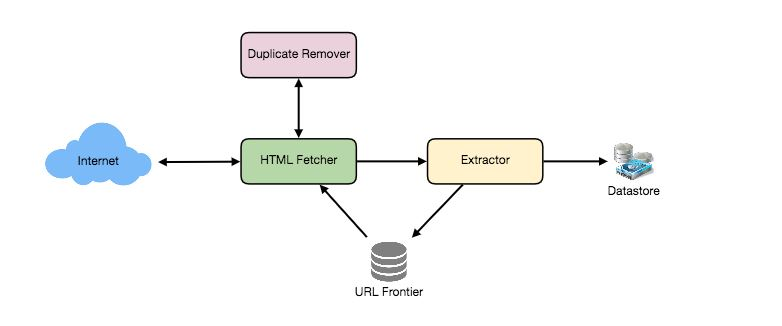
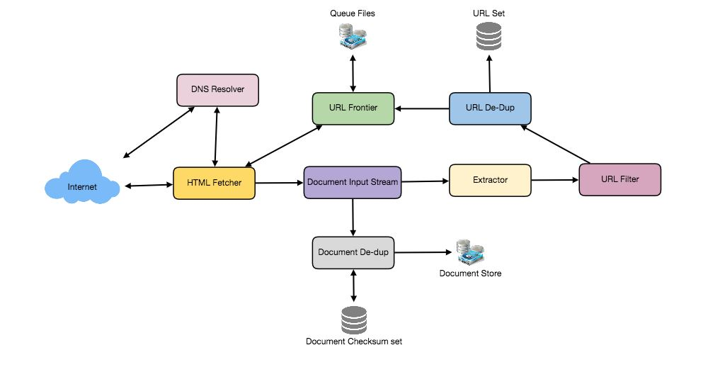

# Designing a Web Crawler
## Problem Statement
Let's design a Web Crawler that will systematically browse and download the World Wide Web. Web crawlers are also known as web spiders, robots, worms, walkers, and bots.

- Difficulty Level: Hard

### What is a Web Crawler?
A web crawler is a computer program that crawls the Internet in a systematic and automated manner. It gathers documents by fetching links from a set of starting pages in a recursive manner. Web crawling is used by many sites, particularly search engines, to provide up-to-date information. To do speedier searches, search engines download all of the pages and index them.

Other applications for web crawlers include:

1. Validate the syntax and structure of online pages and links.
2. To keep an eye on websites to check if the structure or content changes.
3. Keeping major Web sites' mirror pages up to date.
4. To look for copyright violations.
5. Create a special-purpose index, such as one that understands the material stored in Web-based multimedia files.

## Pratice Problem

***Let's get started on the system design solution.***

**If you run into any problems, please see the solution below.**

<!DOCTYPE html>
<html>
<head>
	<meta charset="UTF-8">
	<meta name="viewport" content="width=device-width, initial-scale=1.0">
	<meta name="description" content="X-Frame-Bypass: Web Component extending IFrame to bypass X-Frame-Options: deny/sameorigin">
</head>
<body>
    <a href="https://ej2.syncfusion.com/showcase/angular/diagrambuilder/" target="_blank">Pratice on full Screen</a>
      
	<iframe is="x-frame-bypass" src="https://ej2.syncfusion.com/showcase/angular/diagrambuilder/" width="725" height="500"></iframe>

      
    <h2>Hints to solve the problem</h2>

    <a href="https://jayaemekar.github.io/systemdesign/DesigningURLShorteningService/#requirements-and-goals-of-the-system" target="_blank">1. Consider functional and non-functional requirements. </a>
      
    <a href="https://jayaemekar.github.io/systemdesign/DesigningURLShorteningService/#capacity-estimation-and-constraints" target="_blank">2. Estimation of capacity and constraints, such as traffic, bandwidth, and storage. </a>
      
    <a href="https://jayaemekar.github.io/systemdesign/DesigningURLShorteningService/#system-apis" target="_blank">3. Consider System APIs. </a>
      
    <a href="https://jayaemekar.github.io/systemdesign/DesigningURLShorteningService/#database-design" target="_blank">4. How do you create a database system? </a>
      
    <a href="https://jayaemekar.github.io/systemdesign/DesigningURLShorteningService/#data-partitioning-and-replication" target="_blank">5. What about data replication and partitioning?</a>
     
     
    <a href="https://jayaemekar.github.io/systemdesign/DesigningURLShorteningService/#cache" target="_blank">6.  Consider Cache and Load Balancing </a>
     
  
</body>
</html>

## <h1>Solution<h1>

### Requirements and Goals of the System
Let’s assume we need to crawl all pages across the web.

**Scalability:** Our service should be scalable enough to crawl the entire Internet and retrieve hundreds of millions of pages.

**Extensibility:** Our service should be built in a modular fashion, with the anticipation of future capabilities being added. In the future, there may be newer document kinds that need to be downloaded and processed.

### Some Design Considerations
Crawling the web is a complex task, and there are many ways to go about it. We should be asking a few questions before going any further:

**Is it a crawler for HTML pages only? Or should we fetch and store other types of media, such as sound files, images, videos, etc.?** 

- This is significant because the response has the potential to alter the design. 
- If we're developing a general-purpose crawler that downloads a variety of media kinds, we might wish to divide the parsing module into several sets of modules: one for HTML, another for photos, and yet another for videos, with each module extracting what's useful for that media type.

Let's suppose our crawler will only deal with HTML for the time being, but it should be extendable and easy to add support for additional media types.

**What protocols are we looking at? HTTP? What about FTP links? What different protocols should our crawler handle?** 

We'll assume HTTP for the sake of this exercise. Again, extending the idea to include FTP and other protocols later should not be difficult.

**What is the expected number of pages we will crawl? How big will the URL database become?** 

Assume we have one billion websites to crawl. Because a website can have a lot of URLs, we'll set an upper limit of 15 billion unique web pages that our crawler can access.

**What is ‘RobotsExclusion’ and how should we deal with it?** 

The Robots Exclusion Protocol, which allows Webmasters to declare parts of their sites off limits to crawlers, is implemented by courteous Web crawlers. Before downloading any real material from a website, the Robots Exclusion Protocol needs a Web crawler to fetch a special document called robot.txt that contains these declarations.

### Capacity Estimation and Constraints
If we want to crawl 15 billion pages within four weeks, how many pages do we need to fetch per second?

                15B / (4 weeks * 7 days * 86400 sec) ~= 6200 pages/sec
What about storage? Page sizes vary greatly, but as we will only be working with HTML content, we will assume an average page size of 100KB. If each page contains 500 bytes of metadata, the total storage required is:

                15B * (100KB + 500) ~= 1.5 petabytes
Assuming a 70% capacity model (we don’t want to go above 70% of the total capacity of our storage system), total storage we will need:

                1.5 petabytes / 0.7 ~= 2.14 petabytes

### High Level design
Any Web crawler's core method is to accept a list of seed URLs as input and perform the following stages repeatedly.

1. Choose a URL from the list of unvisited URLs.
2. Determine the host-IP name's address.
3. Connect to the host in order to download the related document.
4. Search the contents of the page for new URLs.
5. Add the new URLs to the list of URLs that have not been visited.
6. Store or index the contents of the downloaded document, for example.
7. Return to step 1

**How to crawl?**
**Breadth first or depth first?** 

BFS (breadth-first search) is commonly utilized. Depth First Search (DFS) is also used in some scenarios, such as when your crawler has already established a connection with a website and wants to save time by DFSing all of the URLs on that page.

**Path-ascending crawling:** 

Path-ascending crawling can aid in the discovery of a large number of isolated resources or resources for which no inbound link would have been discovered in a conventional crawl of a Web site. A crawler would rise to every path in each URL it intended to crawl in this scheme. When given the seed URL http://foo.com/a/b/page.html, for example, it will try to crawl /a/b/, /a/, and /.

**Difficulties in implementing efficient web crawler**

There are two important characteristics of the Web that makes Web crawling a very difficult task:

**1. Large volume of Web pages:** Because a web crawler can only download a percentage of the online pages at any given moment due to the vast number of web pages, it is vital that the web crawler be intelligent enough to prioritize download.

**2. Rate of change on web pages.** Another issue in today's dynamic world is that online web pages are always changing. As a result, by the time the crawler downloads a site's last page, the page may have changed or a new page may have been added.

These are the bare minimal requirements for a crawler:

1. **URL frontier:** To keep track of the URLs to download and prioritize which ones should be crawled first.
2. **HTTP Fetcher:** This program retrieves a web page from a server.
3. **Extractor:** This program extracts hyperlinks from HTML texts.
4. **Duplicate Eliminator:** To ensure that the identical content is not accidentally extracted twice.
5. **Datastore:** This is where you'll keep retrieved pages, URLs, and other metadata.

 
  <kbd>
  
  </kbd>

### Detailed Component Design
- Assume that our crawler is operating on a single server and that all of the crawling is handled by many worker threads, each of which performs all of the processes required to download and process a document in a loop.
- The initial step in this loop is to remove an absolute URL from the download shared URL frontier. A scheme (for example, "HTTP") indicates the network protocol that should be used to download an absolute URL. 
- We can build these protocols in a modular fashion for flexibility, so that our crawler can easily support additional protocols in the future. 
- The worker contacts the relevant protocol module to download the document based on the URL scheme. The document is downloaded and stored in a Document Input Stream (DIS). 
- By storing documents in DIS, other modules will be able to read them many times.
- The worker thread runs the dedupe test after writing the document to the DIS to see if this document (associated with a different URL) has been seen before. 
- If this is the case, the document is not further processed, and the worker thread deletes the next URL from the frontier.
- The downloaded document must then be processed by our crawler. Each document can have its own MIME type, such as HTML page, Image, Video, and so on. 
- We can build these MIME schemes in a modular fashion so that if our crawler needs to handle other kinds in the future, we can easily add them. 
- The worker calls the process method of each processing module associated with the MIME type of the downloaded document based on that MIME type.
- In addition, our HTML processing module will extract all of the page's links. To evaluate if a link should be downloaded, it is transformed to an absolute URL and tested against a user-supplied URL filter. 
- If the URL passes the filter, the worker does the URL-seen test, which determines whether the URL has been seen before, that is, whether it is in the URL frontier or has been downloaded. The URL is added to the border if it is new.

 
  <kbd>
  
  </kbd>

Let’s discuss these components in detail, and see how they can be fit onto multiple machines:

**1. The URL frontier:** 

The data structure that stores all of the URLs that need to be downloaded is known as the URL frontier. We can crawl by traversing the Web in order of breadth, beginning with the pages in the seed set. Using a FIFO queue, such traversals are simple to implement.

We can distribute our URL frontier across multiple servers because we'll have a large list of URLs to crawl. Assume there are several worker threads conducting the crawling operations on each server. Let's also assume that our hash function associates each URL with a server that will crawl it.

When constructing a distributed URL border, keep the following politeness requirements in mind:

1. Our crawler should avoid overburdening a server by downloading a large number of pages.
2. A web server should not be connected to numerous machines.

On each server, our crawler can have a set of distinct FIFO sub-queues to implement this politeness restriction. Each worker thread will have its own sub-queue from which URLs for crawling will be removed. When a new URL needs to be added, the URL's canonical hostname determines which FIFO sub-queue it goes into. Each hostname can be mapped to a thread number using our hash function. These two factors together suggest that just one worker thread will download content from a given Web server, and that the Web server will not be overloaded because of the FIFO queue.

What will the size of our URL border be? The number of URLs would be in the hundreds of millions. As a result, we'll need to save our URLs to disk. We can design our queues so that enqueuing and dequeuing buffers are separate. The enqueue buffer will be flushed to disk once it is full, whereas the dequeue buffer will preserve a cache of URLs that need to be visited and can read from disk to fill the buffer frequently.

**2. The fetcher module:** 

A fetcher module's job is to download the document associated with a specified URL using the proper network protocol, such as HTTP. As previously stated, webmasters use robot.txt to block the crawler from accessing certain areas of their websites. Our crawler's HTTP protocol module can retain a fixed-sized cache mapping host-names to their robot's exclusion criteria to avoid downloading this file on every request.

**3. Document input stream:** 

The design of our crawler allows many processing modules to process the same document. To avoid downloading a document several times, we use a Document Input Stream abstraction to cache the document locally (DIS).

A DIS is a type of input stream that stores the whole content of a document downloaded over the internet. It also has options for rereading the document. Small documents (64 KB or less) can be cached totally in memory by the DIS, whereas bigger documents can be temporarily written to a backup file.

Each worker thread has its own DIS, which it reuses from one document to the next. The worker delivers the URL extracted from the border to the appropriate protocol module, which initializes the DIS from a network connection to include the document's contents. The DIS is then passed to all appropriate processing modules by the worker.

**4. Document Dedupe test:** 

Many documents on the Internet are accessible via many URLs. There are also many instances where documents are replicated over many servers. Any Web crawler will download the same document several times as a result of both of these effects. We run a dedupe test on each document to eliminate duplication and prevent it from being processed twice.

To execute this test, we can generate a 64-bit checksum for each processed document and store it in a database. Each new document's checksum can be compared to all previously calculated checksums to see if it's been seen before. MD5 or SHA can be used to calculate these checksums.

What size would the checksum storage be? If the entire point of our checksum store is to perform dedupe, we only need to hold a single set of checksums for all previously processed documents. With 15 billion unique web pages, we would require:

                            15B * 8 bytes => 120 GB
Although this can fit within the memory of a modern server, if we don't have enough, we can keep a smaller LRU-based cache on each server, with everything backed up by persistent storage. The checksum must be present in the cache for the dedupe test to succeed. If not, it must determine whether the checksum is stored in the back storage. If the checksum is found, the document will be ignored. It will be added to the cache and back storage if not.

**5. URL filters:** 

The URL filtering technique allows you to customize the list of URLs that are downloaded. This is used to create a blacklist of websites that our crawler will ignore. The worker thread evaluates the user-supplied URL filter before adding each URL to the frontier. Filters can be used to limit URLs by domain, prefix, or protocol type.

**6. Domain name resolution:** 

A Web crawler must use the Domain Name Service (DNS) to map the Web server's hostname into an IP address before accessing it. Given the number of URLs we'll be working with, DNS name resolution will be a major bottleneck for our crawlers. By constructing a local DNS server, we may begin caching DNS results to avoid repeated calls.

**7. URL dedupe test:** 

Any Web crawler will come across several links to the same document while extracting links. To prevent downloading and processing a document numerous times, each extracted link must pass a URL dedupe test before being included to the URL frontier.

We can store all of the URLs observed by our crawler in canonical form in a database to execute the URL dedupe test. We save a fixed-sized checksum instead of the textual representation of each URL in the URL collection to conserve space.

We can keep an in-memory cache of popular URLs on each host shared by all threads to reduce the amount of operations on the database store. The purpose for this cache is that some URLs include a lot of links, therefore caching the most popular ones in memory will result in a high hit rate.

How much space do we need to store URLs? If the entire point of our checksum is to perform URL deduplication, we only need to retain a single set of checksums for all previously viewed URLs. With 15 billion unique URLs and a checksum of four bytes, we'd need:

                        15B * 4 bytes => 60 GB

**Can we use bloom filters for deduping?** 

Bloom filters are a probabilistic data structure that can produce false positives when used for set membership checking. The set is represented by a big bit vector. By computing the element's 'n' hash functions and setting the relevant bits, an element is added to the set. If the bits at all 'n' of an element's hash locations are set, the element is considered to be in the set. As a result, a document may be mistakenly identified as part of the collection, but false negatives are not feasible.

The drawback of applying a bloom filter for the URL seen test is that each false positive causes the URL to be removed from the frontier, preventing the document from being downloaded. Also, with the help of larger bit vector chance of a false positive can be reduced.

**8. Checkpointing:** 

It takes weeks to crawl the entire Internet. Our crawler can write regular snapshots of its state to the disk to protect against failures. A crawl that has been paused or aborted can easily be resumed from the most recent checkpoint.

### Fault tolerance
For distribution among crawling servers, we should utilize consistent hashing. Consistent hashing will aid in the replacement of a dead host as well as the distribution of load among crawling servers.

All of our crawling servers will checkpoint and save their FIFO queues to disks on a regular basis. We can replace a server if it goes down. Meanwhile, reliable hashing should distribute the burden to other servers.

### Data Partitioning
Our crawler will deal with three different types of data: 1) Visitor URLs 2) Dedupe URL Checksums 3) Dedupe checksums should be documented.

We can store these data on the same host because we are distributing URLs based on hostnames. As a result, each host will keep track of the URLs that must be visited, as well as the checksums of all previously visited URLs and the checksums of all downloaded contents. We may presume that URLs will be redistributed from overloaded hosts because we'll be utilizing consistent hashing.

Periodically, each host will execute checkpointing and dump a snapshot of all the data it has on a distant server. This ensures that if a server fails, another server can take its data from the previous snapshot and replace it.

### Crawler Traps
- Crawler traps, spam sites, and disguised material abound. 
- Crawler traps are URLs or groups of URLs that cause a crawler to crawl forever. Unintentional crawler traps exist. 
- A cycle can be created via a symbolic link within a file system, for example. Other crawler traps are placed on purpose. People have created traps that dynamically generate an infinite Web of documents, for example. The reasons for such traps differ. 
- Anti-spam traps are designed to catch spammers hunting for email addresses, while search engine crawlers get caught by traps on other sites to improve their search rankings.