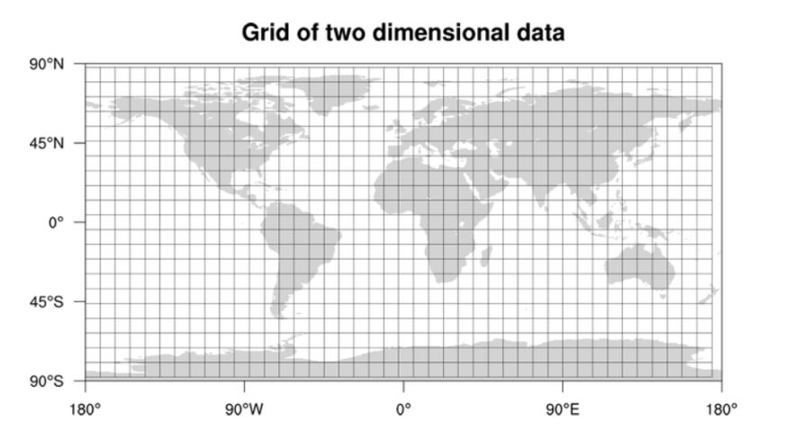

# Designing Yelp or Nearby Friends

## Problem Statement
Let's create a Yelp-style service where users can look for nearby restaurants, theaters, and shopping malls, among other things, and add/view reviews.

- Similar Services: Proximity server.
- Difficulty Level: Hard

### Why Yelp or Proximity Server?
Proximity servers are used to find nearby attractions such as venues, events, and other activities. If you haven't utilized yelp.com before, do so first (you can search for nearby restaurants, theaters, and so on) and spend some time learning about the various possibilities available. 

## Pratice Problem

***Let's get started on the system design solution.***

**If you run into any problems, please see the solution below.**

<!DOCTYPE html>
<html>
<head>
	<meta charset="UTF-8">
	<meta name="viewport" content="width=device-width, initial-scale=1.0">
	<meta name="description" content="X-Frame-Bypass: Web Component extending IFrame to bypass X-Frame-Options: deny/sameorigin">
</head>
<body>
    <a href="https://ej2.syncfusion.com/showcase/angular/diagrambuilder/" target="_blank">Pratice on full Screen</a>
      
	<iframe is="x-frame-bypass" src="https://ej2.syncfusion.com/showcase/angular/diagrambuilder/" width="725" height="500"></iframe>

      
    <h2>Hints to solve the problem</h2>

    <a href="https://jayaemekar.github.io/systemdesign/DesigningYelporNearbyFriends/#requirements-and-goals-of-the-system" target="_blank">1. Consider functional and non-functional requirements. </a>
      
    <a href="https://jayaemekar.github.io/systemdesign/DesigningYelporNearbyFriends/#scale-estimation" target="_blank">2. Estimation of capacity and constraints, such as traffic, bandwidth, and storage. </a>
      
    <a href="https://jayaemekar.github.io/systemdesign/DesigningYelporNearbyFriends/#system-apis" target="_blank">3. Consider System APIs. </a>
      
    <a href="https://jayaemekar.github.io/systemdesign/DesigningYelporNearbyFriends/#database-schema" target="_blank">4. How do you create a database system? </a>
      
    <a href="https://jayaemekar.github.io/systemdesign/DesigningYelporNearbyFriends/#data-partitioning" target="_blank">5. What about data replication and partitioning?</a>
     
     
    <a href="https://jayaemekar.github.io/systemdesign/DesigningYelporNearbyFriends/#cache" target="_blank">6.  Consider Cache and Load Balancing </a>
     
  
</body>
</html>

## <h1>Solution<h1>

### Requirements and Goals of the System
What do we hope to accomplish with a Yelp-like service? Our service will store information about various locations so that users can search for them. Following a query, our service will offer a list of nearby locations.

The following requirements should be met by our Yelp-like service:

**Functional Requirements:**

1. Places should be added, deleted, and updated by users.
2. Users should be able to find all local places within a certain radius based on their location (longitude/latitude).
3. Users should be allowed to leave feedback or reviews on a location. Pictures, text, and a rating can all be included in the feedback.

**Non-functional Requirements:**

1. Users should be able to search in real time with minimal delay.
2. Our service should be able to handle a large number of searches. When compared to adding a new location, there will be a lot of search inquiries.

### Scale Estimation
Assume our system has 500 million places and 100 thousand queries per second (QPS). Let's additionally assume a 20% annual increase in the number of locations and QPS.

### Database Schema
Each Place can have the following fields:

1. LocationID (8 bytes): Uniquely identifies a location.
2. Name (256 bytes)
3. Latitude (8 bytes)
4. Longitude (8 bytes)
5. Description (512 bytes)
6. Category (1 byte): E.g., coffee shop, restaurant, theater, etc.
Although a four-byte integer can uniquely identify 500 million places, we will use eight bytes for LocationID to accommodate future expansion.

            Total size: 8 + 256 + 8 + 8 + 512 + 1 => 793 bytes

We also need to store reviews, photos, and ratings of a Place. We can have a different table to store reviews for Places:

1. LocationID (8 bytes)
2. ReviewID (4 bytes): Uniquely identifies a review, assuming any location will not have more than 2^32 reviews.
3. ReviewText (512 bytes)
4. Rating (1 byte): how many stars a place gets out of ten.
Similarly, we can have a separate table to store photos for Places and Reviews.

### System APIs
To expose the functionality of our service, we can use SOAP or REST APIs. The following could be the API for searching's definition:

        search(api_dev_key, search_terms, user_location, radius_filter, maximum_results_to_return, 
            category_filter, sort, page_token)
**Parameters:**

- **api_dev_key (string):** A registered account's API developer key. This will be used to throttle users based on their quota allocation, among other things.
- **search_terms (string):** A string containing the search terms.
- **user_location (string):** Location of the user.
- **radius_filter (number):** Optional search option to define radius in meters.
- **maximum_results_to_return (number):** Number of business results to return.
- **category_filter (string):** Optional category to filter search results, e.g., Restaurants, Shopping Centers, etc.
- **sort (number):** Optional sort mode: Best matched (0 - default), Minimum distance (1), Highest rated (2).
- **page_token (string):** This token will specify a page in the result set that should be returned.

**Returns: (JSON)**
A JSON file containing data about a list of businesses that match the search query. The business name, address, category, rating, and thumbnail will all be included in each search entry.

### Basic System Design and Algorithm
At a high level, each dataset given above must be stored and indexed (places, reviews, etc.). Users expect to see results in real time while searching for local areas, therefore the indexing must be read efficiently for them to query this enormous database.

We don't need to worry about frequent data updates because the position of a place doesn't change too often. In contrast, if we want to construct a service where items, such as people or cabs, change their location regularly, we might come up with a radically different design.

Let's look at the various options for storing this information and determine which technique is appropriate for our needs:

**a. SQL solution**

One simple option is to put all of the information in a database such as MySQL. Each location will be recorded in its own row, with its own LocationID. Each location's longitude and latitude will be stored separately in two columns, so we'll need indexes on both of these values to perform a quick search.

We can use the following query to find all the nearby places of a given location (X, Y) within a radius of 'D':

        Select * from Places where Latitude between X-D and X+D and Longitude between Y-D and Y+D
The preceding question is not quite accurate, as we know that the distance formula (Pythagorean theorem) must be used to find the distance between two points, but let's go with it for now.

**How efficient would this query be?** 

We expect that our service will store 500 million items. Because we have two different indexes, each one can produce a large list of locations, making an intersection of the two lists inefficient. Another perspective on this issue is that there may be too many locations between 'X-D' and 'X+D,' and similarly between 'Y-D' and 'Y+D.' We can enhance the performance of our query if we can shorten these lists.

**b. Grids**

To arrange sites into smaller sets, we can divide the entire map into smaller grids. Each grid will contain all of the Places that fall within a specified longitude and latitude range. This technique would allow us to discover neighboring locations by querying only a few grids. We can identify all the neighboring grids based on a given location and radius, and then query these grids to find close places.

 
  <kbd>
  
  </kbd>

It would be safe to assume that GridID (a four bytes number) would uniquely identify grids in our system.

**What could be a reasonable grid size?** 

Because we also want to limit the number of grids, the grid size might be equal to the distance we want to query. If the grid size is the same as the distance we want to query, we just need to look in the grid that contains the supplied location and the eight grids around it. We can simply discover the grid number of any place (lat, long) and its nearby grids because our grids are statically specified (due to the set grid size).

We may save the GridID with each location in the database and create an index on it for faster searching. Our query will now look like this:

    Select * from Places where Latitude between X-D and X+D and Longitude between Y-D and Y+D and GridID in (GridID, GridID1, GridID2, ..., GridID8)
This will surely reduce the query's execution time.

Is it necessary to store our index in memory? Our service's performance will be improved by keeping the index in memory. We can keep our index in a hash table with the grid number as the key and the list of places in the grid as the value.

**How much memory will we need to store the index?** 

Let's say our search radius is 10 miles; we'll have 20 million grids because the earth's total area is roughly 200 million square miles. We'd need a four-byte integer to uniquely identify each grid, and since LocationID is eight bytes, we'd require 4GB of memory to hold the index (ignoring hash table overhead).

                (4 * 20M) + (8 * 500M) ~= 4 GB
Because our locations are not evenly distributed among grids, this method may still be slow for grids with a large number of places. On the one hand, we can have densely crowded areas with many places, and on the other hand, we can have sparsely populated areas.

This issue can be overcome if we can dynamically alter our grid size such that whenever we have a large grid, we can divide it down into smaller grids. The following are some potential drawbacks of this strategy: 1) how to map these grids to locations, and 2) how to locate all of a grid's neighboring grids.

**c. Dynamic size grids**

Let's pretend we don't want more than 500 spots in a grid since we want to search faster. When a grid hits this size limit, we divide it into four equal-sized grids and distribute locations among them. This implies densely crowded locations, such as downtown San Francisco, will have several grids, while sparsely populated areas, such as the Pacific Ocean, will have enormous grids with places just along the shore.

**What data-structure can hold this information?** 

Our needs can be met by a tree with four children at each node. Each node will represent a grid and will store information about all of the locations within that grid. If a node surpasses our 500-place limit, it will be broken down into four child nodes, with spots distributed among them. All of the leaf nodes will now depict grids that can't be broken down any more. As a result, leaf nodes will maintain a list of locations. A QuadTree is a tree structure in which each node can have four offspring.

 
  <kbd>
  
  </kbd>

**How will we build a QuadTree?** 

We'll start with a single node that represents the entire world in a single grid. We'll divide it into four nodes and distribute places among them because it'll contain more than 500 sites. This step will be repeated for each child node until no nodes with more than 500 locations remain.

**How will we find the grid for a given location?** 

We'll start with the root node and work our way down to the node/grid we need. We'll check if the current node we're visiting has any children at each step. If it has, we will repeat the operation on the child node that has our desired location. If the node doesn't have any children, it's the one we want.

**How will we find neighboring grids of a given grid?** 

We can connect all leaf nodes using a doubly linked list because only leaf nodes include a list of locations. We can iterate forward and backward among the surrounding leaf nodes to find our target positions in this fashion. Another method for locating adjacent grids is to use parent nodes. We can store a pointer in each node to access its parent, and we can quickly discover siblings of a node because each parent node holds pointers to all of its offspring. By continuing up through the parent pointers, we can keep broadening our search for neighboring grids.

We can query the backend database to discover details about adjacent LocationIDs once we have them.

**What will be the search workflow?** 

We'll start by locating the node that includes the user's current location. We can return them to the user if that node contains enough desired spots. If not, we'll keep expanding to surrounding nodes (either through parent pointers or a doubly linked list) until we either locate the needed number of places or our maximum radius search is exhausted.

To store the QuadTree, how much memory will be required? If we merely cache LocationID and Lat/Long for each Place, we'd require 12GB to keep all of them.

                            24 * 500M => 12 GB
Since each grid can have a maximum of 500 places, and we have 500M locations, how many total grids we will have?

                            500M / 500 => 1M grids
That means we'll have 1 million leaf nodes, each with 12GB of location data. Internal nodes make up around 1/3 of a QuadTree with 1M leaf nodes, and each internal node has four pointers (for its children). If each pointer is 8 bytes long, the total amount of memory required to hold all internal nodes is:

                            1M * 1/3 * 4 * 8 = 10 MB
As a result, total memory for the QuadTree would be 12.01GB. This is small enough to fit into a modern server.

**How would we insert a new Place into our system?** 

We need to update the databases as well as the QuadTree whenever a new Place is added by a user. If our tree is on a single server, adding a new Place is simple; but, if the QuadTree is split across multiple servers, we must first locate the new Place's grid/server and then add it there (discussed in the next section).

### Data Partitioning
What if we have so many places that our index will not fit in the memory of a single machine? With a 20% annual growth rate, we will eventually surpass the server's memory limit. What if one server is unable to handle all of the read traffic? We must partition our QuadTree to tackle these problems!

We'll look at two options (both of these partitioning strategies can be used with databases):

**a. Sharding based on regions:** 

We can divide our locations into regions (similar to zip codes), with each region's locations kept on a single node. To save a location, we will use the server's region, and to query for nearby places, we will use the region server that contains the user's position. This strategy has couple of flaws:

**What if a region becomes hot?** 

On the server holding that region, there would be a lot of inquiries, making it slow. This will have an impact on the quality of our service.
When compared to other regions, some can wind up storing a lot of spots over time. As a result, keeping a consistent allocation of sites while regions grow is difficult.
We must either repartition our data or apply consistent hashing to recover from these instances.

**b. Sharding based on LocationID:** 

Each LocationID will be mapped to a server where it will be stored by our hash function. We'll go through all of the places and calculate the hash of each LocationID to select a server where it may be stored while creating our QuadTree. To locate places near a location, we must query all servers, with each server returning a list of neighboring locations. These results will be compiled and returned to the user by a centralized server.

**Will we have different QuadTree structure on different partitions?** 

Yes, this is possible because an equal number of locations in any particular grid on all partitions is not guaranteed. We do, however, ensure that each server has roughly the same number of Places. However, because we will be scanning all nearby grids within the stated radius on all partitions, the differing tree structure on different servers will not be an issue.

The remaining part of this chapter is based on an assumtion that we have partitioned our data based on LocationID.

 
  <kbd>
  
  </kbd>

### Replication and Fault Tolerance
Data partitioning can be replaced by having replicas of QuadTree servers. We can have clones of each QuadTree server to spread read traffic. We can set up a master-slave setup in which replicas (slaves) solely provide read traffic and all write traffic goes to the master before being applied to slaves. Slaves may not have certain newly inserted spots (there will be a few milliseconds delay), but this may be okay.

**What will happen when a QuadTree server dies?** 

We can have a secondary replica of each server that will assume control after the primary dies. The QuadTree structure will be the same on both primary and backup servers.

**What if both primary and secondary servers die at the same time?** 

- We'll need to set aside a new server and rebuild the QuadTree on it. We don't know what locations were saved on this server, so how can we do that? The brute-force technique would be to cycle over the entire database, filtering LocationIDs with our hash function to find all of the required locations that would be kept on this server. 
- This would be wasteful and slow; also, while the server is being rebuilt, we will be unable to service any queries from it, resulting in the users missing certain areas that they should have viewed.

**How can we efficiently retrieve a mapping between Places and QuadTree server?** 

- We must create a reverse index that maps all Places to their QuadTree server. This information can be stored on a separate QuadTree Index server. 
- We'll need to create a HashMap with the QuadTree server number as the key and a HashSet containing all the Places kept on that QuadTree server as the value. 
- Because information servers can generate QuadTrees using LocationID and Lat/Long, we need to keep them with each place. We've kept Places' data in a HashSet, which allows us to swiftly add and remove Places from our index. 
- So now, anytime a QuadTree server has to rebuild itself, it can simply request all of the Places it requires from the QuadTree Index server. 
- This method will undoubtedly be quick. For fault tolerance, we need additionally have a duplicate of the QuadTree Index server. If a QuadTree Index server fails, the index can be rebuilt by iterating through the database.

### Cache
- We can put a cache in front of our database to deal with busy places. We may use an off-the-shelf solution like Memcache to store all of the information about hot spots. 
- Before reaching the backend database, application servers can rapidly verify if the cache has that Place. We can modify the number of cache servers required based on client usage patterns. 
- Least Recently Used (LRU) appears to be a good cache eviction policy for our system.

### Load Balancing (LB)
- We can use the LB layer in our system in two places: 1) between clients and application servers, and 2) between application servers and backend servers. 
- A basic Round Robin technique can be used to distribute all incoming requests evenly among backend servers at first. 
- This LB is simple to set up and has no additional overhead. Another advantage of this method is that if a server goes down, the load balancer will remove it from the rotation and stop distributing traffic to it.
- Round Robin LB has the drawback of not taking server load into account. The load balancer will not stop sending new requests to a server that is overcrowded or slow. 
- To tackle this, a more intelligent LB solution would be required, one that polls the backend server about their load on a regular basis and adjusts traffic accordingly.

### Ranking
How about if we want to rank the search results not only by proximity but also by popularity or relevance?

**How can we return most popular places within a given radius?** 

- Assume we keep track of each location's overall popularity. In our system, an aggregated figure can indicate this popularity, such as how many stars a location receives out of 10 (this would be an average of multiple user rankings)? 
- This number will be saved in both the database and the QuadTree. We can ask each partition of the QuadTree to return the top 100 places with the most popularity while looking for the top 100 places within a defined radius. 
- The aggregator server may then decide the top 100 locations from all of the locations returned by different partitions.

Remember that our system was not designed to update location data often. How can we change the popularity of a location in our QuadTree using this design? Although we can search for a location and update its popularity in the QuadTree, this would consume a significant amount of resources and could slow down search queries and system throughput. We can decide to update it once or twice a day if the popularity of a location is not expected to show in the system within a few hours, especially when the load on the system is low.

The QuadTree's dynamic updates are discussed in depth in our following challenge, Designing Uber backend.