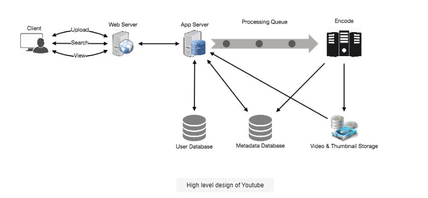
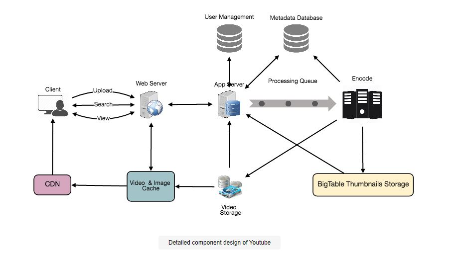

# Designing Youtube or Netflix
## Problem Statement
Let's create a video sharing service similar to Youtube, where users may publish, view, and search videos.

- Similar Services: netflix.com, vimeo.com, dailymotion.com, veoh.com
- Difficulty Level: Medium

### What is Youtube?
Youtube is one of the world's most popular video-sharing platforms. Users can submit, watch, share, rate, and report videos, as well as leave comments on them.

## Pratice Problem

***Let's get started on the system design solution.***

**If you run into any problems, please see the solution below.**

<!DOCTYPE html>
<html>
<head>
	<meta charset="UTF-8">
	<meta name="viewport" content="width=device-width, initial-scale=1.0">
	<meta name="description" content="X-Frame-Bypass: Web Component extending IFrame to bypass X-Frame-Options: deny/sameorigin">
</head>
<body>
    <a href="https://ej2.syncfusion.com/showcase/angular/diagrambuilder/" target="_blank">Pratice on full Screen</a>
      
	<iframe is="x-frame-bypass" src="https://ej2.syncfusion.com/showcase/angular/diagrambuilder/" width="725" height="500"></iframe>

      
    <h2>Hints to solve the problem</h2>

    <a href="https://jayaemekar.github.io/systemdesign/DesigningURLShorteningService/#requirements-and-goals-of-the-system" target="_blank">1. Consider functional and non-functional requirements. </a>
      
    <a href="https://jayaemekar.github.io/systemdesign/DesigningURLShorteningService/#capacity-estimation-and-constraints" target="_blank">2. Estimation of capacity and constraints, such as traffic, bandwidth, and storage. </a>
      
    <a href="https://jayaemekar.github.io/systemdesign/DesigningURLShorteningService/#system-apis" target="_blank">3. Consider System APIs. </a>
      
    <a href="https://jayaemekar.github.io/systemdesign/DesigningURLShorteningService/#database-design" target="_blank">4. How do you create a database system? </a>
      
    <a href="https://jayaemekar.github.io/systemdesign/DesigningURLShorteningService/#data-partitioning-and-replication" target="_blank">5. What about data replication and partitioning?</a>
     
     
    <a href="https://jayaemekar.github.io/systemdesign/DesigningURLShorteningService/#cache" target="_blank">6.  Consider Cache and Load Balancing </a>
     
  
</body>
</html>

## <h1>Solution<h1>
### Requirements and Goals of the System
For the purposes of this exercise, we intend to create a simplified version of Youtube that meets the following criteria:
**Functional Requirements:**

1. Users should be able to upload videos.
2. Users should be able to share and view videos.
3. Users should be able to perform searches based on video titles.
4. Our services should be able to record stats of videos, e.g., likes/dislikes, total number of views, etc.
Users should be able to add and view comments on videos.

**Non-Functional Requirements:**

1. The system should be highly reliable, any video uploaded should not be lost.
2. The system should be highly available. Consistency can take a hit (in the interest of availability); if a user doesn’t see a video for a while, it should be fine.
3. Users should have a real time experience while watching videos and should not feel any lag.

**Not in scope:** Video recommendations, most popular videos, channels, subscriptions, watch later, favorites, etc.

### Capacity Estimation and Constraints
Assume there are 1.5 billion overall users, with 800 million being daily active users. If a consumer watches five videos each day on average, the total video views per second is:

                        800M * 5 / 86400 sec => 46K videos/sec
Assume our upload:view ratio is 1:200, which is 200 videos are seen for every video posted, resulting in 230 videos uploaded each second.

                        46K / 200 => 230 videos/sec
**Storage Estimates:** Assume that 500 hours of videos are added to Youtube every minute. If one minute of video requires an average of 50MB of storage (films must be kept in several codecs), the total storage required for videos uploaded in one minute is:

                        500 hours * 60 min * 50MB => 1500 GB/min (25 GB/sec)
These numbers are calculated without taking into account video compression and replication, which might alter our results.

**Bandwidth estimates:**  With 500 hours of video uploads each minute and a bandwidth of 10MB/min per video upload, we'd be obtaining 300GB of data per minute.

                        500 hours * 60 mins * 10MB => 300GB/min (5GB/sec)
Assuming an upload:view ratio of 1:200, we would need 1TB/s outgoing bandwidth.

### System APIs
To expose the functionality of our service, we can use SOAP or REST APIs. The APIs for posting and searching videos could have the following definitions:

        uploadVideo(api_dev_key, video_title, vide_description, tags[], category_id, default_language, 
                                recording_details, video_contents)
**Parameters:**

- **api_dev_key (string):** The API developer key of a registered account. This will be used to, among other things, throttle users based on their allocated quota.
- **video_title (string):** Title of the video.
- **vide_description (string):** Optional description of the video.
- **tags (string[]):** Optional tags for the video.
- **category_id (string):** Category of the video, e.g., Film, Song, People, etc.
- **default_language (string):** For example English, Mandarin, Hindi, etc.
- **recording_details (string):** Location where the video was recorded.
- **video_contents (stream):** Video to be uploaded.

**Returns: (string)**
A successful upload will return HTTP 202 (request accepted) and once the video encoding is completed the user is notified through email with a link to access the video. We can also expose a queryable API to let users know the current status of their uploaded video.

        searchVideo(api_dev_key, search_query, user_location, maximum_videos_to_return, page_token)
**Parameters:**

- **api_dev_key (string):** The API developer key of a registered account of our service.
- **search_query (string):** A string containing the search terms.
- **user_location (string):** Optional location of the user performing the search.
- **maximum_videos_to_return (number):** Maximum number of results returned in one request.
- **page_token (string):** This token will specify a page in the result set that should be returned.

**Returns: (JSON)**
A JSON containing information about the list of video resources matching the search query. Each video resource will have a video title, a thumbnail, a video creation date, and a view count.

            streamVideo(api_dev_key, video_id, offset, codec, resolution)
**Parameters:**

- **api_dev_key (string):** The API developer key of a registered account of our service.
- **video_id (string):** A string to identify the video.
- **offset (number):** We should be able to stream video from any offset, which is measured in seconds from the start of the video. We'll need to save the offset on the server if we allow playing/paused videos from many devices. Users will be able to resume watching a video on any device from the point where they left off.
- **codec (string) & resolution(string):** To support play/pause from different devices, the client should communicate the codec and resolution information to the API. Assume you were watching a video on Netflix on your TV when you paused it and switched to Netflix on your phone. Both these devices have different resolutions and use different codecs, therefore you'll need codec and resolution in this scenario.

**Returns: (STREAM)**
A media stream (a video chunk) from the given offset.

### High Level Design
We'd require the following components at a high level:

- **Processing Queue:** Each submitted video will be placed in a processing queue, which will be de-queued for encoding, thumbnail generation, and storage later.
- **Encoder:** To encode each uploaded video into multiple formats.
- **Thumbnails generator:** To generate a few thumbnails for each video.
- **Video and Thumbnail storage:** To store video and thumbnail files in some distributed file storage.
- **User Database:** To store user’s information, e.g., name, email, address, etc.
- **Video metadata storage:** A metadata database that stores all of the information about videos, such as title, system file path, uploading user, total views, likes, dislikes, and so on. It will also serve as a repository for all video comments.

 
  <kbd>
  
  </kbd>

### Database Schema
- Video metadata storage - MySql

A SQL database can be used to store video metadata. Each video should have the following information:

    VideoID
    Title
    Description
    Size
    Thumbnail
    Uploader/User
    Total number of likes
    Total number of dislikes
    Total number of views

For each video comment, we need to store following information:

    CommentID
    VideoID
    UserID
    Comment
    TimeOfCreation
    User data storage - MySql

UserID, Name, email, address, age, registration details etc.

### Detailed Component 

We'll focus on designing a system that can retrieve videos quickly because the service will be read-heavy. We may expect a read:write ratio of 200:1, which equals 200 video views for every video uploaded.

Where would the videos be kept? A distributed file storage system such as HDFS or GlusterFS can be used to store videos.

**How should we manage read traffic efficiently?** 

- Read traffic and write traffic should be separated. We can split our read traffic over numerous servers because each video will have multiple copies. 
- We can have master-slave arrangements for metadata, where writes go to the master first and subsequently to all slaves. 
- Such configurations can result in data staleness; for example, when a new video is added, its metadata is placed in the master first, and our slaves will not be able to see it until it is applied to the slave; as a result, the user will receive stale results.
- This staleness might be acceptable in our system as it would be very short-lived and the user would be able to see the new videos after a few milliseconds.

**How would you store thumbnails?** 

- The number of thumbnails will far outnumber the number of videos. 
- If we estimate that each movie will have five thumbnails, we'll need a storage system that can handle a large amount of read traffic. 
- Before determining which thumbnail storage method to utilize, two factors must be considered:
- Thumbnails are little files with a maximum file size of 5KB.
- In comparison to videos, read traffic for thumbnails will be massive. 
- Users will watch a single video at a time, although they may be viewing a page with 20 thumbnails of other films.
- Consider putting all of the thumbnails on a CD. Given the large number of files, we must do numerous seeks to various regions on the disk in order to read them. This is inefficient and will result in longer delays.
- Bigtable is a good option because it merges numerous files into a single block for storage on the disk and reads a modest quantity of data quickly. 
- Our service's two most important needs are both of these. 
- Keeping hot thumbnails in the cache will also assist to reduce latency, and because thumbnail files are short, we can simply cache a large number of them in memory.

**Video Uploads:** 

Because videos can be large, we should support continuing from the same position if the connection stops while uploading.

**Video Encoding:** 

Newly uploaded videos are saved on the server, and a new task to encode the video into several formats is added to the processing queue. The uploader will be alerted when all of the encoding is complete, and the video will be made available for viewing and sharing.

 
  <kbd>
  
  </kbd>

### Metadata Sharding

We need to distribute our data across numerous machines to do read/write operations efficiently because we have a large number of new films every day and our read load is really high. We can shard our data in a variety of ways. Let's have a look at the various sharding strategies one by one:

**Sharding based on UserID:** 

- We can try storing all of a user's data on a single server. We can give the UserID to our hash function while storing, which will map the user to a database server where all of the metadata for that user's films will be stored. 
- When searching for a user's videos, we can utilize our hash function to locate the server that holds the user's data and read it from there. 
- We'll have to ask all servers to find videos by title, and each server will return a set of videos. Before sending the results to the user, a centralized server would aggregate and rank them.

This strategy has several flaws:

**What if a user gets well-known?** 

- There could be a large number of queries on the server that hold that user, causing a performance bottleneck. This will have an impact on our service's overall performance.
- Some users may accumulate a large number of movies over time compared to others. It's difficult to keep a uniform distribution of rising user data.
- We must either repartition/redistribute our data or utilize consistent hashing to balance the load between servers to recover from these circumstances.

**Sharding based on VideoID:** 

- Each VideoID will be mapped to a random server where the metadata for that video will be stored. We will query all servers to find a user's videos, and each server will return a set of videos. 
- Before sending these results to the user, a centralized server will aggregate and rank them. 
- This method overcomes the problem of popular users, but also transfers the focus on popular videos.

We can boost our performance even further by putting a cache in front of the database servers to store hot videos.

### Video Deduplication
- Our service will have to deal with widespread video duplication as a result of a large number of customers uploading a large volume of video data. 
- Duplicate videos can have different aspect ratios or encodings, overlays or extra borders, or be fragments from a lengthier original video. 

The development of duplicate videos has a variety of consequences:

**Data Storage:** Keeping numerous copies of the same video could be a waste of storage space.

**Caching:** Duplicate movies reduce cache efficiency by consuming space that could be used for unique content.

**Network usage:** Duplicate videos will increase the quantity of data that must be transferred over the network to caching services in-network.

**Energy consumption:** Increased storage, an ineffective cache, and network utilization can all lead to energy waste.

Duplicate search results, longer video startup times, and interrupted streaming for the end user will be the result of these inefficiencies.

Deduplication makes the greatest sense for our service early on, while a user is uploading a video, rather than waiting until later to identify duplicate films. We will save a lot of resources by using inline deduplication instead of encoding, transferring, and storing the duplicate copy of the video. Our service can execute video matching algorithms (e.g., Block Matching, Phase Correlation, etc.) to discover duplications as soon as a user starts uploading a video.

We can either halt the upload and use the old copy or continue the upload and use the freshly uploaded video if it is of higher quality. We can intelligently break the video into smaller chunks if the newly uploaded video is a subpart of an old video or vice versa, so that we only upload the missing parts.

### Load Balancing
- We should employ Consistent Hashing among our cache servers, as this will assist balance the demand between them. 
- Due to the varying popularity of each video, we will be adopting a static hash-based approach to map videos to hostnames, which may result in an uneven load on the logical replicas. 
- If a video gets popular, for example, the logical replica corresponding to that video will see more traffic than other servers. 
- These unequal loads for logical replicas can then result in unequal load distribution on physical servers. - Any busy server in one area can send a client to a less busy server in the same cache location to remedy this issue. 
- For this circumstance, we can employ dynamic HTTP redirections.
- However, there are several disadvantages to using redirections. First, because our service attempts to load balance locally, several redirections may occur if the server receiving the redirection is unable to serve the video. 
- Furthermore, each redirection necessitates an additional HTTP request from the client, resulting in longer delays before the video begins to play. 
- Furthermore, because higher tier caches are only available at a limited number of locations, inter-tier (or cross data-center) redirections send a client to a distant cache location.

### Cache
- Our service requires a large-scale video distribution infrastructure to serve globally distributed users. Using a huge number of geographically distributed video cache servers, our service should bring its material closer to the user. 
- We need an approach that maximizes user performance while simultaneously distributing the load equitably across the cache servers.
- To cache hot database rows, we can add a cache to metadata servers. 
- Application servers can quickly verify if the cache has the needed rows by using Memcache to cache the data before reaching the database. 
- For our system, the Least Recently Used (LRU) policy may be an appropriate cache eviction policy. 
- The least recently viewed row is discarded first under this policy.

**How can we make our cache more intelligent?** 

If we follow the 80-20 rule, which states that 20% of daily video read volume generates 80% of traffic, implying that some videos are so popular that the majority of people watch them, we can try caching 20% of daily video read volume and metadata.

### Content Delivery Network (CDN)

- A content delivery network (CDN) is a network of distributed servers that deliver web content to users based on their geographic location, the origin of the web page, and the position of a content delivery server. 
- In our Caching chapter, look at the 'CDN' section.

Popular videos can be moved to CDNs using our service:

- Content is replicated in many locations using CDNs. Videos are more likely to be closer to the user, and videos will stream from a friendlier network with fewer hops.
- CDNs make extensive use of caching and can typically serve videos from memory.
- Our servers in multiple data centers can provide less popular videos (1-20 views per day) that are not cached by CDNs.

### Fault Tolerance
- For database server distribution, we should utilize Consistent Hashing. 
- Consistent hashing will aid in the replacement of a dead server as well as the distribution of load among servers.