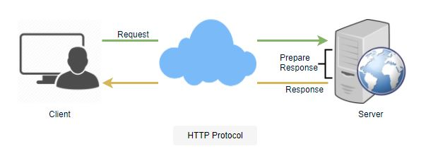
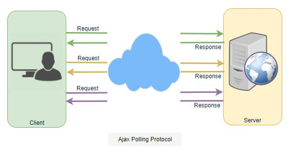
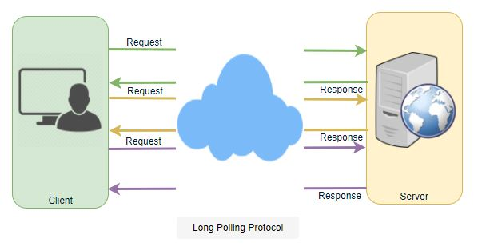
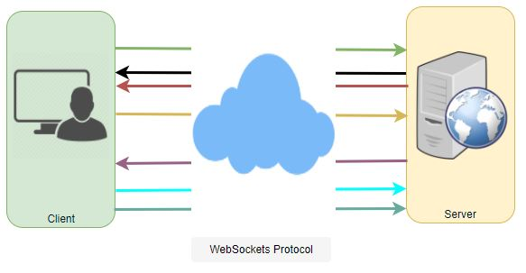
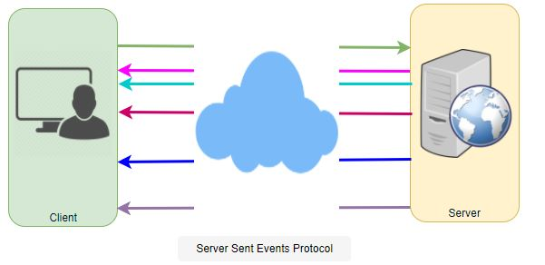

# WebSockets vs. Server-Sent Events vs. Long-Polling

**Can you explain the differences between Long-Polling, WebSockets, and Server-Sent Events?

Long-Polling, WebSockets, and Server-Sent Events are some of the most popular communication protocols between a client and a web server. Let's start with a basic understanding of how a regular HTTP web request looks. The sequence of events for a standard HTTP request is as follows:

1. The client establishes a connection with the server and requests data.
2. The response is calculated by the server.
3. On the opened request, the server provides the response back to the client.

 
  <kbd>
  
  </kbd>

## Polling with Ajax
The great majority of AJAX apps employ polling as a common strategy. The basic concept is that the client polls (or requests) data from the server on a regular basis. The client submits a request and awaits a response from the server. An empty response is returned if no data is available.

1. The client establishes a connection with the server and sends a standard HTTP request for data.
2. The requested webpage sends periodic queries to the server (e.g., 0.5 seconds).
3. Just like regular HTTP traffic, the server calculates the response and sends it back.
4. To acquire updates from the server, the client performs the first three steps on a regular basis.

Polling has the drawback of requiring the client to continually requesting the server for new data. As a result, many answers are blank, resulting in HTTP overhead.

 
  <kbd>
  
  </kbd>

## Long-Polling HTTP
This is a version of traditional polling that allows the server to push data to a client whenever it is available. Long-Polling involves the client requesting information from the server in the same way that standard polling does, but with the caveat that the server may not respond right away. This is why this approach is also known as a "Hanging GET."

1. Instead of returning an empty answer if the server does not have any data for the client, the server holds the request and waits for data to become available.
2. A full response is delivered to the client once the data is accessible. The client then instantly re-requests information from the server, ensuring that the server has a waiting request ready to give data in response to an event virtually all of the time.

The following is the basic life cycle of an application that uses HTTP Long-Polling:

1. The client issues a standard HTTP request and then waits for a response.
2. The server waits until an update is available or a timeout occurs before responding.
3. When an update is available, the server sends the client a complete response.
4. After getting a response, the client normally sends a new long-poll request, either immediately or after a delay to provide for an acceptable latency duration.
5. There is a timeout on each Long-Poll request. After a connection is lost owing to timeouts, the client must rejoin on a regular basis.

 
  <kbd>
  
  </kbd>

## WebSockets

Over a single TCP connection, WebSocket delivers full duplex communication channels. It establishes a permanent link between a client and a server, allowing both parties to begin transferring data at any moment. The WebSocket handshake is the process by which the client establishes a WebSocket connection. If the operation is successful, the server and client can freely communicate data in both ways.

The WebSocket protocol allows for low-latency communication between a client and a server, allowing for real-time data flow from and to the server. This is accomplished by providing a standardized method for the server to deliver content to the browser without the client's permission, as well as allowing messages to be passed back and forth while the connection is open. A two-way (bi-directional) continuing dialogue between a client and a server can be established in this manner.

 
  <kbd>
  
  </kbd>

## Server-Delivered Events (SSEs)
SSEs allow the client to establish a long-term and persistent connection with the server. This connection is used by the server to send data to a client. If the client wants to communicate data to the server, it will have to do so using a different technology/protocol.

1. A client uses HTTP to request data from a server.
2. The requesting webpage establishes a server connection.
3. When new information becomes available, the server provides it to the client.

When real-time transmission from the server to the client is required, or if the server generates data in a loop and will be transmitting several events to the client, SSEs are the ideal choice.

 
  <kbd>
  
  </kbd>

