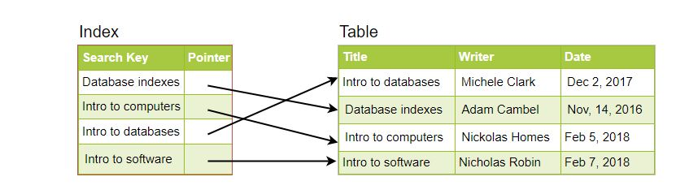

# Indexes

When it comes to databases, indexes are well-known. Database performance will eventually degrade to the point where it is no longer acceptable. When this happens, database indexing is one of the first things you should do.

The purpose of setting an index on a table in a database is to make it easier to search through the table and discover the row or rows we're looking for. Indexes can be built utilizing one or more columns from a database table, allowing for quick random lookups as well as efficient access to ordered items.

**An example would be a library catalog.**

- A library catalog is a list of books found in a library that is kept in a register. The catalog is laid out in the format of a database table, with four columns: book title, author, subject, and publication date.
- Typically, there are two such catalogs: one ordered by book title and the other sorted by author name. That way, you may either think of a writer you'd like to read and then browse their books, or hunt up a specific book title you'd like to read if you don't know the author's name. 
- These catalogs function as indexes for the book database. They give you a sorted set of data that you can search for pertinent information in.
- Simply said, an index is a data structure that functions similarly to a table of contents in that it directs us to the real data. When we establish an index on a table column, we store the column as well as a pointer to the entire row in the index. 
- Assuming you have a table with a list of books, the diagram below depicts how an index on the 'Title' column would look:

 
  <kbd>
  
  </kbd>

- This notion can be used to larger datasets in the same way that a standard relational data store can. When it comes to indexes, the trick is to think about how users will access the data. 
- Indexes are essential for maximizing data access when data sets are many terabytes in size but have very little payloads (e.g., 1 KB). 
- Finding a tiny payload in such a vast dataset can be difficult because we can't iterate over all of it in an acceptable amount of time.
- Furthermore, such a big data collection is extremely likely to be dispersed among numerous physical devices, necessitating the development of a method for locating the correct physical location of the needed data. 
- The best way to do this is to use indexes.

## How do Indexes decrease write performance?

- An index can drastically speed up data retrieval, but because of the additional keys, it can be rather huge, slowing down data input and update.
- When adding rows to a table with an active index or updating existing rows, we must not only write the data but also update the index. The writing performance will suffer as a result of this. 
- All insert, update, and delete actions for the table suffer from this speed decrease. 
- As a result, adding unnecessary indexes to tables should be avoided, and obsolete indexes should be eliminated.
- To be clear, increasing indexes is all about enhancing the speed of search queries. If the purpose of the database is to offer a data store that is frequently written to but seldom read from, then slowing down the more common process, writing, is probably not worth the performance boost we obtain from reading.

See this page for further information. **[Database Indexes](https://en.wikipedia.org/wiki/Database_index)**