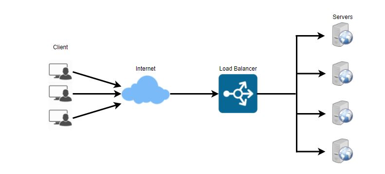
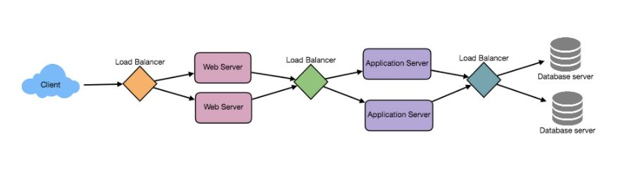
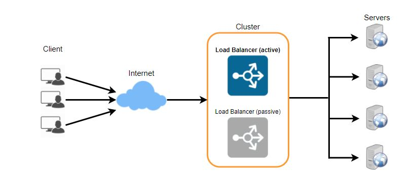

# Load Balancing

- A load balancer sits in front of your server and acts as a "traffic cop," directing client requests across all servers.
- It aids in the distribution of traffic among a cluster of servers in order to improve application, website, or database responsiveness and availability. While distributing requests, LB also maintains track of the status of all the resources.
- A load balancer can be a real device, a virtualized instance, or a software process that runs on specialized hardware.
- Load Balancer will stop transmitting traffic to a server if it is not available to accept new requests, is not responding, or has a high error rate.

 
  <kbd>
  
  </kbd>

We can strive to balance the load at each tier of the system to achieve full scalability and redundancy. Load balancers can be added in three places:

1. Between the web server and the user
2. Between web servers and a platform layer within the company, such as application servers or cache servers
3. Between the database and the internal platform layer.

 
  <kbd>
  
  </kbd>

### Load Balancing Algorithms

There are several load balancing methods available, each of which employs a different algorithm to meet the needs of the user.

**1. Least Connection Method** : Traffic is sent to the server with the fewest active connections using this strategy.
When there are a significant number of persistent client connections that are distributed unevenly throughout the servers, this strategy is quite useful.

**2. Least Response Time Method**: Traffic is routed to the server with the fewest active connections and the fastest average response time.

**3. Least Bandwidth Method**: This approach chooses the server with the least amount of traffic (measured in megabits per second) at the time (Mbps).

**4. Round Robin Method**: This approach sends each new request to the next server after cycling through a list of servers. It restarts from the beginning when it reaches the end of the list. It's most useful when the servers are of similar specs and there aren't a lot of permanent connections.

**5. Weighted Round Robin Method**: The weighted round-robin scheduling is intended to accommodate servers with varying processing capacities more effectively. A weight is allocated to each server (an integer value that indicates the processing capacity). Higher-weighted servers receive new connections before lower-weighted servers, and higher-weighted servers receive more connections than lower-weighted servers.

**6. IP Hash**: To redirect the request to a server, this approach calculates a hash of the client's IP address.

## Redundant Load Balancers

- The load balancer can be a single point of failure; to avoid this, link a second load balancer to the first to form a cluster. 
- Each load balancer keeps an eye on the other's health, and since they're both capable of providing traffic and detecting failures, if the main load balancer fails, the second load balancer takes over.

 
  <kbd>
  
  </kbd>

## Benefits of Load Balancing
1. Users benefit from faster and more consistent service. Users will not have to wait for a single underperforming server to complete its earlier responsibilities. Instead, their queries are forwarded to a more readily available resource right away.
2. There is reduced downtime and higher throughput for service providers. Even a complete server failure will have no effect on the end user experience because the load balancer will simply redirect traffic to a healthy server.

3. Load balancing makes it easier for system administrators to deal with incoming requests while reducing the amount of time users have to wait.

4. Predictive analytics, which detects traffic bottlenecks before they occur, is one of the advantages of smart load balancers. As a result, the smart load balancer provides actionable data to a business. These are essential for automation and can aid in commercial decision-making.

5. There are fewer defective or strained components for system managers to deal with. Instead of a single device doing a lot of work, load balancing distributes the workload among numerous devices.

The following links contain useful information regarding load balancers:

1. **[What is load balancing](https://avinetworks.com/what-is-load-balancing/)**
2. **[Introduction to architecting systems](https://lethain.com/introduction-to-architecting-systems-for-scale/)**
3. **[Load balancing ](https://en.wikipedia.org/wiki/Load_balancing_(computing))**