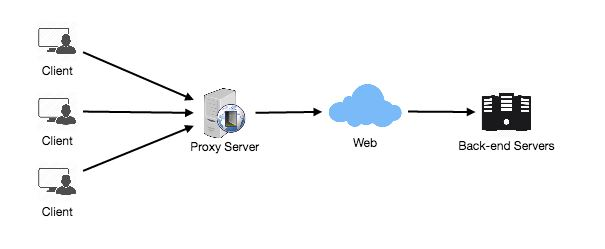

# Proxy Servers

A proxy server is a server that sits in the middle of the client and the back-end server. Clients connect to proxy servers to request services such as a web page, a file, a connection, and so on. In a nutshell, a proxy server is a piece of software or hardware that acts as a middleman between clients and other servers when they request resources.

Proxy servers are commonly used to filter requests, log requests, and occasionally alter requests (by adding/removing headers, encrypting/decrypting, or compressing a resource). Another benefit of a proxy server is that it can handle a large number of requests in its cache. If a resource is accessed by numerous clients, the proxy server can cache it and serve it to all clients without having to go to the remote server.

 
  <kbd>
  
  </kbd>

## Types of Proxy Servers

Proxies can be found on the client's local server or between the client and remote servers. Here are a few well-known proxy server types:

### Open Proxy
An open proxy is a proxy server that anyone on the Internet can visit. In general, a proxy server only permits users within a network group (i.e., a closed proxy) to store and forward Internet services like DNS or web pages in order to reduce and regulate the group's bandwidth usage. An open proxy, on the other hand, allows any Internet user to use this forwarding service. There are two well-known open proxy types:

1. **Anonymous Proxy -** This proxy identifies itself as a server but does not reveal the client's real IP address. Though this proxy server is easily detectable, it can be beneficial to some users because it hides their IP address.
2. **Trаnspаrent Proxy –** trаnspаrent Proxy – This proxy server identifies itself, and the first IP address can be viewed with the use of HTTP headers. The main advantage of using this type of server is its ability to cache web pages.

### Reverse Proxy
A reverse proxy retrieves resources from one or more servers on behalf of a client. These resources are then returned to the client, making it look as if they came from the proxy server.

**References**

1. **[Open Proxy](https://en.wikipedia.org/wiki/Open_proxy)**
2. **[Reverse Proxy](https://en.wikipedia.org/wiki/Reverse_proxy)**