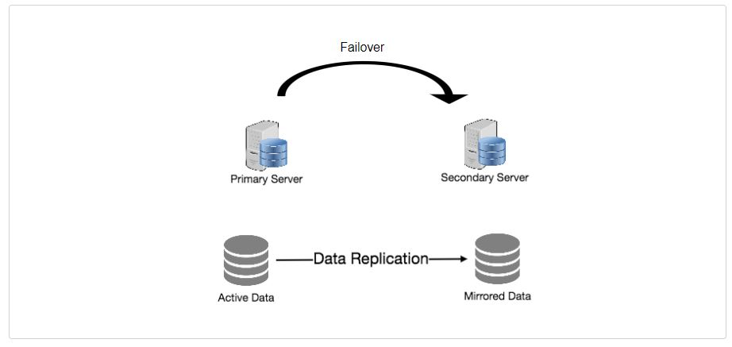

# Replication and Redundancy

Redundancy is the duplication of important components or functions in a system with the goal of boosting the system's reliability, usually as a backup or fail-safe, or improving real system performance. If a single copy of a file is stored on a single server, for example, losing that server means losing the file. Because losing data is rarely a good thing, we can remedy this problem by making duplicate or redundant copies of the file.

Redundancy is important because it eliminates single points of failure in the system and offers backups in the event of a disaster. For instance, if one of two service instances running in production fails, the system can failover to the other.

 
  <kbd>
  
  </kbd>

Replication is the process of exchanging data among redundant resources, such as software or hardware components, in order to improve dependability, fault tolerance, or accessibility.

Many database management systems (DBMS) use replication, which is commonly done using a master-slave connection between the original and the copies. The master receives all updates, which are then sent to the slaves. Each slave sends a message indicating that the update was properly received, enabling for the delivery of following updates.

**References**

1. **[Replication](https://en.wikipedia.org/wiki/Replication_(computing))**
2. **[Redundancy](https://en.wikipedia.org/wiki/Redundancy_(engineering))**
3. **[Fault Tolerance](https://en.wikipedia.org/wiki/Fault_tolerance)**