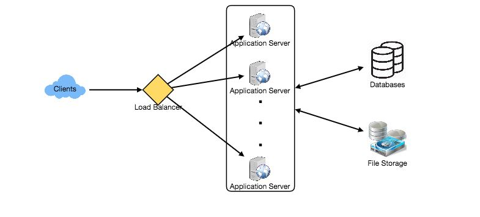

# A Step-by-Step Guide to System Design Interviews

Many software developers have difficulty with system design interviews (SDIs) for three reasons:

- SDIs are unstructured in nature, with applicants being asked to work on an open-ended design challenge with no standard solution.
- Candidates are lacking in intricate and large-scale system development experience.
- Candidates did not devote enough time on SDI preparation.
- Candidates who haven't put out a concerted effort to prepare for SDIs, like those who haven't put forth a concerted effort to prepare for coding interviews, typically perform poorly, particularly at top organizations such as Google, Facebook, Amazon, Microsoft, and others. Candidates who do not perform above average at these companies have a slim probability of being hired. A good performance, on the other hand, invariably leads to a better offer (a higher job and compensation), as it demonstrates the candidate's capacity to manage a complicated system.

This article will take a step-by-step approach to solving numerous design issues. Let's begin with the steps below:

## Step 1: Clarification of requirements

It's always a good idea to ask about the scope of the problem we're attempting to solve. Because design questions are typically open-ended and don't have a single proper solution, it's vital to clear up any misunderstandings early in the interview. Candidates that take the effort to establish the system's end goals have a better chance of succeeding in the interview. We should also define which aspects of the system we will be working on given we only have 35-40 minutes to build a (apparently) vast system.

Let's have a look at a real-world example of how to construct a Twitter-like service. Before moving on to the next steps, you should answer the following questions about Twitter design:

1. Will our service's users be able to publish tweets and follow others?
2. Should we also design for the user's timeline to be created and displayed?
3. Will images and videos be included in tweets?
4. Are we concentrating just on the backend or are we also working on the front-end?
5. Will users be able to use Twitter to search for tweets?
6. Is it necessary to show hot subjects that are currently trending?
7. Will new (or important) tweets be notified via push notification?

All of these considerations will influence the final design.

## Step 2: Estimation from the back of the envelope
Estimating the scope of the system we're going to design is always a smart idea. This will also come in handy later when we're dealing with scaling, partitioning, load balancing, and caching.

1. On what scale should the system operate (e.g., number of new tweets, tweet views, timeline generation per second, etc.)?
2. What kind of storage will we require? If users may include photographs and videos in their tweets, we will have different storage needs.
3. What kind of network bandwidth utilization do we anticipate? This will be critical in determining how we will manage traffic and load balance among servers.

## Step 3: Define the system interface
Define which APIs the system should provide. This will not only define the exact contract that the system should deliver, but it will also guarantee that we haven't missed any criteria. APIs for our Twitter-like service will include the following:

    postTweet(user_id, tweet_data, tweet_location, user_location, timestamp, …)  
    generateTimeline(user_id, current_time, user_location, …)  
    markTweetFavorite(user_id, tweet_id, timestamp, …)  

## Step 4: Defining the data model
Defining the data model early in the interview will help to define how data will move between the system's various components. It will later provide instructions for data partitioning and administration. The candidate must be able to recognize various system entities, how they will interact with one another, and various areas of data management such as storage, transportation, encryption, and so on. For our Twitter-like service, here are some entities:

**User:** UserID, Name, Email, DoB, CreationData, LastLogin, etc.
**Tweet:** TweetID, Content, TweetLocation, NumberOfLikes, TimeStamp, etc.
**UserFollowo:** UserdID1, UserID2
**FavoriteTweets:** UserID, TweetID, TimeStamp

Should we use a relational database system or a relational database system? Will a NoSQL database, such as Cassandra, be the greatest fit for our purposes, or should we go with a MySQL-like solution? To store photographs and videos, what type of block storage should we use?

## Step 5: High-level design
Create a block diagram with 5-6 boxes to illustrate the system's essential components. We should determine how many components are required to tackle the problem from beginning to conclusion.

At a high level, numerous application servers will be required to service all read/write requests for Twitter, with load balancers in front of them to distribute traffic. If we anticipate a high volume of read traffic (in comparison to write traffic), we can set up separate servers to handle these circumstances. We'll need an efficient database on the backend to hold all of the tweets and support a large number of reads. For storing photographs and movies, we'll also need a distributed file storage system.

 
  <kbd>
  
  </kbd>

## Step 6: Detailed design
Examine two or three important components in further depth; the interviewer's input should always point us in the direction of which portions of the system require more study. We should be able to demonstrate many approaches, their benefits and drawbacks, and explain why we prefer one over the other. Remember that there is no one-size-fits-all solution; the most important thing is to weigh the benefits and drawbacks of various solutions while keeping system limits in mind.

1. How should we split our data to distribute it across various databases, given that we will be storing a large amount of data? Should we aim to keep all of a user's data in the same database? What kind of problem may it cause?
2. How will we deal with popular users who send out a lot of tweets or have a lot of followers?
3. Should we aim to store our data in such a way that it is optimized for scanning the most current (and relevant) tweets, as users' timelines will contain the most recent (and relevant) tweets?
4. To speed things up, how much and at which layer should we introduce cache?
5. Which components require improved load balancing?

## Step 7: Identifying bottlenecks and fixing them
Try to cover as many bottlenecks as possible, as well as potential solutions.

1. Does our system have any single points of failure? So, what are we going to do about it?
2. Do we have enough data copies so we can continue serve our users if a few servers fail?
3. Do we have enough copies of different services running such that a few failures do not result in the entire system being shut down?
4. How do we keep track of our service's performance? Do we be notified if one of our important components fails or if its performance deteriorates?

## Conclusion
In short, the keys to success in system design interviews are preparation and organization during the interview. The processes outlined above should help you stay on track and cover all of the major components of system design.

Let's use the recommendations above to develop a few systems that are commonly asked for in SDIs.

**If you understand the concept and basic technologies mentioned in the previous section, you can skip Level 2 and go straight to Level 3 problem solution.**